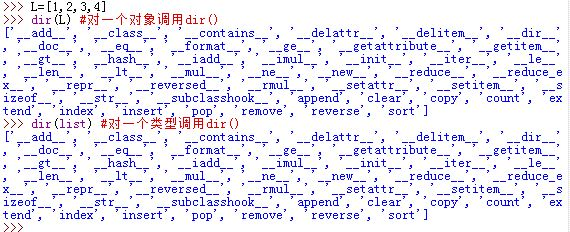

<!--
    作者：华校专
    email: huaxz1986@163.com
**  本文档可用于个人学习目的，不得用于商业目的  **
-->
# 1 文档
1.`#`是注释符，它之后的文字到行尾均为注释。Python解释器会忽略`#`之后的所有字符

2.`dir(obj)`可以返回对象内所有的属性列表。它能够调用任何有属性的对象
> 也可以把类型名称传给`dir()`，可以得到相应的结果  

  

3.文档字符串：对象的`.__doc__`属性。  
文档字符串是放在模块文件、函数、类定义的顶端，在任何可执行代码之前。Python会自动封装这个字符串，使其成为相应对象的`.__doc__`属性。

* 模块文件、函数、类定义的多行注释一般用三重引号字符串

4.标准PyDoc工具用Python代码编写，它提取文档字符串并自动格式化其信息，展示成排列友好的报表。

* Python在标准库中附带了PyDoc工具
* 有两种最主要的PyDoc接口：
	* 内置的`help()`函数。可以对函数、方法、类型、对象使用`help()`函数。  
	  对较大的对象（如模块、类型），`help()`输出的内容会分成几段。
  	  报表中的信息有些是文档字符串，有些是PyDoc自动查看对象内部而收集的结构化信息。
	* PyDoc的 GUI|HTML 接口。启动 `Tools/scripts` 目录下的`pydoc3.py` 脚本：
	  `pydoc3.py -b`  
 	

5.Python标准手册随Python发布。手册以HTML和其他格式实现。最重要的项目是：
	
* Library Reference：标准库文档，说明了内置类型、函数、异常等等
* Language Reference：官方给出的语言层次的细节