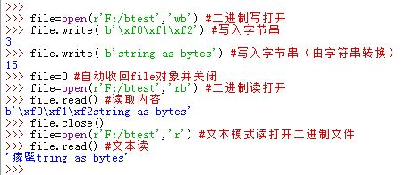

<!--
    作者：华校专
    email: huaxz1986@163.com
**  本文档可用于个人学习目的，不得用于商业目的  **
-->
# 1 文件
1.内置的`open()`函数会创建一个Python文件对象，可以作为计算机上的一个文件的引用。

2.打开文件：`outfile=open(r'C:\filename','w')`：

* 第一个参数`r'C:\filename'`为文件名字符串
* 第二个参数`'w'`为打开模式字符串。有以下三种：
	* `'r'`：读打开（默认行为）
	* `'w'`：写打开
	* `'a'`：追加写打开

	>* 第二个参数也可以添加`'b'`表示二进制处理。二进制处理中，换行符未转换，
	>  同时Python3中 Unicode编码被关闭  
	>* 第二个参数也可以添加`'+'`表示读写同时作用
* 还有第三个参数可选，用于控制输出缓冲.`'0'`表示无缓冲（只能在二进制模式中使用无缓冲）。  


3.文件对象的方法：

* 文件读入：
	* `.read()`：读取接下来的整个文件到单个字符串
	* `.read(n)`：读取接下来的`n`个字节到一个字符串
	* `.readline()`：读取下一行到一个字符串（包括行末的换行符）
	* `.readlines()`：按行读取接下来的整个文件到字符串列表，每个字符串一行  
	
* 写入文件：
	* `.write(str)`：写入字符串到文件（并不会自动添加换行符以及其他任何字符，`str`是啥就写啥），
   	  返回写入的字符数
	* `.writelines(strlist)`：将字符串列表内所有字符串依次写入文件（并不会自动添加换行符以及其他任何字符）  
	
* 关闭文件：`.close()`方法。
* 刷新输出缓冲区：`.flush()`方法。通常关闭文件会将输出缓冲区内容写入到文件中；但用`.flush()`方法不必关闭文件。
* 定位文件：`.seek(N)`方法，将文件偏移修改到字节`N`处以便进行下一次操作
* 文件迭代：文件对象也是一个可迭代对象，每一次迭代返回一行，对于大型文件一次性读取非常耗内存和性能：

	```
	for line in open('data'):#每次循环迭代时，自动读取并返回一行
		#use line
		pass
	```
* 读写文本文件时，默认的编码是`utf-8`，你也可以使用指定的编码：`open(r'filename',encoding='latin-1')`
* 读二进制文件用`openopen(r'filename','rb')`  


4.从文本文件中读取文字行的最佳方式是用文件迭代器，不要直接读取文件

5.当文件对象被自动收回时，Python会自动关闭该文件，这意味着不一定要手动调用`.close()`方法

6.默认的写操作总是缓冲的。当文件关闭或者`.flush()`方法调用时，缓冲的输出数据会写入硬盘。

7.文件的空行是含有换行符的字符串，而不是空字符串。因此如果读入操作返回空字符串，则表示已经到文件末尾了。

8.Python3中，文本文件将内容表示为常规的`str`字符串，自动执行Unicode编码和解码，并且默认执行行末转换。而二进制文件将内容表示为一个特殊的`bytes`字节串类型，且运行程序不修改地访问文件内容。
>不能以文本格式打开一个二进制数据文件，会乱码



9.可以在文件中存储并解析Python对象。由于文件数据在脚本中是字符串，文件对象的`.write()`方法不会自动地将Python对象转成字符串，因此需要手工转换。

* 可以用格式化字符串方法或者`str()`方法将Python对象转成字符串
* 将字符串转换成Python对象可以用`eval()`方法
* 或者直接使用`pickle`模块自动存储和解析Python对象：
	* 存储：`pickle.dump(obj,file)`，其中`obj`是要存储的Python对象，`file`文件对象
	 （用二进制写打开）
	* 加载：`obj=pickle.load(file)`，其中`file`文件对象（用二进制读打开）  
	

10.`struct`模块能够打包/解包二进制数据

* 打包：`data=struct.pack('>i4sh',7,b'abcd',8)`。其中第一个参数为格式说明字符串，后面的参数为待打包的数据。格式说明字符串为：
	* `>`为说明符
	* `i`说明第一个待打包的数据为整数
	* `4s`说明第二个待打包的数据为4个字节的字节串
	* `h`说明第三个待打包的数据为16进制整数
* 解包：`val=struct.unpack('>i4sh`,data)`。其中第一个参数为格式说明符，第二个参数为已经打包的二进制数据，返回一个元组。  


11.`sys`模块中有几个预先打开的文件对象：
	
* `sys.stdout`对象：标准输出对象
* `sys.stdin`对象：标准输入对象
* `sys.stderr`对象：标准错误输出对象  


12.`os`模块中的文件描述符对象支持文件锁定之类的低级工具  


13.`socket`、`pipe`、`FIFO`文件对象可以用于网络通信与进行同步


