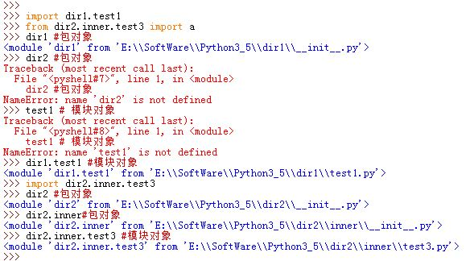
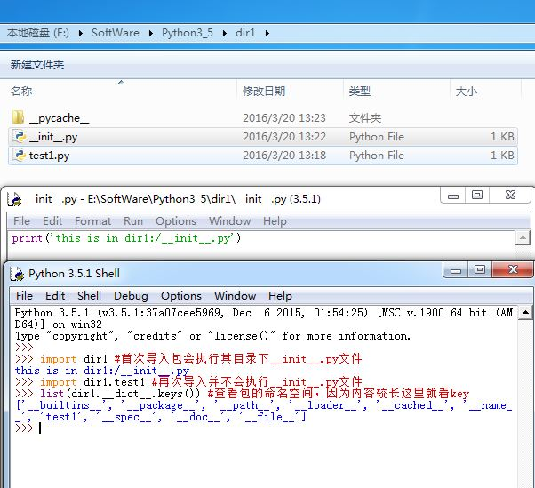

<!--
    作者：华校专
    email: huaxz1986@163.com
**  本文档可用于个人学习目的，不得用于商业目的  **
-->
# 1 模块包
1.`import`时，也可以指定目录。目录称为包，这类的导入称为包导入。

* 包导入是将计算机上的目录变成另一个Python命名空间，它的属性对应于目录中包含的子目录和模块文件
* 包导入的语法：

  ```
	import dir1.dir2.modname
	from dir1.dir2.modname import x
  ```

  

* 包导入语句的路径中，每个目录内部必须要有`__init__.py`这个文件。否则包导入会失败
	* `__init__.py`就像普通模块文件，它可以为空的
	* Python首次导入某个目录时，会自动执行该目录下`__init__.py`文件的所有程序代码
	* `import dir1.dir2.modname`包导入后，每个目录名都成为模块对象
	 （模块对象的命名空间由该目录下的`__init__.py`中所有的全局变量定义
	  （包含显式定义和隐式定义）决定）
	* `__init__.py`中的全局变量称为对应目录包的属性

  

2.任何已导入的目录包也可以用`reload`重新加载，来强制该目录包重新加载
>`reload`一个目录包的用法与细节与`reload`一个模块相同
  
  

3.包与`import`使用时输入字数较长，每次使用时需要输入完整包路径。可以用from语句来避免  
  

4.包相对导入：`from`语句可以用`.`与`..`：

```
  from . import modname1 #modname1与本模块在同一包中（即与本文件在同一目录下）
  from .modname1 import name #modname1与本模块在同一包中（即与本文件在同一目录下）
  from .. import modname2 #modname2在本模块的父目录中（即在本文件上层）
```
>Python2中，`import modname`会优先在本模块所在目录下加载`modname`以执行相对导入。
>因此局部的模块可能会因此屏蔽`sys.path`上的另一个模块  
>要想启用相对导入功能，使用`from __future__ import absolute_import`

* Python3中，没有点号的导入均为绝对导入。`import`总是优先在包外查找模块  


