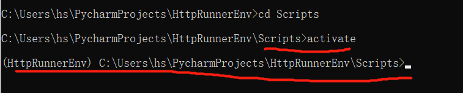

# 1 Venv
virtual environment
Mehr Informationen zu venv: [https://docs.python.org/3/tutorial/venv.html](https://docs.python.org/3/tutorial/venv.html)


• Problem1: multiple projects with different required packages
• Problem2: two applications requiring different version of the
same library
• Problem3: no credentials to install at site-packages
• Problem4: different Python Versions
->  Create isolated Python environments


Python unterstuetzt seit PEP 405 virtuelle Interpreter bzw Umgebungen (virtual environment, kurz: venv).

Eine virtuelle Umgebung ist eine Ansammlung von einer Python-Installation, -Konfiguration und Paketen, die fuer ueblich einem oder ggf. auch mehreren Projekten zugeordnet werden.  (每个umgebung 中可以自己配置 信息 ，python version )
Diese Umgebung existiert unabhaengig von anderen virtuellen Umgebungen und insbesondere unabhaengig von der Systeminstallation von Python.

Der Vorteil einer virtuellen Umgebung ist die Isolation von Projekten;
Abhaengigkeiten von Paketen muessen nicht global im System installiert werden, sondern bleiben lokal auf ein Projekt beschraenkt.
Insbesondere kommt es dadurch nicht zu Versionskonflikten, wenn ein Projekt auf eine aeltere Paket-Version angewiesen ist.  (适应 venv 能够避免的问题)

Die Standardbibliothek enthaelt ab Python 3.3 ein venv-Modul, das automatisiertes Erzeugen von virtuellen Umgebungen ermoeglicht. Virtuelle Umgebungen werden fuer ueblich lokal in einem Unterordner des Projekts angelegt und tragen den Namen venv oder .venv .

https://www.cnblogs.com/smilecindy/p/14012122.html
https://blog.csdn.net/gaoqing_dream163/article/details/109219452

## 1.1 使用方法

```
# Open a terminal and check whether you have `pip` and `venv` available

python3 -m pip --version  
python3 -m venv --help

# Create a virtual enviroment to install new Python packages 
# 方法1 使用 virtualenv 命令 (不推荐 )
pip install virtualenv
virtualenv venv
virtualenv --python=C:\Python38\python.exe --nosite-packages


# 方法2  使用 python3 -m venv  (这个方法常用)
创造一个名为venv 的虚拟环境: python3 -m venv venv
```


然后 在 venv/scripts/ 中文件加下 会有  一系列的文件 
不同的 activate 文件可以在不同的 OS 中 去使用 以此来启动虚拟环境 

- activate 
- activate.bat 
- active.ps1  
- deactivate.bat 
- jupyter.exe 
- pip.exe 
- pip3.exe 
- python.exe


```

# Activate the enviroment by typing:
cd ve1
Scripts/activate.bat  ()

# activate the enviromrnt by typing
source venv/bin/activate  (只能在sh 中使用 )
source venv/Scripts/activate

在powershell 中使用 
. venv/Scripts/activate.ps1

# deactivate 某个 environment 
执行 venv/Scripts/deactivate 这个文件

```

### 1.1.1 创建虚拟环境

#### 1.1.1.1 通过 pycharm 创建新的虚拟环境
https://blog.csdn.net/gaoqing_dream163/article/details/109219452

#### 1.1.1.2 通过 virtualenv  命令 创建 新的虚拟环境 
https://www.cnblogs.com/smilecindy/p/14012122.html

python使用virtualenv管理虚拟环境，便于在不同的环境下使用不同版本的包，不同项目使用不用版本的包，创建虚拟环境的步骤：
 步骤一：virtualenv的安装，安装命令：pip install virtualenv
 
![[02_理论基础/images/Pasted image 20240625160434.png]]

步骤二：使用virtualenv命令创建虚拟环境，

方法0 (推荐 )
使用 python3 -m venv  (这个方法常用)
创造一个名为venv 的虚拟环境: python3 -m venv venv


方法1 创建命令：virtualenv 【环境名称】
创建虚拟环境的目录可以任意选择，环境名称也可以任意定义：
![[02_理论基础/images/Pasted image 20240625160508.png]]
 
虚拟环境创建成功之后，则在选择的目录下生成虚拟环境，虚拟环境目录生成之后包含了Lib目录和Scripts目录以及.gitgnore和pyvenv.cfg文件，如下图：
![[02_理论基础/images/Pasted image 20240625160523.png]]


步骤三 虚拟环境安装好之后需要激活才能使用，激活环境需要在该环境的绝对路径（必须是Scripts目录）下激活，使用activate命令

 跳转到虚拟环境下的Scripts目录，使用activate命令进行激活
 


### 1.1.2 项目在虚拟环境中的使用

**步骤一：检查项目是否已存在requirement.txt文件**

 如果没有，则使用命令：pip freeze > requirements.txt进行生成requirements.txt文件

注意：pip的freeze命令用于生成将当前项目的pip类库列表生成 requirements.txt 文件。

---

 **步骤二：跳转到需要使用虚拟环境的目录下（注意是在虚拟环境状态下跳转）**
 ****

---

**步骤三：根据requirements.txt文件安装项目需要的所有模块，使用命令： pip  install -r requirements.txt**
 

 安装完成之后，使用 pip  list查看是否所有的第三方包均安装成功即可。

### 1.1.3 pycharm中项目如何加载虚拟环境


 **步骤一：打开pycharm并打开需要加载虚拟环境的项目，然后依次点击左上方的file->Settings，如下图所示：**

 


 **步骤二：Project->Project Interpreter，project  Interpreter默认选择的是本地的python环境以及对应的第三方包，如下图所示：**
 

---

 **步骤三：添加虚拟环境**

 1）点击右上方的设置按钮，然后点击Add，如下图所示：


2）在弹出的Add Python Interpreter页面中，依次选择Virtualenv Environment（虚拟环境）->Existing environment，如下图所示：


---

 **第四步：选择虚拟环境运行于项目：Project->Project Interpreter，project  Interpreter选择新添加的虚拟机环境并点击【ok】即可，如下图：**


# 2 Poetry 

Offizielle Poetry-Website: https://python-poetry.org/ 

Poetry ist ein Dependency-Manager für Python-Projekte. 
Neben der definierten Syntax um Paketabhängigkeiten zu beschreiben, bietet Poetry Funktionalität zum automatischen erstellen einer virtuellen Umgebung mit allen nötigen Abhängigkeiten, sowie Hilfen zum Bauen und Veröffentlichen (z.B. auf PyPi) des Pakets.  

Der Grund für die Entscheidung für poetry als entsprechendes Tool ist die gemeinsame Lösung für das Erstellen von virtuellen Umgebungen, das Definieren von Abhängigkeiten, das Bauen von Paketen und der Upload zu einem Python-Repository. 
Für alle diese Aufgaben existierten bereits andere Tools, aber (unserem Wissensstand nach) keins, dass alle vereint erfüllt.

(能干什么。 1 包关系， 2 产生 venv 3 发布 code 到 repo 上面  )

pyproject.toml-Datei ： 
Poetry nutzt dafür die pyproject.toml-Datei (siehe PEP 518), die ebendiese Abhängigkeiten und andere Optionen definiert. 
Diese Datei bietet damit eine Alternative zu der weitverbreiteten setup.py-Datei, die ein Python-Skript definiert, dass das Paket bauen soll.  (是 setup.py 的替代物 )
Alternative Pakete / Tools zu poetry, die einem vor allen in externen Projekten begegnen können: setuptools, setup.py, twine, distribute

poetry.lock-Datei： 
Neben der pyproject.toml-Datei erstellen poetry eine poetry.lock-Datei. 
Diese Datei wird bei VCS eingecheckt, damit alle Entwickler des Pakets die gleiche Datei teilen. 
Während die pyproject.toml-Datei für Pakete Mindest- und Maximal-Versionen festlegt, gibt es im Normalfall mehrere konkrete Versionen, die diese Restriktionen erfüllen. Welche tatsächlichen Versionen genutzt werden, damit alle (auch rekursiven) Abhängigkeiten erfüllt sind, legt poetry automatisch fest und schreibt diese Informationen in die poetry.lock-Datei. 
Zum Beispiel erfüllen sowohl Version 1.1.0 als auch 1.2.1 die Abhängigkeit "^1.1", aber nur eine davon wird in der .lock-Datei zu finden sein. 


Ein Beispiel für eine pyproject.toml-Datei ist unten zu sehen.
```
[tool.poetry]
name = "paketname"
version = "1.9.5"
description = "Paketbeschreibung"
authors = ["Max Mustermann <mmu@ivu.de>"]
readme = "README.md"
 
# Damit IVU-interne Pakete in den Abhängigkeiten definiert werden.
[[tool.poetry.source]]
name = "ivu"
url = "https://nexus3.ivu.de/repository/Ivu-Pypi/simple"
 
# Paket-Abhängigkeiten zum Ausführen / Nutzen
[tool.poetry.dependencies]
python = "^3.8"
mako = "^1.1"
grt-gparser = "^1.3.0"
anytree = "^2.8.0"
 
# Paket-Abhängigkeiten zur Entwicklung
[tool.poetry.dev-dependencies]
bitstring = "^3.1"
pytest = "^5.3"
 
# "Entry Points". In diesem Beispiel ist nach der Installation des Pakets "foo" ein Kommandozeilenbefehl, der die gegebene main-Funktion aufruft.
[tool.poetry.scripts]
foo = "paketname.__main__:main"
 
[build-system]
requires = ["poetry>=0.12"]
build-backend = "poetry.masonry.api"

```

# 3 poetry 命令

```
# Erzeugen einer pyproject.toml in einem neuen Projekt
poetry init
 
# Erzeugen einer virtuellen Umgebung mit poetry
poetry install

# Berechnen der Abhängigkeiten und Erstellen / Überschreiben der poetry.lock
poetry update
 
# Veröffentlichen von Paketen im IVU-PyPi
poetry publish -r ivu --build  # Die Nutzerdaten fuer den Schreibzugriff auf das PyPi-Repository koennen vom DELI-Team erfragt werden.

```


1 Installation ueber Powershell: 
(Invoke-WebRequest -Uri https://raw.githubusercontent.com/python-poetry/poetry/master/get-poetry.py -UseBasicParsing).Content | python - --version=1.0.10

Die installierte Version muss der oben genannten Anforderung entsprechen. Siehe https://github.com/python-poetry/poetry/issues/977 für einen Bug, der sonst dabei auftreten kann.
Weitere Informationen, siehe: https://python-poetry.org/docs/ .


2  poetry config
```
Nach der Installation von poetry (s.o.) muessen einmalig folgende Kommandozeilen ausgefuehrt werden:

poetry config virtualenvs.create true
poetry config virtualenvs.in-project true
poetry config repositories.ivu https://nexus3.ivu.de/repository/Ivu-Pypi/

```


3 poetry uninstall
```
Falls Probleme mit poetry haben, und deinstalliert werden müss, kann man den Datei get-poetry.py  benutzen.
python get-poetry.py --uninstall
```

