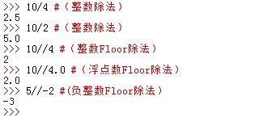
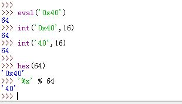
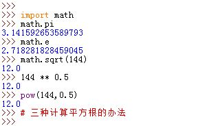
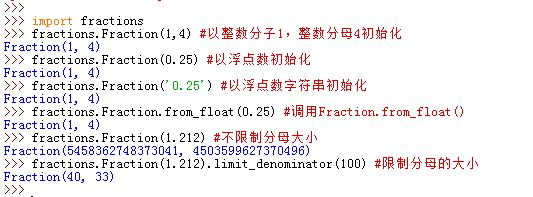

<!--
    作者：华校专
    email: huaxz1986@163.com
**  本文档可用于个人学习目的，不得用于商业目的  **
-->
# 1 Python的数字常量：

* 整数：`1234`,`-1234`,`0`。Python支持无穷整数大小
	>Python3中，整数不再区分一般整数与长整数
	>
	>Python2.7中整数分为一般整数（32位）与长整数（支持无穷整数大小）。
	整数以`l`或者`L`结尾时为长整数。当整数值超过32位时自动转换为长整数

* 浮点数：`1.23`，`1.`，`.3`，`3.14e-10`，`4E10`，`4.0e+10`
* 八/十六/二进制整数：`0o177`（小写的字符`o`或者大写的`O`），`0x9ff`，`0b101010`
	> 对于Python2.7来讲，八进制整数为`0177`（没有小写的字符`o`）
* 复数：`3+4j`，`3.0+4.0j`，`3j`，`3J`

• Integer: 12, 0xFF, 0o377, 0b101
    – to convert: bin(a), oct(a), hex(a)
• Float: 3.0, 3e2, 3e-3
    – To convert to Integer: int(3.14)
• Complex: 3+4j
• Arithmetic Operators: + - * ** / // %
    – 2**10 # 1024
    – 23 // 11 # 2
    – 23 % 11 # 1
• Build-in functions: abs min max pow round

# 2 数字类型转换：

* `hex(intx)`、`oct(intx)`、`bin(intx)`、`str(intx)`将整数`intx`转换成十六/八/二/十进制表示的字符串
* `int(strx,base)`将字符串`strx`根据指定的`base`进制转换成整数。`base`默认为10
* `float(strx)`将字符串`strx`转换成浮点数
* `complex(num_real,num_imag)`创建一个复数，实部为数字`num_real`，
  虚部为数字`num_imag`  
 

# 3 其他

3.混合类型表达式中，Python先将被操作对象转换成其中最复杂的操作对象的类型。

* 整数与浮点数混合操作时，将整数自动转换成浮点数
* 浮点数与复数混合操作时，将浮点数自动转换成复数
>也可以通过`int()`，`float()`，以及`complex()`执行手动转换

4.Python允许执行连续比较，且比较链可以任意长：

* `a<b<c`结果等同于`a<b and b<c`
* `a<b>c`结果等同于`a<b and b>c`
> 这二者并不完全等价，因为`a<b<c`中的表达式`b`只需要计算一次；
  而`a<b and b<c`中的表达式`b`需要计算两次

5.Python的除法`x/y`在Python3和Python2.7中不同

* Python3中的除法保留小数部分，无论是整数除法还是浮点除法
* Python2.7中的除法：对整数除法会截取整数部分放弃小数部分，对小数除法会保留小数部分

Python中还有一种除法：Floor除法`x//y`，它会将结果向下取整到不大于它的最大整数
> 即使是浮点的Floor除法，结果也是取整的浮点数 
 

6.将字符串转为整数除了用`int()`函数外，也可以通过`eval()`函数将字符串转为整数；  
整数转字符串除了用`str()/hex()`等函数外，也可以用格式化字符串。  

7.Python支持将整数当作二进制位串对待的位操作。  

8.Python支持许多对数字处理的内置函数与内置模块：
> 内置函数位于一个隐性的命名空间内，对应于`builtins`模块（python2.7叫做
  `__builtins__`模块）

* `math`模块：如`math.pi`，`math.e`，`math.sqrt`....
* 内置函数，如`pow()`，`abs()`，...  
  

9.`random`模块提供的工具可以生成0～1之间的随机浮点数、两个数字之间的任意整数、
  序列中的任意一项。  

10.浮点数缺乏精确性，因为存储浮点数的空间有限（这是硬件相关的内存缺陷），
  可以用`Decimal`对象解决精度问题。  
  `Decimal`对象来自于`decimal`模块，它类似于浮点数，但是有固定的位数和小数点，
  因此是固定精度的小数。相对于浮点数，它带来了微小的精度损失。

* 设置全局的精度和舍入模式：`decimal.getcontext().prec=5`，将全局精度设置为小数点后5位
* 可用整数、浮点数、字符串初始化`Decimal`对象  
  

11.Python中的分数类型是`Fraction`对象，来自于`fractions`模块。

* `Fraction`对象以一个分子，一个分母初始化：`Fraction(1,4)`；
  也可以从浮点数或者浮点数的字符串初始化：`Fraction('0.25')`，`Fraction(0.25)`
* `Fraction`对象能保证精确性，且能自动简化结果
* 从浮点数产生分数有两个方法：
	* 调用`Fraction`的构造函数：`Fraction(0.25)`
	* 用`Fraction.from_float()`函数：`Fraction.from_float(0.25)`
 
  从浮点产生分数时，可以通过`.limit_denominator()`限制分母的最大值。  
  

12.浮点数有个`as_integer_ratio()`方法，能生成`(分子，分母)`的元祖。  

13.整数、浮点数、`Fraction`、`Decimal` 可以混合运算
> `Fraction`与`Decimal`不可以混合运算

~~~mermaid
graph LR
id1(整数)-->|提升|id2(浮点数);
id2(浮点数)-->|提升|id3(Fraction);
id2(浮点数)-->|提升|id4(Decimal);
~~~

14.Python中的布尔类型为`bool`，它只有两个值`True`和`False`。  
`True`和`False`是预定义的内置变量名，其在表达式中的行为与整数1和0是一样的。实际上他们就是内置的`int`类型的子类。  

15.`真`和`假`是Python中每个对象的固有属性：每个对象不是`真`就是`假`。
  该属性可以用于`任何需要`bool`值的地方。

* 一个数如果不是0，则为真；如整数 0，浮点数 0.0 都是 `假`
* 其他对象如果非空，则为真；如空字符串 `""`为`假`，空字典`{}`为`假`，
  空列表`[]`为`假`，`None`对象为`假`

