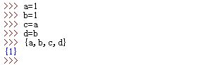

# 1 Set类型
1.Python的`set`类型是集合内元素值唯一、元素值不可变的无序集。
  `set`类型并不要求其集合内各个元素都是相同类型。  

* 唯一：`set`类型的集合内元素的值唯一。
	* 如果有两个变量指向同一个对象，则在`set`集合内只会出现一次
	* 如果有两个对象值相等，则在`set`集合内也只会出现一次
* 不可变：一旦创建完毕，则`set`集合内的各个元素值不能修改。
	> 本质上`set`通过元素值的哈希值来判断唯一性  
  

• Unordered
• finite sets of unique, immutable elements
a = set(("duck", "pick"))
• Mutable -> plain sets
• Immutable -> frozen sets
a = set()
a = {'a', 12, (1,2,3,)}
a = set((23,))
f = frozenset((1, 4, 5, 2, ))

## 1.1 Set 的创建 

```
a = set('abc')
a = {'a', 12, (1,2,3,)}
b = set(2) # Error
b = set((2))
```


5.Python3中，`set`常量可以用大括号创建：`{1,2,3,4}`等价于`set([1,2,3,4])`。

* 空`set`必须由`set([])`创建，`{}`为空字典而不是空`set`
* Python3中，`set`的字符串表示为`{...}`形式，而不是`set([...])`形式


# 2 `set`本身的性质有：

* `set`对象是可迭代对象
* `set`对象可以增长或缩短
* `set`对象可能包含各种类型的对象作为元素
* 创建`set`对象的方法为调用`x=set(iter)`，其中`iter`为任何序列或可迭代对象


# 3 操作 

3.`set`对象有以下操作：
* 成员关系：`e in x`(返回`bool`值）
* 差集： `x-y`（返回新的`set`对象）
* 并集： `x|y`（返回新的`set`对象）
* 交集： `x&y`（返回新的`set`对象）
* 对称差集： `x^y`（返回新的`set`对象）
	>对称差集：并集中去掉交集的那部分
* 判定x是否是y的超集： `x>y`(返回`bool`值）
* 判定x是否是y的子集：`x<y`(返回`bool`值）  
  

```
a = set(range(10))
b = set(range(1,10,2))
c = set(range(0,20,3))
d = a | c # Union
a.union(c) # returns new set, a unchanged
a.update(c) # updates a, returns None


d = a & c # Intersection
a.intersection(c) # returns new set, a unchanged
a.intersection_update(c) # updates a, returns None
d = a - c # Difference
d = a ^ c # Symmetric Difference

```


# 4 `set`的方法有：

* `.add(item)`：向`set`中插入一项，原地修改（返回`None`)。其中`item`为待插入项
* `.update(iter)`：求并集，原地修改（返回`None`)。其中`iter`为任何可迭代对象
* `.remove(item)`：向`set`中删除一项，原地修改（返回`None`)。其中`item`为待删除项
* `.intersection(iter)`：求交集，返回新的`set`对象。其中`iter`为任何可迭代对象
> 注意这里与表达式中的`set`交集、并集操作的区别：
  表达式中的`set`交集、并集操作要求两个对象均为集合

  


```
a.add(2)
a.remove('d') # Exception, if not exists
a.discard('d')
c = a.pop()
c.clear()
```

# 5 迭代

4.`set`对象是可迭代的，因此可用于`len()`函数，`for`循环，以及列表解析中，但是因为是无序的所以不支持索引和分片操作。      


8.`set`的解析构造（在Python3之后）：`{x**2 for x in iter}`，其中`iter`为任何可迭代对象。  


- 特有方法

  - .add('内容') 添加指定内容

    ```python
    v = {1, 2, 3, 'abc', '计算机'}
    v.add("Python")
    print(v)
    ```

  - .discard('内容')，删除指定内容，无则返回None

    ```python
    v = {1,2,3,5,'k','hggh'}
    val = v.discard('m')
    print(v,val)
    ```

  - .update()批量添加（列表、元组、集合都可以，若为字典只将键更新到集合内）

    ```python
    v = {1, 2, 3, 'abc', '计算机'}
    b = [4, 5, 6]
    v.update(b)
    print(v)
    ```

  - .intersection() 交集

    ```python
    v1 = {1, 2, 3, 'abc', '计算机'}
    v2 = {2, 3, 4, 'ABC', '计算机'}
    v3 = v1.intersection(v2)
    print(v3)
    ```

  - .union()并集

    ```python
    v1 = {1, 2, 3, 'abc', '计算机'}
    v2 = {2, 3, 4, 'ABC', '计算机'}
    v3 = v1.union(v2)
    print(v3)
    ```

  - .difference()前者对后者的差集（前有后无）

    ```python
    v1 = {1, 2, 3, 'abc', '计算机'}
    v2 = {2, 3, 4, 'ABC', '计算机'}
    v3 = v1.difference(v2)  # v1对v2的差集
    # v3 = v2.difference(v1)  # v2对v1的差集
    print(v3)
    ```

  - .symmertric_difference()对称差集

    ```python
    v1 = {1, 2, 3, 'abc', '计算机'}
    v2 = {2, 3, 4, 'ABC', '计算机'}
    v3 = v1.symmetric_difference(v2)
    print(v3)
    ```

# 6 forzenset and set 

6.`set`只能包含不可变的对象，因此列表对象、字典对象、`set`对象均不能作为`set`的元素。
> 元组和字符串可作为`set`的元素

  


7.`frozenset`是`set`的子类型，它与`set`的唯一区别是：
`frozenset`对象可以作为`set`的元素。  


