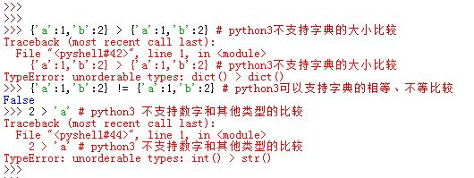

1.Python的通用序列包括：字符串、列表、元组。

* 字符串：不可变对象，元素只能是字符
* 列表：可变对象，元素类型不限
* 元组：不可变对象，元素类型不限
>这里的`可变`指的是能否修改对象，如增加序列元素，修改序列元素等等

2.Python通用序列操作有：

* 索引操作： `seq[index]`，返回序列在该位置处的值，有越界检查
* 分片操作： `seq[index1:index2]`：返回一个新的序列，有越界检查
* 序列加法： `seq1+seq2`：返回一个新序列，包含`seq1`、`seq2`的拷贝
* 序列乘法： `seq*N`：返回一个新序列，包含`seq`的`N`份拷贝  

3.`set`不是序列，它是可变对象，但是元素只能是不可变类型。  
字典也不是序列，它是可变对象，其元素的值是不限类型，但是键必须是不可变类型。

4.三种解析表达式：

* 列表解析表达式：`[c*4 for c in 'abcd']`生成一个新列表对象，
  结果为：`['aaaa','bbbb','cccc','dddd']`
* `set`解析表达式：`{c*4 for c in 'abcd'}`生成一个新`set`对象，
  结果为：`{'aaaa','bbbb','cccc','dddd'}`（打印顺序不确定）
* 字典解析表达式：`{c:c*4 for c in 'abcd'}`生成一个新列表对象，
  结果为：`{'a':'aaaa','b':'bbbb','c':'cccc','d':'dddd'}` （打印顺序不确定） 

>注意：并没有元组解析表达式。`(c*4 for c in 'abcd')`返回的是一个生成器对象。  

5.Python 3.0 中，`bytearray`字节串类型是可变的

6.序列的拷贝：

* 分片表达式能复制序列， 只能进行顶层拷贝
* 字典的`.copy()`方法能复制字典， 只能进行顶层拷贝
* 通过`list()`、`tuple()`等方法
* 通过`copy`标准库模块，可以进行深层拷贝  

7.比较操作时，Python能够自动遍历嵌套的对象，从左到右递归比较，要多深有多深。过充中首次发现的差异将决定比较的结果。  

* 数字通过相对大小比较
* 字符串从左到右每个字符按照字符的字典序比较
* 列表和元组从左到右每部分内容都比较
* 字典通过排序后的`(键，值)`列表比较
>Python 3.0 中的字典只能进行相等、不等比较

* 数字与其他类型比较在 Python 3.0 中是错误的  

8.当一个复合对象包含指向自身的引用时（如`L.append(L)`），称为循环对象。当Python在对象中检测到循环时，会打印成`[...]`而不会陷入无限循环。  
 

