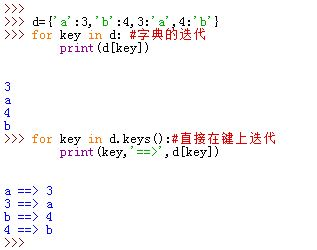
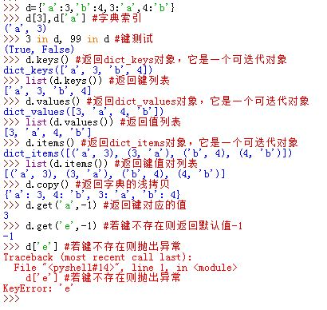
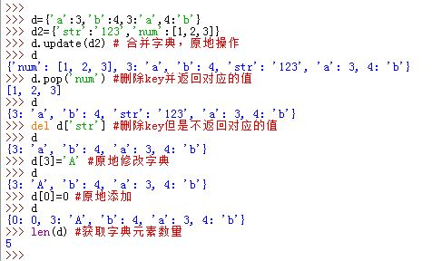

• = mutable associative array (aka hash table aka lookup tableaka map)
• ordered (3.7+)

HashMaps/Key-Value-Stores/...

# 1 dict的生成
1.字典是一些 "键 --- 值" 对的无序集和。它通过键来索引。
* 字典是可变对象，它的元素的值的类型不限，它的元素的键类型是不可变类型
> 意味着键类型不能是列表、`set`、，字典

```python
两种定义方法
fruit = {  
    'color': 'green',  
    'taste': 'sweet',  
    'size 3d': [1, 3, 2]  
}  
  
fruit2 = dict(color='green', taste='sweet', size3d=[1, 2, 3])


key->value mapping by hashtable
a={}
a={2:3}
a=dict(ci='ao')

• Hash tables, "associative arrays"
d = {"duck": "eend", "water": "water"}

```


* 字典的常量表达式：`{'a':3,'b':4}`，空字典的常量表达式为`{}`
* `dict()`函数可以从关键字参数生成字典：`dict(a=3,b=4)`生成字典`{'a':3,'b':4}`
	* 你可以通过`zip()`函数生成关键字参数：`dict(zip(['a','b'],[3,4]))`
	  生成字典`{'a':3,'b':4}`
* 你也可以用字典的`.fromkeys()`类方法生成字典：
	* `dict.fromkeys(['a','b'])` 生成字典`{'a':None,'b':None}`
	* `dict.fromkeys(['a','b'],3)` 生成字典`{'a':3,'b':3}`

  


# 2 dict的获取 

```python
• Lookup:
d["duck"] -> "eend"
d["back"] # raises KeyError exception

• Delete, insert, overwrite:
del d["water"] # {"duck": "eend", "back": "rug"}
d["back"] = "rug" # {"duck": "eend", "back": "rug"}
d["duck"] = "duik"# {"duck": "duik", "back": "rug"}

• Keys, values, items:
d.keys() -> ["duck", "back"]
d.values() -> ["duik", "rug"]
d.items() -> [("duck","duik"), ("back","rug")]
for k,v in d.items():
print(k,v)

• Values of any type; but keys?
{"name":"Guido", "age":43, ("hello","world"):1, 42:"yes",
"flag": ["red","white","blue"]}

```

* 字典索引：`d[key]`。字典索引返回对应的值
* 键测试：`key in d`。测试指定键是否存在字典中

## 2.1 d.get()

* 获取键的值：通过`d.get(key,default_value)`。返回键对应的值，	若键不存在则返回
  `default_value`

>对于`d[key]`返回对应的值，如果`key`不存在则抛出`KeyError`异常


  - .get()根据“键”获取“值”(若没有返回None，不会报错)

    ```python
    info = {'name': 'hei', 'age': 18, 'gender': '男'}
    value = info.get('name') 
    print(value) #若“键”不存在则返回None
    ```


# 3 dict的迭代

* 字典的迭代：
	* `d.keys()`：返回一个dict_keys对象，它是一个可迭代对象，迭代时返回键序列
	* `d.values()`：返回一个dict_values对象，它是一个可迭代对象，迭代时返回值序列
	* `d.items()`：返回一个dict_items对象，它是一个可迭代对象，
	  迭代时返回元组`(键，值)`的序列
		>字典迭代在Python3中返回可迭代对象，在Python2.7中均返回列表。
		  因此在Python3中如果想得到列表，必须将返回值传入`list()`函数中得到列表


* 字典本身也是一个可迭代对象，它的迭代方法为：

	```
	for key in d:
	  pass
	```

它在列表的键上迭代，也等价于

```
for key in d.keys()
  pass
```


 


iterating dicts will return the keys

```
list(fruit)
['color', 'taste', 'size 3d']

list(fruit.values())
['green', 'sweet', [2, 3, 1]]

```


  - .keys(),获取字典中的所有键

    ```python
    info = {'name':'hei','age':18,'gender':'男'}
    for item in info.keys():
        print(item)
    ```

  - .values(),获取字典中所有的值

    ```python
    info = {'name':'hei','age':18,'gender':'男'}
    for item in info.values():
        print(item)
    ```

  - .items(),获取字典中所有的键值对（需两个变量对应）

    ```python
    info = {'name': 'hei', 'age': 18, 'gender': '男'}
    for item in info.items():
        v1,v2 = item
        print(v1,v2)
        print(item)
    ```

# 4 dict的操作 

* 字典的拷贝：`d.copy()`。只是字典的浅拷贝
  


* 字典的操作：
	* `d1.update(d2)`：合并两个字典，原地修改`d1`字典
	* `d.pop(key)`： 从字典中删除`key`并返回该元素的值
	* `del d[key]`：从字典中删除`key`但是不返回该元素的值
	* `d[key]=value`：原地的添加/修改字典。当向不存在的键赋值时，相当于添加新元素


  - .pop(),(删除的键值对可以赋予一个新的变量与之对应)

    ```python
    info = {'name': 'hei', 'age': 18, 'gender': '男'}
    result = info.pop('name')
    print(result,info)
    ```

  - .update() 不存在则添加，存在则更新

    ```python
    info = {'name': 'hei', 'age': 18, 'gender': '男'}
    info1 = {'name': 'bai', 'sha': 18}
    info.update(info1)
    print(info)
    ```


* 获取字典中元素数量：`len(d)`。它也等于键列表/值列表的长度  



Combining Dicts
```
# copy a dict
cool_fruit = dict(fruit)
cool_fruit is fruit, cool_fruit == fruit
(False, True)

# some new dict for combining
properties = {
    'best before': 7,
}

# xxx 
cool_fruit.update(properties)  # cool_fruit is changed in-place
cool_fruit

```

# 5 dictionary unpacking 

similar to sequence unpacking with `*`, we can use *dictionary unpacking* using the `**` operator
```
print({**fruit, 'price': 3})
print({**fruit, **properties})
```


use it to unpack into function keyword arguments
```
def f(a,b):
    return a +b

kwargs = {"b" : 1, "a" : 2}

f(a=1, b=2)
f(**kwargs)
```


# 6 Python3中字典的变化

* `d.keys()`、`d.values()`、`d.items()`返回的是可迭代对象，他们称为视图对象，
  而不是列表。修改字典，则这些视图对象会相应变化
* 支持字典解析表达式来生成字典，如 `{k:v for k,v in zip(['a','b','c'],[1,2,3])}`，
 `{k:v for k,v in [('a',1),('b',2),('c',3)]}`
* 取消了Python2中的`has_key(key)`方法，而用`key in d`表达式取代
* Python3中，只有相等不等测试有效，字典的大小比较无效  


# 7 Keys must be immutable:

dictionaries are ordered by the time the key was first written

Keys must be immutable:
– because of hashing
(fast lookup technique)
• no restrictions on values


```python
dict_a = {'a': 1, 'b': 2, 'c': 3}
dict_b = {'b': 2, 'a': 1, 'c': 3}
print(dict_a)
print(dict_b)

print(list(dict_a))
print(list(dict_b))

dict_a['a'] = 0
print(dict_a)

```


