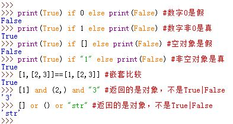

<!--
    作者：华校专
    email: huaxz1986@163.com
**  本文档可用于个人学习目的，不得用于商业目的  **
-->
# 1 `if`语句
1.`if`语句的的通用格式：

```
	if test_expr1: #必选
		statement1#必选
	elif test_expr2: #可选
		statement2
	else: #可选
		statement3
```

* 注意`if`、`elif`、`else`的缩进一致
* 除了开头的`if`以及关联的子句外，`elif`、`else`均可选

2.Python中多路分支必须写成一系列的`if/elif`测试，因为Python中没有`switch-case`语句
>字典也可以执行多路分支的逻辑，如：
>
>```
>	mydict={'a':func1,'b':func2}
>	choice='a'
>	print(mydict[choice])
>```

3.Python中的真值测试：

* 任何非0数字或者非空对象为`True`，数字0、空对象（如空列表，空字典、空元组、空`set`、空字符串）、`None`对象为`False`
* 比较、相等测试会递归地应用在嵌套的数据结构中，他们返回`True`或`False`
* 布尔`and`和`or`运算符会返回真或假的操作对象，而不是`True`或`Flase`，并且它们是短路计算
	* `and`：从左到右依次对操作对象求值，停在第一个为假的对象上并返回它，或者当前面所有操作对象为真时返回最后一个操作对象
	* `or`：从左到右依次对操作对象求值，停在第一个为真的对象上并返回它，或者当前面所有操作对象为假时返回最后一个操作对象

  

4.Python支持`if|else`三元表达式：`Y if X else Z`：  
  当`X`为真时，表达式的值为`Y`；当`X`为假时，表达式的值为`Z`。
  <font color='red'>注意这里为短路计算，并不会同时对`Y`和`Z`求值</font>。

* 三元表达式`X? Y:Z`也能得到同样的效果
* 还有一种模拟方法：`[Z,Y][bool(X)]`。但是它会同时对`Z`、`Y`求值，可能会有副作用。
	> `bool(X)`将`X`转换成对应的1或者0
	

