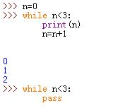

# 1 `while`
1.`while`语句格式：

```
	while test_expr:
		statement1
	else:#可选
		statement2


`While <expr>: <indented block>`
– within the block, may have
• break
• continue
– then, optionally: else: `<indented block>`


```
* `while`和`else`缩进必须一致。
* `else`可选。`else`子句在控制权离开循环且未碰到`break`语句时执行。即在正常离开循环时执行（`break`是非正常离开循环）
* 在`while`子句中可以使用下列语句：
	* `break`：跳出最近所在的循环到循环外部
	* `continute`：跳过本次循环后续部分，直接掉转到下一轮循环起始处
	* `pass`：占位符，什么都不做
		>在Python3中，允许在使用表达式的地方使用`...`代表，
		>这是`pass`语句的一种替代方案。它表示代码随后填充，是未确定的内容  

  


