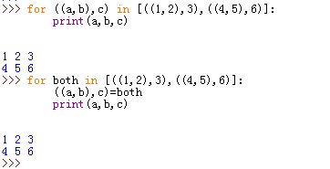

`for`语句通常比对应的`while`语句执行速度快
# 1 `for`语句格式：

```
	for target_var in iter_obj:
		statement1
	else:#可选
		statement2
```
* `for`和`else`缩进必须一致。
* `else`可选。`else`子句在控制权离开循环且未碰到`break`语句时执行。即在正常离开循环时执行（`break`是非正常离开循环）
* 在`for`子句中可以使用`break`、`continute`、`pass`语句
* `target_var`是赋值目标，`iter_obj`是任何可迭代对象。每一轮迭代时将迭代获得的值赋值给`target_var`，然后执行`statement1`

```
for i in range(2, 13, 4):
    print(i)

for i in {1, 2, 3}:
    print(i)

for i in 'hello':
    print(i)
```


>任何赋值目标在语法上均有效，即使是嵌套的结构也能自动解包：

```
for ((a,b),c) in [((1,2),3),((4,5),6)]:#自动解包
    print(a,b,c)
```


>当然你也可以手动解包：
>
```
for both in [((1,2),3),((4,5),6)]:#手动解包
    ((a,b),c)=both
    print(a,b,c)
```

  

3.`for`扫描文件时，直接使用文件对象迭代，每次迭代时读取一行，执行速度快，占用内存少：

```
for line in open('test.txt'):
	print(line)
```


# 2 For, Continue, Break , else

`break` can be used to immediately exit a loop, `continue` jumps to the next iteration
```
for i in range(5):  
    if i > 3:  
        break  
    if i == 1:  
        continue  
    print(i)
```

the extended definition of `for` allows an `else`, which is only triggered when no `break` was hit
```
for i in 'hello':
    if i == 'a':
        break
else:
    print('No e encountered!')
```


