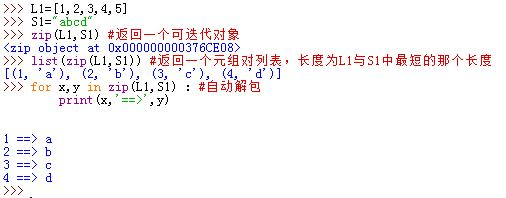
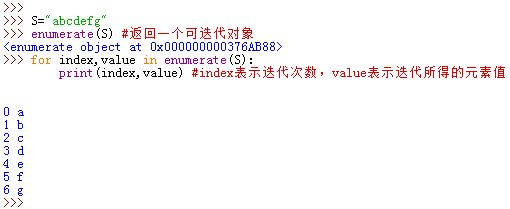

iterable types can be iterated, the manual way is to use `iter`, which creates an iterator that tracks the state of the iteration, and `next` to get the next element in sequence, when the sequence is over, a `StopIteration` will be raised

# 1 iter函数 
iterable types can be iterated, the manual way is to use `iter`, which creates an iterator that tracks the state of the iteration, and `next` to get the next element in sequence, when the sequence is over, a `StopIteration` will be raised


```
my_iter = iter([1, 2, 3])  
print(my_iter)  
print(next(my_iter))  
print(next(my_iter))  
print(next(my_iter))  
print(next(my_iter, 'no more elements here!'))

执行后返回 
<list_iterator object at 0x00000125DC423340>
1
2
3
```

# 2 `range()`返回一个迭代器对象。

5.Python3中，`range()`返回一个迭代器对象。用法为：`range(0,10,2)`，其中`0`为起始数，`10`为终止数（不包含），`2`为步长。默认步长为1，起始为0.
>Python2中，`range()`返回一个列表对象

* 要得到列表，用`list(range(0,10,2))`
* 通常`range()`用于`for`循环：

	```
	S="abcdefg"
	for i in range(0,len(S),2):
		print(S[i],end=" "）
	```
  它也等价于下列循环：

  ```
	S="abcdefg"
	for c in S[::2]
		print(c,end=" ")
  ```
  用range()优点是它并未复制字符串			
* 当我们遍历列表且对其进行修改时，要用到`range()`和`len()`组合。直接用`for`遍历列表不能修改列表，因为`for x in L：`遍历的是列表元素，不是列表中元素的位置。  
  

# 3 zip()函数返回一个迭代器对象。

6.Python3中，`zip()`函数返回一个迭代器对象。
>Python2中，`zip()`返回一个元组对的列表

* `list(zip(L1,L2))`创建一个列表，列表元素为元组对，元组对的第一个元素来自于`L1`，第二个元素来自于`L2`，列表长度为`L1`与`L2`的最小值
* `zip()`可以有两个以上的参数，且这些参数可以是任意的可迭代对象
* 可以在循环中用自动列表解包：

  ```
	for x,y,z in zip(iter_obj1,iter_obj2,iter_obj3):
		pass
  ```
  


# 4 `map()`函数生成一个可迭代对象

7.Python3中，`map()`函数生成一个可迭代对象，用法为：`map(func,iter_obj)`。每一次迭代则在迭代得到的元素上应用函数`func`。
>Python2中，`map()`执行的是另一种语意

  

8.`enumerate()`函数生成一个可迭代对象，用法为：`enumerate(iter_obj)`。每一次迭代生成一个`(index,value)`元组，`index`表示迭代次数，从0开始计数，`value`代表迭代获得的元素值。

 


