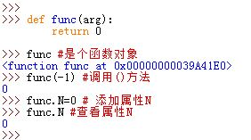

# 1 总览
1.Python的函数是由`def`语句编写。Python中，函数也是一种对象类型

* `def`是一个可执行语句。Python与行了`def`语句后函数对象才存在，之前该函数对象不存在
* Python运行到`def`语句时，它将会生成一个新的函数对象，并将该函数对象赋值给这个函数名。函数名成了这个函数对象的引用
* `lambda`表达式创建一个函数对象并返回它，但是它并没有绑定一个名字即它是匿名的没有函数名
* `return`语句将一个结果对象发送给调用者
* `yield`语句使得函数成为一个生成函数  
  

2.函数参数没有任何类型约束，返回类型也没有任何类型约束

# 2 Syntax 

3.Python函数定义语句：

```python
def func_name(arg1,arg2):
    statement


def function_a(parameter_1, parameter_2):
    '''This is a dummy function.
    '''
    if parameter_1 % parameter_2 == 0:
    return True
    return False


def func(x, y, coeff=1):  
    z = (x ** 2 + y ** 2) ** 0.5   
z *= coeff  
    return z, z ** 2  # multipe outputs possible (returned type is a tuple)

```

call function
```
func(y=4, coeff=2, x=3)
```


==• functions are objects==
• function defintions are statements

在执行完`def`语句时，Python创建一个函数对象并将它赋值给`func_name`变量。

* `return`语句是可选的。若无`return`，则默认自动返回`None`对象
* `def`语句可以出现在任何语句可以出现的地方，甚至是嵌套在其他语句中。
* 与C语言不同，Python函数在程序运行之前不需要全部定义。`def`在它定义的地方时才评估，而`def`的之内的代码在函数调用的时候才求值。  
  

4.函数仅仅是对象类型，函数名也仅仅是变量名，它们没有任何特殊之处。

* 函数对象有函数调用方法`operator ()`
* 函数对象允许任意的属性添加`func.attr=value`  
  

5.函数主体内的代码直到函数被调用时才运行。函数内的变量名在函数实际执行之前都不会解析。

# 3 书写规范

• LEGB rule:
    - Name references search following scopes:
        • Local: inside a function or class method
        • Enclosed: enclosing function, e.g., if a function is wrapped inside another
        function.
    • Global: uppermost level of the executing script itself
    • Built-in: special names that Python reserves for itself
• Assignments create or change local names by default
• Can force arguments to be global with global command


# 4 Fucntion docstrings

```python
def add_c(first, second):  
    """ Adds two complex numbers  
                Args:   
            first (tuple)  : the first complex number  
            second (tuple) : the second complex number                Returns:  
            complex : sum of the two complex numbers    """    assert type(first) == tuple, 'not a tuple'  
    assert type(second) == tuple, 'not a tuple'  
    re = first[0] + second[0]  
    im = first[1] + second[1]  
      
    return complex(re, im)  
  
add_c((2,3), (2,-1))


```


# 5 全局变量必须大写


```python
USER_LIST = [1,2,3]
def func():
    name = 'alex'
    USER_LIST.append(12)
    USER_list.append(name)
func()
print(USER_LIST)
```


# 6 可变参数


```

def generic_function(*arg, **kwarg):
    pass


• <parameters> may optionally end with
– *<name>
    • tuple of arbitrary extra positional arguments
    • converted to positional parameters) and/or
– **<name>
    • dict of arbitrary extra named arguments
    • Converted to keyword parameters


```


# 7 函数可做返回值

```python
def func():
    print(123)
def bar():
    return func
v = bar() 
v()
```

```python
name = 'oldboy'
def func():
    print(name)
    
def bar():
    return func

v = bar()

v()
```

```python
def bar():
    def inner():
        print(123)
    return inner
v = bar()
v()
```

```python
name = 'oldboy'
def bar():
    name = 'alex'
    def inner():
        print(name)
    return inner
v = bar()
v()
```

```python
name = 'oldboy'
def bar(name):
    def inner():
        print(name)
    return inner
v1 = bar('alex') # { name=alex, inner }  # 闭包，为函数创建一块区域（内部变量供自己使用），为他以后执行提供数据。
v2 = bar('eric') # { name=eric, inner }
v1()
v2()
```

练习题

```python
# 第一题
name = 'alex'
def base():
    print(name)

def func():
 	name = 'eric'
    base()

func() # {name=alex, }
    

# 第二题
name = 'alex'

def func():
 	name = 'eric'
    def base():
    	print(name)
    base()
func() # eric 

# 第三题
name = 'alex'

def func():
 	name = 'eric'
    def base():
    	print(name)
    return base 
base = func()
base() # eric
```

注意：函数在何时被谁创建？

面试题

```python
info = []

def func():
    print(item)
    
for item in range(10):
    info.append(func)

info[0]()
```

```python
info = []

def func(i):
    def inner():
        print(i)
	return inner

for item in range(10):
    info.append(func(item))

info[0]()
info[1]()
info[4]()
```


## 7.1 返回值

返回值若不指定，则默认返回：None

```python
def func(arg):
    # ....
    return 9 # 返回值为9 默认：return None

val = func('adsfadsf')
```

```python
# 1. 让用户输入一段字符串，计算字符串中有多少A字符的个数。有多少个就在文件a.txt中写多少个“李邵奇”。

def get_char_count(data):
    sum_counter = 0
    for i in data:
        if i == 'A':
            sum_counter += 1
            
	return sum_counter

def write_file(line):
    if len(line) == 0:
        return False  # 函数执行过程中，一旦遇到return，则停止函数的执行。
    with open('a.txt',mode='w',encoding='utf-8') as f:
        f.write(line)
	return True 


content = input('请输入:')
counter = get_char_count(content)
write_data = "李邵奇" * counter 
status = write_file(write_data)
if status:
    print('写入成功')
else:
    print('写入失败')
```

f分析函数执行的内存

```python
def func(name):
    def inner():
        print(name)
        return 123
    return inner 

v1 = func('alex')
v2 = func('eric')

v1()
v2()
```

闭包

```python
#不是闭包
def func(name):
    def inner():
        return 123
    return inner
#是闭包：封装值+内层函数需要使用
def func2(name):
    def inner():
        print(name)
        return 123
    return inner

        
```

以上总结

```python
# 情况1
def f1():
    pass 
f1()

# 情况2
def f2(a1):
    pass 
f2(123)

# 情况3
def f3():
    return 1 
v1 = f3()

# 情况4
def f4(a1,a2):
    # ... 
    return 999
v2 = f4(1,7)
```

练习题

```python
# 1. 写函数，计算一个列表中有多少个数字，打印： 列表中有%s个数字。
#    提示：type('x') == int 判断是否是数字。
"""
# 方式一：
def get_list_counter1(data_list):
    count = 0
    for item in data_list:
        if type(item) == int:
            count += 1
	msg = "列表中有%s个数字" %(count,)
    print(msg)
    
get_list_counter1([1,22,3,'alex',8])

# 方式二：
def get_list_counter2(data_list):
    count = 0
    for item in data_list:
        if type(item) == int:
            count += 1
	return count
    
v = get_list_counter1([1,22,3,'alex',8])
msg = "列表中有%s个数字" %(v,)
print(msg)
"""

# 2. 写函数，计算一个列表中偶数索引位置的数据构造成另外一个列表，并返回。
"""
# 方式一：
def get_data_list1(arg):
    v = arg[::2]
    return v

data = get_data_list1([11,22,33,44,55,66])

# 方式二：
def get_data_list2(arg):
    v = []
    for i in range(0,len(arg)):
    	if i % 2 == 0:
    		v.append(arg[i])
   	return v

data = get_data_list2([11,22,33,44,55,66])

"""

# 3. 读取文件，将文件的内容构造成指定格式的数据，并返回。
"""
a.log文件
    alex|123|18
    eric|uiuf|19
    ...
目标结构：
a.  ["alex|123|18","eric|uiuf|19"] 并返回。
b. [['alex','123','18'],['eric','uiuf','19']]
c. [
	{'name':'alex','pwd':'123','age':'18'},
	{'name':'eric','pwd':'uiuf','age':'19'},
]
"""
```
