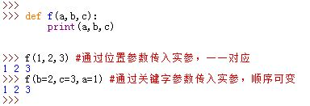
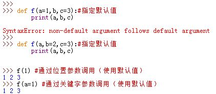
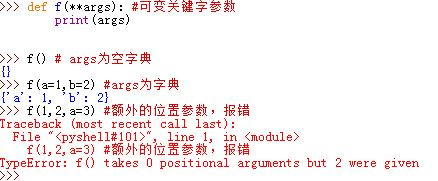
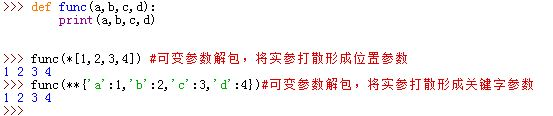
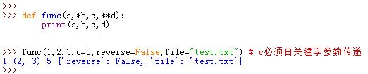
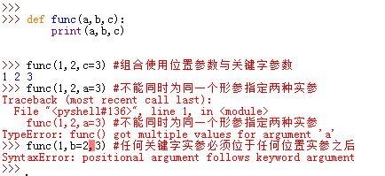
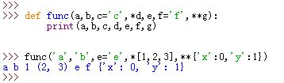

# 1 基本知识


- 基本参数知识
  - 任意个数
  - 任意类型
  - 调用或执行函数时，传参：位置>关键字参数（必须位置参数在前关键字参数在后）
  - 参数传参分为：位置传参和关键字传参
  - 定义函数：
    - def func(a)
    - def func(a,b=None),对于默认值，如果是可变类型，有坑》》》》》
    - def func(*args,**kwargs)

```python
def func(a1,a2,a3):
    print(a1,a2,a3)
    
func(1,"asdf",True)
```

形式参数和实际参数

```python
def get_list_first_data(aaa): # aaa叫形式参数(形参)
    v = [11,22,33,44]
    print(v[aaa])


get_list_first_data(1) # 2/2/1调用函数时传递叫：实际参数（实参）
get_list_first_data(2)
get_list_first_data(3)
get_list_first_data(0)
```

```python
# 假如：管理员/业务员/老板用的是同一个邮箱。
"""
def send_email(to):
	import smtplib
    from email.mime.text import MIMEText
    from email.utils import formataddr

    msg = MIMEText('导演，我想演男一号，你想怎么着都行。', 'plain', 'utf-8')
    msg['From'] = formataddr(["李邵奇", '15776556369@163.com'])
    msg['To'] = formataddr(["导演", to])
    msg['Subject'] = "情爱的导演"

    server = smtplib.SMTP("smtp.163.com", 25)
    server.login("15776556369@163.com", "qq1105400511")
    server.sendmail('15776556369@163.com', [to, ], msg.as_string())
    server.quit()
"""
def send_email(to):
    template = "要给%s发送邮件" %(to,)
    print(template)
 


user_input = input('请输入角色：')

if user_input == '管理员':
    send_email('xxxx@qq.com')
elif user_input == '业务员':
    send_email('xxxxo@qq.com')
elif user_input == '老板':
    send_email('xoxox@qq.com')
```

# 2 参数传递 

1.参数传递的性质：

* 参数的传递是通过自动将对象赋值给本地变量名来实现的（自动的隐式赋值）
	>被传递的参数对象本身并不会被拷贝
* 在函数内部的参数名赋值不会影响到实参对象，只是将变量名重新引用到另一个对象
* 若实参对象为可变对象，则在函数内原地修改参数对象会影响所有的指向该实参对象的引用
	>可变参数实参对象对函数来说，既可以作为输入也可以作为输出
	>
	>如果想限制对可变实参对象的修改，可以创建一个可变对象的拷贝作为参数；
	>或者直接转换成不可变对象作为参数


  

2.默认情况下，参数匹配是通过其位置进行匹配的，从左到右一一匹配。必须精确传递和函数签名中参数名一样多的实参。


# 3 不同的参数类型 


- 位置传参（调用函数并传入函数）【执行】

```python
def func(a1,a2):
    print(a1,a2)
    
func(1,3)
```

- 关键字参数【执行】

```python
def func(a1, a2):
    print(a1, a2)

func(a2=99,a1=2)

# 关键字传参数和位置传参可以混合使用（位置传入的参数 > 关键字参数在后 = 总参数个数）
def func1(a1, a2, a3):
    print(a1, a2, a3)

# func(1, 2, a3=9)
# func(1, a2=2, a3=9)
# func(a1=1, a2=2, a3=9)
# func(a1=1, 2,3) # 错误
```

- 默认参数【定义】

```python
def func(a1,a2,a3=9,a4=10):
    print(a1,a2,a3,a4)

func(11,22)
func(11,22,10)
func(11,22,10,100)
func(11,22,10,a4=100)
func(11,22,a3=10,a4=100)
func(11,a2=22,a3=10,a4=100)
func(a1=11,a2=22,a3=10,a4=100)
```

- 万能参数（打散）
  - *args
    - 可以接受任意个数的位置参数，并将参数转换成元组。
      - 调用函数无*

      ```python
      def func(*args):
          print(args)
      
      func(1,2,3,4)
      ```

      - 调用函数有*

      ```python
      def func(*args):
          print(args)
      
      func(*(1,2,3,4))
      func(*[1,2,3,4])#将*后所有元素逐个调出后形成新的元组
      ```

  - 只能用位置传参

    ```python
    def func(*args):
        print(args)
    
    # func(1)
    # func(1,2)
    func(1,2) # args=(1, 2)
    func((11,22,33,44,55)) # args=((11,22,33,44,55),)
    func(*(11,22,33,44,55)) # args=(11,22,33,44,55)
    ```

- **kwargs
  - 可以接受任意个数的关键字参数，并将参数转换成字典。
    - 调用函数无**

    ```python
    def func(**kwargs):
        print(kwargs)
    func(k1=1,k2='alex') #{'k1': 1, 'k2': 'alex'}
    ```

    ```python
    def func(**kwargs)
    	print(kwargs)
    print(**{'k1':'v2','k2':'v2'})#{'k1'='v2','k2'='v2'}
    ```

- 综合应用：无敌 + 无敌=》真无敌

  ```python
  def func(*args,**kwargs):
      print(args,kwargs)
  
  # func(1,2,3,4,5,k1=2,k5=9,k19=999)
  func(*[1,2,3],k1=2,k5=9,k19=999)
  func(*[1,2,3],**{'k1':1,'k2':3})
  func(111,222,*[1,2,3],k11='alex',**{'k1':1,'k2':3})
  ```

- 参数的相关重点：
  - 定义函数

  ```python
  def func1(a1,a2):
      pass 
  
  def func2(a1,a2=None):
      pass 
  
  def func3(*args,**kwargs):
      pass 
  
  ```

  - 调用函数
  位置参数》关键字参数


## 3.1 位置参数_positional_parameters

```
def f(a,b,c)
    print(a,b,c)

f(1,2,3) 通过位置参数传入实参
1,2,3,

```

## 3.2 关键字参数_keyword_parameters

– named parameter == keyword arguments == kwargs


3.关键字参数：允许通过变量名进行匹配，而不是通过位置。其中关键字顺序可以任意。   
  

## 3.3 默认参数_Default_parameters

4.默认参数：函数定义时，可以为参数设定默认值，这样允许调用时传递较少的参数。
>对于默认实参，可以不用给它传入实参

Default parameters:
– evaluated only once, when def executes

* 默认实参后面不能跟随非默认实参。如果出现这种情况则报语法错误。  
 


```

def student(firstname, lastname ='Mueller', program ='Bachelor'):
    print(f'{firstname} {lastname} studies in {program} Program')

student(firstname ='Hans') # 1 keyword argument
student(firstname ='Klaus', program ='Master) # 2 kwargs
student(lastname ='Schmidt', firstname ='Heiner') # 2 kwargs, diff order

```

## 3.4 可变参数_`*args_**args`

5.可变位置参数：
* 函数能用特定的参数（以`*`开头），收集任意多的额外位置参数，将收集到的位置相关的参数到一个新元组中。
	>若出现了额外的关键字参数，则报错

    
* 可变关键字参数: 函数能用特定的参数（以`**`开头），收集任意多的额外关键字参数，将收集关键字相关的参数到一个新字典中。
	>若出现了额外的位置参数，则报错

    

6.可变参数解包：

* 调用者可以用`*`语法将实参（如元组、列表、`set`）打散，形成位置参数
* 调用者可以用`**`语法将字典实参打散，形成关键字参数  
>这里的`*`和`**`均是在函数调用中出现，而不是在函数定义中出现

    

7.`keyword-only`参数：在Python3中，它是一种命名参数，出现在`*`参数之后，在`**`参数之前。所有的`keyword-only`参数必须使用关键字语法传递。
>如果不这么做，则没有办法传递该实参

  


# 4 函数调用

8.函数调用时，位置参数与关键字参数可以组合

* 不能为同一个形参同时指定位置实参与关键字实参
* 任何关键字实参必须位于任何位置实参之后  
  

# 5 参数顺序

9.函数定义时的参数类型顺序：

```
def func(a,b,c='c',*d,e,f='f',**g):
	pass
# a,b:为一般参数
# c:指定了默认实参
# d:为可变位置参数
# e,f:为 keyword-only参数，其中f指定了默认参数
# g:为可变关键字参数
```
* 调用时必须先赋值形参`c`，才能进入`d`。无法跳过`c`去赋值`d`
* `e,f,g`调用时必须都是关键字实参

10.函数调用时实参类型顺序：

```
func('a','b',e='e',*seq,**dic)
#seq是一个序列，它解包之后优先覆盖c，剩下的再收集成元组传给d
#dic是一个字典，它解包之后优先考虑e,f，剩下的在收集成字典传递给g
#e='e'这个关键字实参也可以位于'b'之后的任何位置
#关键字实参必须位于位置实参之后
```
  

* 通过位置分配位置参数
* 通过匹配变量名在分配关键字参数
* 额外的非关键字参数分配到 `d`引用的元组中
* 额外的关键字参数分配到`g`引用的字典中
* 默认值分配给剩下未赋值的参数

Python最后检测确保每一个参数只传入了一个值

11.定义函数时，形参列表中`*`可以单独出现。此时函数并不表示接受一个可变长度的实参列表，而是表示`*`后面的所有实参必须作为关键字实参传入：
>并不能用`**`像`*`一样单独出现在函数定义中。 
 
  

