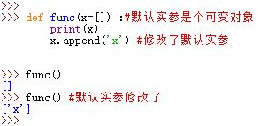

<!--
    作者：华校专
    email: huaxz1986@163.com
**  本文档可用于个人学习目的，不得用于商业目的  **
-->
# 1 函数的高级特性
1.在Python中，函数的递归通常比`for`循环要慢而且空间消耗大，但是递归的优点是可以遍历任意形状的结构。

2.Python函数是对象，自身存储在内存块中，它可以自由地传递与引用。

* 函数对象支持一个特殊操作：有括号`()`以及参数列表执行调用行为
* 我们可以通用地检查函数对象的某些属性：如`.__name__`属性、`.__code__`属性
* 可以向函数对象附加任意的用户自定义属性，如`func.count=0`。这样的属性可以用来直接将状态信息附加到函数对象上
* Python3中，可以给函数对象附加注解。注解不作任何事情，而且注解是可选的，它被附加在函数对象的`.__annotaions__`属性中。注解的格式为：

  ```
  def func(a:'a',b:(1,10),c:float) -> int:
	return a+b+c  
  ```
	* 注解分两种：参数注解紧随形参名字的冒号`:`之后；返回值注解紧随参数列表的`->`之后
	* 当出现注解时，Python将它们收集到字典中并附加到`.__annotations__`属性中
	* 注解可以与默认值同时出现，此时形参形式为`c:float=4.0`
	* 注解只有在`def`中有效，在`lambda`表达式中无效
	
  


6.Python是静态检测局部变量的：

  ```
  x='global'
  def func():
	print(x)
	x=3
  ```
编译时，Python看到了赋值语句`x=3`，因此决定了在函数内的任何地方，`x`都是本地变量。但是`print(x)`时赋值语句并未发生，此时即使全局中有全局的`x`，也会报错。

* 任何在函数体内的赋值、`import`，嵌套`def`，嵌套类等都受这种行为影响
  >即只要有局部变量的定义，无论在函数内哪个地方，其作用域都是本局部作用域全域

  

7.Python在内部会将每个默认实参保存成对应的对象，附加在这个函数本身。在不同的函数调用期间，这些默认实参会保存同一个对象。因此对于可变对象作为默认实参注意保持警惕。  
 


# 2 Lambda

• Small, anonymous functions
• Restricted to a single expression

3.匿名函数：`lambda`表达式  
`lambda`表达式创建了一个函数对象，它返回该函数对象而不是将其赋值给一个变量名。  
创建`lambda`表达式的语法为：

```
	lambda arg1,arg2,...argN: expression using args
```
* `lambda`表达式是个表达式而不是语句，它能出现在不允许`def`出现的某些地方，比如参数中
* `lambda`表达式返回一个值（一个新的函数对象），可以将它手动赋值给一个变量名
  >`def`总是将一个新的函数对象自动赋值给一个变量名（函数名）

* `lambda`的主体是一个单一的表达式，而不是一个代码块。因此`lambda`通常比`def`功能简单
  >`lambda`内部甚至不能使用`if`语句
* `lambda`主体中表达式的值就是调用时的返回值，不需要显式`return`
* `lambda`表达式也能使用默认实参
* `lambda`表达式主体中遵循`def`内一样的名字作用域查找法则  
  

4.出于可读性要求，最好不要嵌套使用`lambda`表达式
5.`lambda`表达式应用于`map()`、`filter()`、`reduce()`等函数中较多


```python
#三元运算，为了解决简单的if else的情况，如：
if a == b:
    a = 135
else:
    a = 0
a 135 if a ==b else 0
# lambda表达式，为了解决简单函数情况，如：
def func(a1,a2):
    return a1 + 100
func = lambda a1,a2: a1+100
```

```python
func1 = lambda : 100
func2 = lambda x1: x1*10
func3 = lambda *args,**kwargs: len(args)+len(kwargs)
DATA = 100
func4 = lambda a1: a1 +DATA
v = func4(1)
print(v)
DATA = 100
def func():
    DATA = 666
    func4 = lambda a1: a1 +DATA
    v = func4(1)
    print(v)
func()
func5 = lambda n1,n2: n1 if n1 > n2 else n2
v = func(111,6)
print(v)
```

练习题

```python
#练习题1
USER_LIST = []
def func(x):
    v = USER_LIST.append(x)
    return v  #None
result = func('alex')
print(result)
#练习题2
def func0(x):
    v = x.strip()
    return v 

result = func0(' alex ')
print(result)  #alex
#练习题3
USER_LIST = []
func1 = lambda x: USER_LIST.append(x)

v1 = func1('alex')
print(v1) #None
print(USER_LIST) #['alex']
#练习题4
func1 = lambda x: x.split('l')

v1 = func1('alex')
print(v1) #['a','ex']
#练习题5
func_list = [lambda x:x.strip(), lambda y:y+199,lambda x,y:x+y]

v1 = func_list[0]('alex ')
print(v1) #alex

v2 = func_list[1](100)
print(v2) #299

v3 = func_list[2](1,2)
print(v3) #3
```


# 3 装饰器

- 装饰器：在不改变原函数内部代码的基础上，在函数执行之前和之后自动执行某个功能。（他们是修改其他函数的功能的函数。有助于让我们的代码更pythonic（python范儿））

- 应用场景：想要为函数扩展功能时，可以选择用装饰器。
- 装饰器编写格式(双层嵌套)：

```python
def 外层函数（参数）:
    def 内层参数(*args,**kwargs):
        return 参数(*args,**kwargs)
    return 内层函数
```

传参时候加*args，**kwargs由于每次传参时候参数格式不同，减少定义函数的繁琐。

- 装饰器应用格式（@外层函数）：

```python
@外层函数
def index():
    pass
index()
```

```python
def x(func):
    def inner(*args,**kwargs):
        return func(*args,**kwargs)
    return inner
@x
def index(a1):
    pass

```

```python
def x(func):
    def inner(a1,a2):
        return func(a1,a2)
    return inner 

@x
def index(a1,a2):
	pass

# index = inner
index(1,2)

# ################################### 参数统一的目的是为了给原来的index函数传参
def x(func):
    def inner(a1,a2):
        return func()
    return inner 

@x
def index():
	pass
# func = 原来的index函数u
# index = inner
index(1,2)
```


```python
#计算函数执行时间
import time
def wrapper(func):
    def inner():
        start_time =time.time()
        v = func()
        end_time = time.time()
        print(end_time-start_time)
        return v
    return inner
@wrapper
def func1():
    time.sleep(2)
    print('123')
@wrapper
def func2():
    time.sleep(1)
    print('1234')
def func3():
    for i in range(10)
    print('12345')
func1()
        
```

- 带参数的装饰器

```python
#第一步：执行 ret = xxx(index)
#第二部：将返回值赋值给index = ret
@xxx
def index():
    pass
#第一步：执行v1 = uuu(9)
#第二部：ret = v1(index)
#第三部：index = ret
@uuu(9)
def index():
    pass

```

```python
# ################## 普通装饰器 #####################
def wrapper(func):
    def inner(*args,**kwargs):
        print('调用原函数之前')
        data = func(*args,**kwargs) # 执行原函数并获取返回值
        print('调用员函数之后')
        return data
    return inner 

@wrapper
def index():
    pass

# ################## 带参数装饰器 #####################
def x(counter):
    def wrapper(func):
        def inner(*args,**kwargs):
            data = func(*args,**kwargs) # 执行原函数并获取返回值
            return data
        return inner 
	return wrapper 

@x(9)
def index():
    pass
```

练习题

```python
# 写一个带参数的装饰器，实现：参数是多少，被装饰的函数就要执行多少次，把每次结果添加到列表中，最终返回列表。
def xxx(counter):
    print('x函数')
    def wrapper(func):
        print('wrapper函数')
        def inner(*args,**kwargs):
            v = []
            for i in range(counter):
                data = func(*args,**kwargs) # 执行原函数并获取返回值
                v.append(data)
            return v
        return inner
    return wrapper

@xxx(5)
def index():
    return 8

v = index()
print(v)

# 写一个带参数的装饰器，实现：参数是多少，被装饰的函数就要执行多少次，并返回最后一次执行的结果【面试题】
def xxx(counter):
    print('x函数')
    def wrapper(func):
        print('wrapper函数')
        def inner(*args,**kwargs):
            for i in range(counter):
                data = func(*args,**kwargs) # 执行原函数并获取返回值
            return data
        return inner
    return wrapper

@xxx(5)
def index():
    return 8

v = index()
print(v)
# 写一个带参数的装饰器，实现：参数是多少，被装饰的函数就要执行多少次，并返回执行结果中最大的值。
def xxx(counter):
    print('x函数')
    def wrapper(func):
        print('wrapper函数')
        def inner(*args,**kwargs):
            value = 0
            for i in range(counter):
                data = func(*args,**kwargs) # 执行原函数并获取返回值
                if data > value:
                    value = data 
            return value
        return inner
    return wrapper

@xxx(5)
def index():
    return 8

v = index()
print(v)
```

```python
def x(counter):
    print('x函数')
    def wrapper(func):
        print('wrapper函数')
        def inner(*args,**kwargs):
            if counter:
                return 123
            return func(*args,**kwargs)
        return inner
    return wrapper

@x(True)
def fun990():
    pass

@x(False)
def func10():
    pass
```


