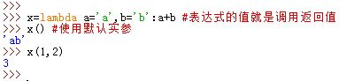

# 1 Lambda

• Small, anonymous functions
• Restricted to a single expression


匿名函数：`lambda`表达式  
`lambda`表达式创建了一个函数对象，它返回该函数对象而不是将其赋值给一个变量名。  
创建`lambda`表达式的语法为：

```
	lambda arg1,arg2,...argN: expression using args
```
* `lambda`表达式是个表达式而不是语句，它能出现在不允许`def`出现的某些地方，比如参数中
* `lambda`表达式返回一个值（一个新的函数对象），可以将它手动赋值给一个变量名
  >`def`总是将一个新的函数对象自动赋值给一个变量名（函数名）

* `lambda`的主体是一个单一的表达式，而不是一个代码块。因此`lambda`通常比`def`功能简单
  >`lambda`内部甚至不能使用`if`语句
* `lambda`主体中表达式的值就是调用时的返回值，不需要显式`return`
* `lambda`表达式也能使用默认实参
* `lambda`表达式主体中遵循`def`内一样的名字作用域查找法则  
  

4.出于可读性要求，最好不要嵌套使用`lambda`表达式
5.`lambda`表达式应用于`map()`、`filter()`、`reduce()`等函数中较多


`lambda` can be used to define functions inside expressions (inline)

```python
(lambda x, y, coeff=1: coeff * (x ** 2 + y ** 2) ** 0.5) (3, 4)
```


```python
def f(x, y, coeff=1):
    return coeff * (x ** 2 + y ** 2) ** 0.5

f = lambda x, y, coeff=1: coeff * (x ** 2 + y ** 2) ** 0.5
f(3, 4)
```


Functions and lambda expressions behave like any other variable or function

```
my_function = f
my_function(3, 4, 5)
```


you can pass functions to other functions
```
def square_fn(x: float):
    return x ** 2

def do_twice(func, x):
    return func(func(x))

do_twice(square_fn, 2)

do_twice(lambda x : x**2, 2)
```


```python
#三元运算，为了解决简单的if else的情况，如：
if a == b:
    a = 135
else:
    a = 0
a 135 if a ==b else 0
# lambda表达式，为了解决简单函数情况，如：
def func(a1,a2):
    return a1 + 100
func = lambda a1,a2: a1+100
```

```python
func1 = lambda : 100
func2 = lambda x1: x1*10
func3 = lambda *args,**kwargs: len(args)+len(kwargs)
DATA = 100
func4 = lambda a1: a1 +DATA
v = func4(1)
print(v)
DATA = 100
def func():
    DATA = 666
    func4 = lambda a1: a1 +DATA
    v = func4(1)
    print(v)
func()
func5 = lambda n1,n2: n1 if n1 > n2 else n2
v = func(111,6)
print(v)
```

练习题

```python
#练习题1
USER_LIST = []
def func(x):
    v = USER_LIST.append(x)
    return v  #None
result = func('alex')
print(result)
#练习题2
def func0(x):
    v = x.strip()
    return v 

result = func0(' alex ')
print(result)  #alex
#练习题3
USER_LIST = []
func1 = lambda x: USER_LIST.append(x)

v1 = func1('alex')
print(v1) #None
print(USER_LIST) #['alex']
#练习题4
func1 = lambda x: x.split('l')

v1 = func1('alex')
print(v1) #['a','ex']
#练习题5
func_list = [lambda x:x.strip(), lambda y:y+199,lambda x,y:x+y]

v1 = func_list[0]('alex ')
print(v1) #alex

v2 = func_list[1](100)
print(v2) #299

v3 = func_list[2](1,2)
print(v3) #3
```


