# 1 模块的基本知识

- 什么是模块：写好了的对程序员可以提供某方面功能的py文件。
- 什么是包：存储了多个py文件的文件夹。（如果导入的一个包，这个包里的模块默认是不可用的，导入一个包相当于执行‘__ init__' .py文件内容。）
- 模块的分类：内置模块、第三方模块、自定义模块。
- 内置模块，python内部提供的功能。

```python
import sys
print(sys.argv) #http://www.cnblogs.com/aland-1415/p/6613449.html#top

Insert the module in the current symbol table with
rename
from random import randint as r_int
print r_int(1, 10)
import randint as r
print r.randint(1, 10)

```

- 第三方模块，下载/安装/使用。
  - 源码安装：
    - 下载源码包：压缩文件。
    - 解压文件
    - 打开cmd窗口，并进入此目录：cd C:\Python36\Lib\site-packages
    - 执行 python36 setup.py build
    - 执行：python36 setup.py install
  - 安装路径：C:\Python36\Lib\site-packages
  - 了解的第三方模块：
    - xlrd
    - request

```python
#把pip.exe所在的目录添加到环境变量中。
pip install 要安装的模块名称 #pip install
```

- 自定义模块
  - xxx.py
  - py文件夹
  - 文件夹''' _ _init_ _.py '''

```python
def f1():
    print('f1')
def f2():
    print('f2')
```

- x1.py

```python
#调用自定义模块中的功能
import xxx
xxx.f1()
xxx.f2()
```

- 运行

```python
python x1.py
```


# 2 模块的基本


本质上是一个python程序, 以.py 作为文件的后缀, 任何py文件都可以作为一个模块 
块，可以有效地避免命名空间的冲突，可以隐藏代码细节让我们专注于高层的逻辑，还可以将一个较大的程序分为多个文件，提升代码的可维护性和可重用性。 

就是 vec_ops.py 中定义了好多 functions,  你想在其他的 python script 中  vec_ops.py 中定义的functions

1.从实际角度，模块对应Python程序文件（或者用外部语言如C|C#编写的扩展）。从逻辑上看，模块是最高级别的程序组织单元
* 每个Python程序文件都是一个模块
* 模块导入另一个模块后，可以直接使用被导模块定义的全局变量名  
  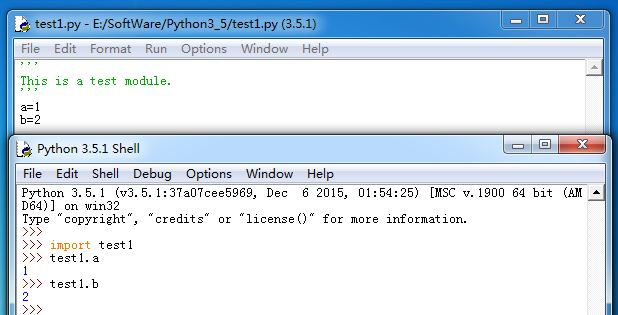

2.Python程序是作为一个主体的、顶层文件来构造，配合零个或者多个支持的模块文件
3.Python自带了很多模块，称为标准链接库。他们提供了很多常用功能

# 3 模块高级用法

1.Python模块会默认导出其模块文件顶层所赋值的所有变量名，不存在私有变量名。所有的私有数据更像是一个约定，而不是语法约束：

* 下划线开始的变量名`_x`：`from *`导入该模块时，这类变量名不会被复制出去  
  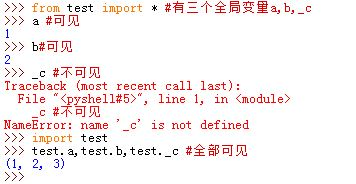
* 模块文件顶层的变量名列表`__all__`：它是一个变量名的字符串列表。`from *`语句只会把列在`__all__`列表中的这些变量名复制出来。  
  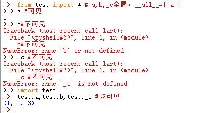
>Python会首先查找模块内的`__all__`列表；否该列表未定义，则`from *`会复制那些非
>`_`开头的所有变量名  
>所有这些隐藏变量名的方法都可以通过模块的属性直接绕开

2.当文件是以顶层程序文件执行时，该模块的`__name__`属性会设为字符串`"__main__"`。若文件被导入，则`__name__`属性就成为文件名去掉后缀的名字

* 模块可以检测自己的`__name__`属性，以确定它是在执行还是被导入
* 使用`__name__`最常见的是用于自我测试代码：在文件末尾添加测试部分：
  
  ```
	if __name__=='__main__':
	 	#pass
  ```

• Modules can import other modules
```
__file__
__name__

# executed only if the file is not imported
if __name__ == '__main__'
```


3.在程序中修改`sys.path`内置列表，会对修改点之后的所有导入产生影响。因为所有导入都使用同一个`sys.path`列表

# 4 import modes 

```python 
# Insert the module in the current symbol table
import random
print(random.randint(1, 10))

#Inserts the functions etc. direct into the symbol table
from my_own_function_file import my_first_function, MyClass
from my_function_file import *
my_first_function(2,3)


```

# 5 Import search order 调用顺序

– Builtin modules
    == module written in C and compiled into the Python interpreter
– Path defined in sys.path
    • Current directory (containing the input script)
    • PYTHONPATH (Environment Variable)
    • Installation dependent settings
    • Customization
        – sys.path.append('/tpr/python/lib')


# 6 模块的调用

## 6.1 理论 

4.导入模块用`import`。其通用格式为`import modname`。其中`modname`为模块名，它没有文件后缀名`.py`，也没有文件路径名。  
导入并非是C语言的`#include`。导入其实是运行时的运算。程序首次导入一个模块时，执行三个步骤：

* 找到模块文件
* 编译成字节码（即`.pyc`文件）。如果字节码文件不存在或者字节码文件比源代码文件旧，
  则执行该步骤。否则跳过该步骤直接加载字节码
* 执行模块代码来创建其定义的对象

在这之后导入相同模块时，会跳过这三步而只是提取内存中已经加载的模块对象。
> 从内部看，Python将加载的模块存储到一个名为`sys.modules`的字典中，键就是模块名字符串。在每次导入模块开始时都检查这个字典，若模块不存在则执行上述三步。

 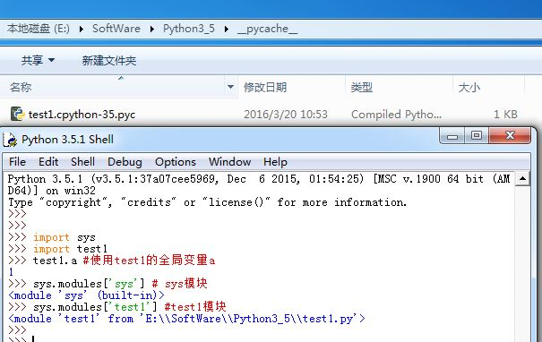

5.当文件`import`时，会进行编译产生字节码文件`.pyc`，因此只有被导入文件才会在机器上留下`.pyc`文件。顶层文件的字节码在内部使用后就丢弃了，并未保留下来。
> 顶层文件通常设计成直接执行，而不是被导入的

6.Python模块文件搜索路径：

* 程序主目录
* 环境变量`PYTHONPATH`指定的目录
* 标准链接库目录（这个一般不动它）
* 任何`.pth`文件的内容，其中`.path`文件在前三者中查找到的。
  >Python会将每个`.pth`文件的每行目录从头到尾添加到`sys.path`列表的最后
  >（在此期间Python会过滤`.pth`文件中目录列表中重复的和不存在的目录)

以上四者优先级从高到低。这四部分组合起来就是`sys.path`列表的内容  
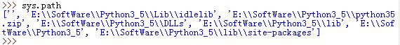

7.`sys.path`列表就是模块的搜索路径。Python在程序启动时配置它，自动将顶级文件的主目录（或代表当前工作目录的一个空字符串）、环境变量`PYTHONPATH`指定的目录、标准库目录以及已创建的任何`.pth`文件的内容合并

* 模块搜索时，从左到右搜索`sys.path`，直到第一次找到要`import`的文件

8.`import`模块时，省略文件后缀名因为模块可能是`.py`文件、`.pyc`文件，或者扩展的C模块等。

9.创建模块：任何保存为`.py`文件的文件均被自动认为是Python模块。所有该模块顶层指定的变量均为模块属性。
> 可执行但不会被导入的顶层文件不必保存为.py文件

* 因为模块名在Python中会变成变量名，因此模块名必须遵守普通变量名的命名规则

## 6.2 `import`和`from`语句


10.`import`和`from`语句：

* `import`使得一个变量名引用整个模块对象：`import module1`
* `from`将一个变量名赋值给另一个模块中同名的对象：`from module1 import printer`。在本模块内`printer`名字引用了`module1.printer`对象
* `from *`语句将多个变量名赋值给了另一个模块中同名的对象：`from module1 import *`。在本模块内，所有`module1.name`对象赋值给了`name`变量名  
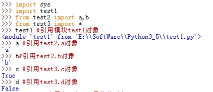

有几点需要注意：

* `from`语句首先与`import`一样导入模块文件。但它多了一步：定义一个或多个变量名指向被导入模块中的同名对象
* `from`与`import`都是隐性赋值语句
* `from`与`import`对本模块的命名空间影响不同：`from`会在命名空间中引入`from import`的变量名而不会引入模块名，
  `import`会在命名空间中引入模块名    
  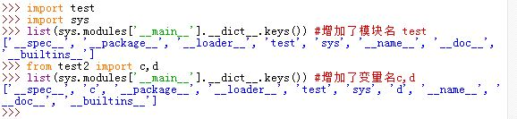
* `from`、`import`与`def`一样是可执行语句，而不是编译器声明
* 当出现交叉导入时，可以使用`import` ，用`from`可能出现死锁的问题：`modA`需要`from import` `modB`的变量
  ，而此时`modB`也在`from import` `modA`的变量 
  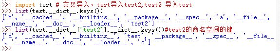

11.要修改被导入的全局变量，必须用`import`，然后用模块名的属性修改它；不能用以`from`隐式创建的变量名来修改。  
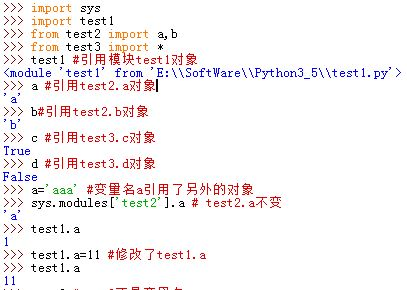

12.用`from`时，被导入模块对象并没有赋值给变量名：
* `import module1`:`module1`既是模块名，也是一个变量名（引用被导入模块对象）
* `from module1 import func`：`module1`仅仅是模块名，而不是变量名  
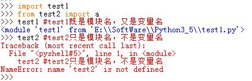

13.`from`语句陷阱：
* `from`语句可能破坏命名空间
* `from`后跟随`reload`时，`from`导入的变量名还是原始的对象


```python
import time
v = time.time()#获取当前时间
time.sleep(n)#(睡眠n秒)
```

示例一

```python
# xxx.py

#!/usr/bin/env python
# -*- coding:utf-8 -*-

def show():
    print('我司里种种')

def func():
    pass

print(456)
```

```python
# 导入模块，加载此模块中所有的值到内存
import xxx
print(123)
func()#因为函数已加载到内存，先执行模块的全局在执行本域内
```

```python
# 导入模块,多种导入方式
from xxx import func,show
from xxx import func
from xxx import show
from xxx import *
func()
```

导入模块：

- import
  - import 模块1                                    模块1.函数()
  - import 模块1.模块2.模块3                模块1.模块2.模块3.函数()
- from 模块 import xxx
  - from 模块.模块 import 函数		函数()
  - from 模块.模块 import 函数 as  f         f()
  - from 模块.模块 import *                      函数1()    函数2()
  - from 模块 import  模块                        模块.函数()
  - from 模块 import  模块  as m              m.函数()

示例二：

文件夹下的py文件调取

```python
xxx#文件夹
	-a.py
    -b.py
    -c.py
bao.py
```

```python
import xxx.a
xxx.a.func()
```

```python
from xxx import a
a.func()
```

```python
from xxx.a import func
func()
```

小结：

- 模块和要执行的py文件在同一目录且需要模块中的很多功能时，推荐用：import模块。
- 其他推荐：from模块import模块 模块.函数（）
- 其他推荐：from模块.模块 import函数 函数（）

注意：sys.path的作用是什么


4.`import`和`from`可以使用`as`扩展，通过这种方法解决变量名冲突：

```
  import modname as name1
  from modname import attr as name2
```
在使用`as`扩展之后，必须用`name1`、`name2`访问，而不能用`modname`或者`attr`，因为它们事实上被`del`掉了  
 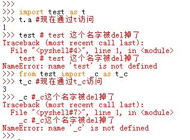

5.在`import`与`from`时有个问题，即必须编写变量名，而无法通过字符串指定。有两种方法：

* 使用`exec: `exec("import "+modname_string)`	
* 使用内置的`__import__`函数：`__import__(modname_string)`，它返回一个模块对象
	> 这种方法速度较快

  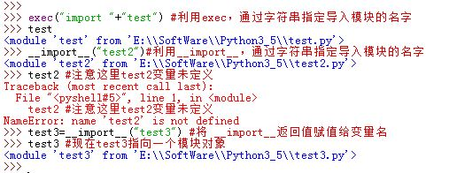


# 7 定义模块

定义模块时可以把一个py文件或一个文件夹（包）当做一个模块，以便于以后其他py文件的调用。

对于包的定义：

- py2:文件夹中必须有_ _init_ _.py。
- py3:不需要_ _init_ _.py。
- 建议以后写代码时都要加上此文件。


# 8 项目文件

- bin开始文件夹 start

  ```python
  import os
  import sys
  base_path = os.path.dirname(os.path.dirname(__file__))
  sys.path.append(base_path)
  from src improt core
  ```

- conf配置文件夹 settings

- src 业务逻辑

  ```python
  student.py
  from src import sore
  core.py
  from conf import settings
  ```

- db数据文件
- lib扩展模块
- log日志文件

# 9 模块的命名空间 `.__dict__`或者`dir(modname)`

14.模块的命名空间可以通过属性`.__dict__`或者`dir(modname)`来获取

* 在Python内部，模块命名空间是作为字典对象存储的
* 我们在模块文件中赋值的变量名在Python内部称为命名空间字典的键  
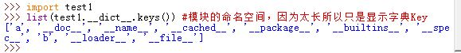

15.一个模块内无法使用其他模块内的变量，除非明确地进行了导入操作

• dir()
    – Currently defined names (variables, modules, functions, etc.)
• dir(__builtins__)
    – Buit-in names
• dir(moduleName)
    – Names defined in a module
# 10 重载函数`reload()`


17.重载函数`reload()`：它会强制已加载的模块代码重新载入并重新执行

* `reload`函数可以修改程序的一部分，而无需停止整个程序
* `reload`函数只能用于Python编写的模块，而无法用于其它语言编写的扩展模块    
  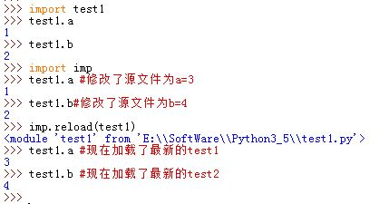

18.`reload()`与`import`和`from`的差异：

* `reload`是Python内置函数，返回值为模块对象，`import`与`from`是语句
* 传递给`reload`是已经存在的模块对象，而不是一个变量名
* `reload`在Python3.0中位于`imp`标准库模块中，必须首先导入才可用。

19.`reload`工作细节：

* `reload`并不会删除并重建模块对象，它只是修改模块对象。即原来模块的每个属性对象内存空间还在，所有旧的引用指向他们，新的引用指向修改后的属性对象内存空间
* `reload`会在模块当前命名空间内执行模块文件的新代码
* `reload`会影响所有使用`import`读取了模块的用户，用户会发现模块的属性已变
* `reload`只会对以后使用`from`的代码造成影响，之前用`from`的代码并不受影响。之前的名字还可用，且引用的是旧对象  
  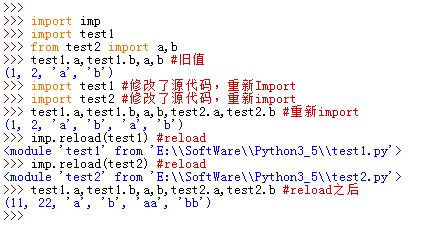


6.`reload(modname)`只会重载模块`modname`，而对于模块`modname`文件中`import`的模块，`reload`函数不会自动加载。  
要想`reload`模块`A`以及`A` `import`的所有模块，可以手工递归扫描`A`模块的`__dict__`属性，并检查每一项的`type`以找到所有`import`的模块然后`reload`这些模块


# 11 可以通过下列几种办法获取模块的某个属性：

* `modname.attr`：直接通过模块对象访问
* `modname.__dict__['attr']`：通过模块对象的`__dict__`属性字典访问
* `sys.modules['modname'].name`：通过Python的`sys.modules`获取模块对象来访问
* `getattr(modname,'attr')`：通过模块对象的`.getattr()`方法来访问