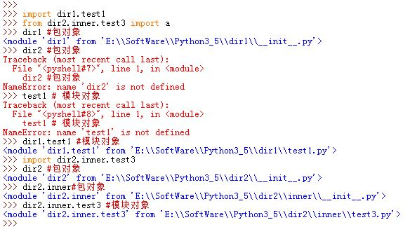
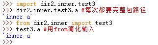
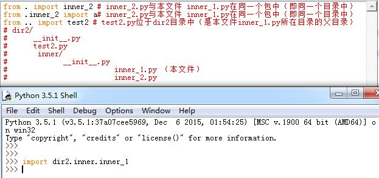
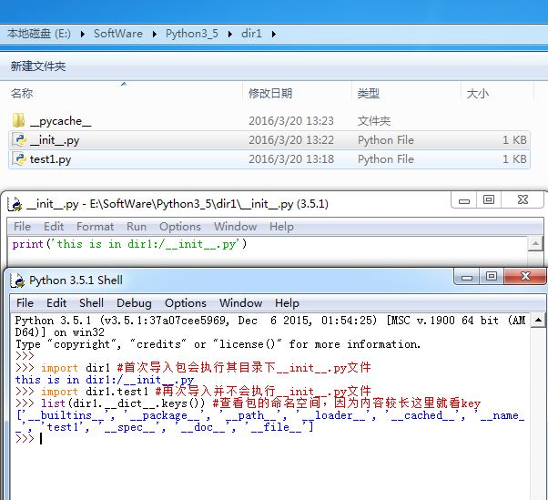
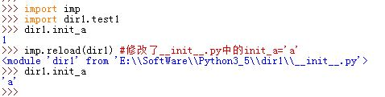

# 1 Package基础

Python organizes modules using `packages`, which are hierarchical collections of modules.

a package is a module containing other modules (& possibly sub-packages...)
–` __init__.py`: initialization procedure and defines all variables, functions, classes, which are / can be imported
– subpackages are subdirs with` __init__.py`


# 2 Syntax

1.`import`时，也可以指定目录。目录称为包，这类的导入称为包导入。

* 包导入是将计算机上的目录变成另一个Python命名空间，它的属性对应于目录中包含的子目录和模块文件
* 包导入的语法：

  ```
	import dir1.dir2.modname
	from dir1.dir2.modname import x
  ```

  

# 3 import and form 的使用 

3.包与`import`使用时输入字数较长，每次使用时需要输入完整包路径。可以用from语句来避免  
  

4.包相对导入：`from`语句可以用`.`与`..`：

```
  from . import modname1 #modname1与本模块在同一包中（即与本文件在同一目录下）
  from .modname1 import name #modname1与本模块在同一包中（即与本文件在同一目录下）
  from .. import modname2 #modname2在本模块的父目录中（即在本文件上层）
```
>Python2中，`import modname`会优先在本模块所在目录下加载`modname`以执行相对导入。
>因此局部的模块可能会因此屏蔽`sys.path`上的另一个模块  
>要想启用相对导入功能，使用`from __future__ import absolute_import`

* Python3中，没有点号的导入均为绝对导入。`import`总是优先在包外查找模块  



# 4 其他


* 包导入语句的路径中，每个目录内部必须要有`__init__.py`这个文件。否则包导入会失败
	* `__init__.py`就像普通模块文件，它可以为空的
	* Python首次导入某个目录时，会自动执行该目录下`__init__.py`文件的所有程序代码
	* `import dir1.dir2.modname`包导入后，每个目录名都成为模块对象
	 （模块对象的命名空间由该目录下的`__init__.py`中所有的全局变量定义
	  （包含显式定义和隐式定义）决定）
	* `__init__.py`中的全局变量称为对应目录包的属性

  


2.任何已导入的目录包也可以用`reload`重新加载，来强制该目录包重新加载
>`reload`一个目录包的用法与细节与`reload`一个模块相同
  
  


# 5 setuptools

- `setuptools` is a package development library that simplifies creating, distributing, and installing Python packages.


# 6 创建一个package 

We'll create a *package for simple linear algebra* using the numpy package and analyze its structure.
```  
my_linalg_project/  
├── README.md  
├── pyproject.toml  
└── src  
    └── small_linalg_package        
        ├── __init__.py        
        ├── matrix_operations.py        
        └── vector_operations.py  

3 directories, 6 files  
```


- `my_linalg_project/`: This is the root directory of your *project*. It contains all the files and subdirectories related to your linear algebra package.  
- pyprooject.toml: define the package name , and so on

- `src/`: A directory containing your package's source code.  
    - This structure is recommended to avoid potential import issues and clarify the package code's location (separation from other package-relevant files).  
    - *NOTE*: the `src` folder could also contain multiple packages, i.e., we would have a project with multiple packages inside.
- `small_linalg_package/`: This is the actual package directory.  
    - The name of this directory is the name of the package you are creating.  
    - It contains the Python modules that make up your package, i.e., `matrix_operations.py` and `vector_operations.py`
- The **`__init__.py` file marks a directory as a Python package**, enabling the organization of modules into cohesive units.  
    - This file can be empty or execute package initialization code, facilitating setup tasks like variable initialization or submodule imports.  
    - It can also set the `__all__` variable to control what is exported when `from small_linalg_package import *` is used. (NOT RECOMMENDED!)


## 6.1 `pyproject.toml` and `setup.py` : How to specify installation information of a created package


- Main configuration files:  
  - `pyproject.toml` (Modern approach for specifying project configurations.)  
  - `setup.py` (Traditional approach still widely used, i.e., with [setuptools](https://setuptools.pypa.io/en/latest/))  
  - The backend (build system) and metadata (e.g., package name, version, author, and description) are specified in both types of configuration files.  
  - Additionally, dependencies and package contents are defined to ensure proper installation and usage.


- Used by tools such as `setuptools` and `pip`.  
- Contents:  
  - Build system requirements  
  - Metadata: Package name, Version, Author, Description, Dependencies, Other configurations

`pyproject.toml` 的例子 
```
[build-system]  
requires = ["setuptools"]  
build-backend = "setuptools.build_meta"  
  
[project]  
name = "small_linalg_package"  
version = "0.0.1"  
dependencies = [  
     'importlib-metadata; python_version<="3.10"',  
]
```


## 6.2 README.md怎么写


一个 README.md的例子
```
# Small linear algebra package  
  
A README file typically serves as an introduction to a project, providing essential information to users, contributors, and collaborators. Here's a general outline of what you might include:  
  
- **Title**: Give your project a clear, concise title at the top of the README.  
- **Description**: Briefly describe what the project does and its purpose.  
- **Installation**: Provide instructions on installing and setting up the project. Include any dependencies and their installation steps.  
- **Usage**: Explain how to use the project. Provide examples if applicable.  
- **Configuration**: If configuration settings exist, explain how to modify them.  
- **Contributing**: Outline guidelines for contributing to the project. Include information on how to report bugs, suggest improvements, and submit code changes.  
- **License**: Specify the project's license. Include any copyright notices.  
- **Credits**: Acknowledge contributors, libraries, or resources that have been used in the project.  
- **Additional Sections**:  
Depending on the project, you may include additional sections such as FAQs, troubleshooting tips, or a roadmap for future development.
```


# 7 install a package 

pip install ./my_linalg_project


