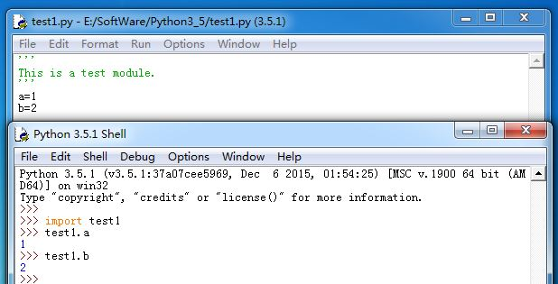
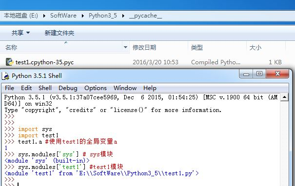
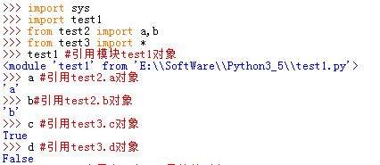
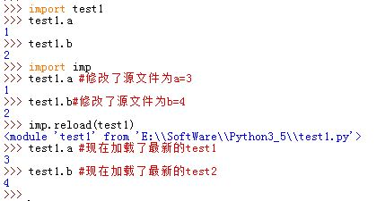
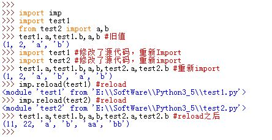

<!--
    作者：华校专
    email: huaxz1986@163.com
**  本文档可用于个人学习目的，不得用于商业目的  **
-->
# 1 模块
1.从实际角度，模块对应Python程序文件（或者用外部语言如C|C#编写的扩展）。从逻辑上看，模块是最高级别的程序组织单元

* 每个Python程序文件都是一个模块
* 模块导入另一个模块后，可以直接使用被导模块定义的全局变量名  
  

2.Python程序是作为一个主体的、顶层文件来构造，配合零个或者多个支持的模块文件

3.Python自带了很多模块，称为标准链接库。他们提供了很多常用功能

4.导入模块用`import`。其通用格式为`import modname`。其中`modname`为模块名，它没有文件后缀名`.py`，也没有文件路径名。  
导入并非是C语言的`#include`。导入其实是运行时的运算。程序首次导入一个模块时，执行三个步骤：

* 找到模块文件
* 编译成字节码（即`.pyc`文件）。如果字节码文件不存在或者字节码文件比源代码文件旧，
  则执行该步骤。否则跳过该步骤直接加载字节码
* 执行模块代码来创建其定义的对象

在这之后导入相同模块时，会跳过这三步而只是提取内存中已经加载的模块对象。
> 从内部看，Python将加载的模块存储到一个名为`sys.modules`的字典中，键就是模块名字符串。在每次导入模块开始时都检查这个字典，若模块不存在则执行上述三步。

 

5.当文件`import`时，会进行编译产生字节码文件`.pyc`，因此只有被导入文件才会在机器上留下`.pyc`文件。顶层文件的字节码在内部使用后就丢弃了，并未保留下来。
> 顶层文件通常设计成直接执行，而不是被导入的

6.Python模块文件搜索路径：

* 程序主目录
* 环境变量`PYTHONPATH`指定的目录
* 标准链接库目录（这个一般不动它）
* 任何`.pth`文件的内容，其中`.path`文件在前三者中查找到的。
  >Python会将每个`.pth`文件的每行目录从头到尾添加到`sys.path`列表的最后
  >（在此期间Python会过滤`.pth`文件中目录列表中重复的和不存在的目录)

以上四者优先级从高到低。这四部分组合起来就是`sys.path`列表的内容  

7.`sys.path`列表就是模块的搜索路径。Python在程序启动时配置它，自动将顶级文件的主目录（或代表当前工作目录的一个空字符串）、环境变量`PYTHONPATH`指定的目录、标准库目录以及已创建的任何`.pth`文件的内容合并

* 模块搜索时，从左到右搜索`sys.path`，直到第一次找到要`import`的文件

8.`import`模块时，省略文件后缀名因为模块可能是`.py`文件、`.pyc`文件，或者扩展的C模块等。

9.创建模块：任何保存为`.py`文件的文件均被自动认为是Python模块。所有该模块顶层指定的变量均为模块属性。
> 可执行但不会被导入的顶层文件不必保存为.py文件

* 因为模块名在Python中会变成变量名，因此模块名必须遵守普通变量名的命名规则

10.`import`和`from`语句：

* `import`使得一个变量名引用整个模块对象：`import module1`
* `from`将一个变量名赋值给另一个模块中同名的对象：`from module1 import printer`。在本模块内`printer`名字引用了`module1.printer`对象
* `from *`语句将多个变量名赋值给了另一个模块中同名的对象：`from module1 import *`。在本模块内，所有`module1.name`对象赋值给了`name`变量名  

有几点需要注意：

* `from`语句首先与`import`一样导入模块文件。但它多了一步：定义一个或多个变量名指向被导入模块中的同名对象
* `from`与`import`都是隐性赋值语句
* `from`与`import`对本模块的命名空间影响不同：`from`会在命名空间中引入`from import`的变量名而不会引入模块名，
  `import`会在命名空间中引入模块名    
  
* `from`、`import`与`def`一样是可执行语句，而不是编译器声明
* 当出现交叉导入时，可以使用`import` ，用`from`可能出现死锁的问题：`modA`需要`from import` `modB`的变量
  ，而此时`modB`也在`from import` `modA`的变量 
  

11.要修改被导入的全局变量，必须用`import`，然后用模块名的属性修改它；不能用以`from`隐式创建的变量名来修改。  

12.用`from`时，被导入模块对象并没有赋值给变量名：

* `import module1`:`module1`既是模块名，也是一个变量名（引用被导入模块对象）
* `from module1 import func`：`module1`仅仅是模块名，而不是变量名  

13.`from`语句陷阱：

* `from`语句可能破坏命名空间
* `from`后跟随`reload`时，`from`导入的变量名还是原始的对象

14.模块的命名空间可以通过属性`.__dict__`或者`dir(modname)`来获取

* 在Python内部，模块命名空间是作为字典对象存储的
* 我们在模块文件中赋值的变量名在Python内部称为命名空间字典的键  

15.一个模块内无法使用其他模块内的变量，除非明确地进行了导入操作

17.重载函数`reload()`：它会强制已加载的模块代码重新载入并重新执行

* `reload`函数可以修改程序的一部分，而无需停止整个程序
* `reload`函数只能用于Python编写的模块，而无法用于其它语言编写的扩展模块    
  

18.`reload()`与`import`和`from`的差异：

* `reload`是Python内置函数，返回值为模块对象，`import`与`from`是语句
* 传递给`reload`是已经存在的模块对象，而不是一个变量名
* `reload`在Python3.0中位于`imp`标准库模块中，必须首先导入才可用。

19.`reload`工作细节：

* `reload`并不会删除并重建模块对象，它只是修改模块对象。即原来模块的每个属性对象内存空间还在，所有旧的引用指向他们，新的引用指向修改后的属性对象内存空间
* `reload`会在模块当前命名空间内执行模块文件的新代码
* `reload`会影响所有使用`import`读取了模块的用户，用户会发现模块的属性已变
* `reload`只会对以后使用`from`的代码造成影响，之前用`from`的代码并不受影响。之前的名字还可用，且引用的是旧对象  
  