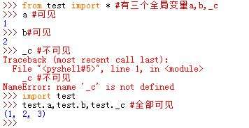
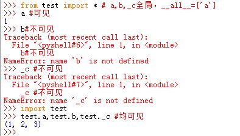

<!--
    作者：华校专
    email: huaxz1986@163.com
**  本文档可用于个人学习目的，不得用于商业目的  **
-->
# 1 模块高级用法
1.Python模块会默认导出其模块文件顶层所赋值的所有变量名，不存在私有变量名。所有的私有数据更像是一个约定，而不是语法约束：

* 下划线开始的变量名`_x`：`from *`导入该模块时，这类变量名不会被复制出去  
  
* 模块文件顶层的变量名列表`__all__`：它是一个变量名的字符串列表。`from *`语句只会把列在`__all__`列表中的这些变量名复制出来。  
  
>Python会首先查找模块内的`__all__`列表；否该列表未定义，则`from *`会复制那些非
>`_`开头的所有变量名  
>所有这些隐藏变量名的方法都可以通过模块的属性直接绕开

2.当文件是以顶层程序文件执行时，该模块的`__name__`属性会设为字符串`"__main__"`。若文件被导入，则`__name__`属性就成为文件名去掉后缀的名字

* 模块可以检测自己的`__name__`属性，以确定它是在执行还是被导入
* 使用`__name__`最常见的是用于自我测试代码：在文件末尾添加测试部分：
  
  ```
	if __name__=='__main__':
	 	#pass
  ```

3.在程序中修改`sys.path`内置列表，会对修改点之后的所有导入产生影响。因为所有导入都使用同一个`sys.path`列表

4.`import`和`from`可以使用`as`扩展，通过这种方法解决变量名冲突：

```
  import modname as name1
  from modname import attr as name2
```
在使用`as`扩展之后，必须用`name1`、`name2`访问，而不能用`modname`或者`attr`，因为它们事实上被`del`掉了  
 

5.在`import`与`from`时有个问题，即必须编写变量名，而无法通过字符串指定。有两种方法：

* 使用`exec: `exec("import "+modname_string)`	
* 使用内置的`__import__`函数：`__import__(modname_string)`，它返回一个模块对象
	> 这种方法速度较快

  

6.`reload(modname)`只会重载模块`modname`，而对于模块`modname`文件中`import`的模块，`reload`函数不会自动加载。  
要想`reload`模块`A`以及`A` `import`的所有模块，可以手工递归扫描`A`模块的`__dict__`属性，并检查每一项的`type`以找到所有`import`的模块然后`reload`这些模块

7.可以通过下列几种办法获取模块的某个属性：

* `modname.attr`：直接通过模块对象访问
* `modname.__dict__['attr']`：通过模块对象的`__dict__`属性字典访问
* `sys.modules['modname'].name`：通过Python的`sys.modules`获取模块对象来访问
* `getattr(modname,'attr')`：通过模块对象的`.getattr()`方法来访问
	