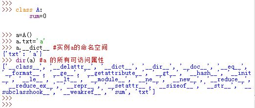

# 1 基本概念

基本概念：

- 什么是类：具有相同方法和属性的一类事物
- 什么是对象、实例：一个拥有具体属性值和动作的具体个体
- 实例化：从一个类得到一个具体对象的过程

组合：

- 一个类的对象作为另一个类对象的实例变量
  - python是课程类的对象
  - xx是学生类的对象
  - xx.course = python

面向对象的三大特性：封装/继承/多态

- 封装
  - 广义的封装：类中有成员
  - 狭义的封装：私有成员
  - 函数封装到类

```python
class File:
    def read(self):
        pass
    def write(self):
        pass
    
```

- 数据封装到对象	

```python
class Person:
    def __init__(sef,name,age):
        self.name = name
        self.age = age
p = Person('alex',19)
```

- 继承
  - 父类、基类、超类
  - 子类、派生类
  - 单继承：子类可以使用父类的方法
  - 多继承：
    - py2深度优先
    - py3广度优先

```python
class Base:
    pass
class Foo(Base):
    pass
```

备注：
​		多继承
​		self到底是谁？
​		self是由于哪个类创建，则找方法时候就从他开始找。

- 多态
  - 一个类表现出来的多种状态》多各类表现出相似状态
    - user  可以浏览商品、购买支付
    - vip_user 可以浏览商品、购买支付
  - 鸭子类型
  - user  和vip_user 有相似的特性
  - list 和tuple有相似的特性

```python
def func(arg): # 多种类型，很多事物
    arg.send() # 必须具有send方法，呱呱叫
```

格式和关键词

```python
class 类:
    def __init__(self,x):
        self.x = x 
        
    def 方法(self,name):
        print(self.x, name)
        
# 实例化一个类的对象
v1 = 类(666)
v2.方法('alex')
```

关键词：
- 类
- 对象
- 方法

什么时候用面向对象？

- 函数（业务功能）比较多，可以使用面向对象来进行归类。
- 想要做数据封装（创建字典存储数据时，面向对象）。
- 游戏示例：创建一些角色并根据角色需要再创建人物。

# 2 面向对象的基本格式

```
• class <name>(<bases>):
    <body>

• all names defined or assigned become attributes of the new
class object <name> (functions become "methods")

• attributes of any of the bases are attributes of the new class,
unless overridden (assigned or defined in body)

```

类和对象的关系：对象是类的一个实例。

self是一个形式参数，对象调用方法时，python内部将该对象传给这个参数。

```python
#定义类
class 类名（首字母大写）():
    def 方法名(self,name):
        print(name)
        return 123
	def 方法名(slef,name):
        print(name)
        return 123
    def 方法名(slef,name):
        print(name)
        return 123
#调用类中的方法
#1.创建该类的对象
obj = 类名()
#2.通过对象调用方法
result = obj.方法名('alex')
print(result)
    
```

```python

class Stack:
    '''A well-known data structure…'''
    def __init__(self): # constructor
    self.items = []
    def push(self, x):
    self.items.append(x)
    def pop(self):
    x = self.items[-1]
    del(self.items[-1])
    return x
    def empty(self):
    return len(self.items) == 0 # Boolean

```


应用场景：遇到很多函数，需要给函数进行归类和划分。【封装】

- 不可修改类型（可命名元组）
  - 创建一个类，这个类没有方法，所有属性不可修改。

```python
from collections import namedtuple   # 可命名元组
Course = namedtuple('Course',['name','price','teacher'])
python = Course('python',19800,'alex')
print(python)
print(python.name)
print(python.price)
```


练习题

```python
#!/usr/bin/env python
# -*- coding:utf-8 -*-

class Db:
    def db_read(self):
        pass

    def db_write(self):
        pass

    def db_delete(self):
        pass

    def db_update(self):
        pass

class File:
    def file_read(self):
        pass

    def file_write(self):
        pass

    def file_delete(self):
        pass

    def file_update(self):
        pass

class Redis:
    def redis_read(self):
        pass

    def redis_write(self):
        pass

    def redis_delete(self):
        pass

    def redis_update(self):
        pass
```

# 3 对象的作用

存储一些值，以后方便自己使用。

```python
class File:
    def read(self):
        with open(self.xxxxx, mode='r', encoding='utf-8') as f:
            data = f.read()
        return data

    def write(self, content):
        with open(self.xxxxx, mode='a', encoding='utf-8') as f:
            f.write(content)

# # 实例化了一个File类的对象
obj1 = File()
# # 在对象中写了一个xxxxx = 'test.log'
obj1.xxxxx = "test.log"
# # 通过对象调用类中的read方法，read方法中的self就是obj。
# # obj1.read()
obj1.write('alex')


# 实例化了一个File类的对象
obj2 = File()
# 在对象中写了一个xxxxx = 'test.log'
obj2.xxxxx = "info.txt"
# 通过对象调用类中的read方法，read方法中的self就是obj。
# obj2.read()
obj2.write('alex')
```

```python
class Person:
    def show(self):
        temp = "我是%s,年龄：%s,性别：%s " %(self.name,self.age,self.gender,)
        print(temp)
        

p1 = Person()
p1.name = '李邵奇'
p1.age = 19
p1.gender = '男'
p1.show()

p2 = Person()
p2.name = '利奇航'
p2.age = 19
p2.gender = '男'
p2.show()
```

```python
class Person:
    def __init__(self,n,a,g): # 初始化方法（构造方法），给对象的内部做初始化。
        self.name = n
        self.age = a
        self.gender = g

    def show(self):
        temp = "我是%s,年龄：%s,性别：%s " % (self.name, self.age, self.gender,)
        print(temp)

# 类() 实例化对象，自动执行此类中的 __init__方法。
p1 = Person('李兆琪',19,'男')
p1.show()

p2 = Person('利奇航',19,'男')
p2.show()
```

小结：将数据封装到对象，方便使用。

```python
"""
如果写代码时，函数比较多比较乱。
1. 可以将函数归类并放到同一个类中。
2. 函数如果有一个反复使用的公共值，则可以放到对象中。
"""

class File:
    def __init__(self,path):
        self.file_path = path
        
    def read(self):
        print(self.file_path)
    
    def write(self,content):
        print(self.file_path)
    
    def delete(self):
        print(self.file_path)
    
    def update(self):
        print(self.file_path)
    
p1 = File('log.txt')
p1.read()

p2 = File('xxxxxx.txt')
p2.read()
```

```python
# 1. 循环让用户输入：用户名/密码/邮箱。 输入完成后再进行数据打印。
# ########## 以前的写法
USER_LIST = []
while True:
    user = input('请输入用户名：')
    pwd = input('请输入密码：')
    email = input('请输入邮箱：')
    temp = {'username':user,'password':pwd,'email':email}
    USER_LIST.append(temp)
for item in USER_LIST:
    temp = "我的名字：%s,密码：%s,邮箱%s" %(item['username'],item['password'],item['email'],)
    print(temp)
    
# ########## 面向对象写法

class Person:
    def __init__(self,user,pwd,email):
        self.username = user
        self.password = pwd
        self.email = email
	
USER_LIST = [对象(用户/密码/邮箱),对象(用户/密码/邮箱),对象(用户/密码/邮箱)]
while True:
    user = input('请输入用户名：')
    pwd = input('请输入密码：')
    email = input('请输入邮箱：')
    p = Person(user,pwd,email)
    USER_LIST.append(p)

for item in USER_LIST:
    temp = "我的名字：%s,密码：%s,邮箱%s" %(item.username,item.password,item.email,)
    print(temp)

# ########## 面向对象写法

class Person:
    def __init__(self,user,pwd,email):
        self.username = user
        self.password = pwd
        self.email = email
        
	def info(self):
        return "我的名字：%s,密码：%s,邮箱%s" %(item.username,item.password,item.email,)
    
USER_LIST = [对象(用户/密码/邮箱),对象(用户/密码/邮箱),对象(用户/密码/邮箱)]
while True:
    user = input('请输入用户名：')
    pwd = input('请输入密码：')
    email = input('请输入邮箱：')
    p = Person(user,pwd,email)
    USER_LIST.append(p)

for item in USER_LIST:
    msg = item.info()
    print(msg)
```

# 4 例子

## 4.1 游戏开发示例

```python
class Police:
	def __init__(self,name) 
		self.name = name 
         self.hp = 10000
    
    def tax(self):
        msg = "%s收了个税。" %(self.name,)
        print(msg)
	
    def fight(self):
        msg = "%s去战了个斗。" %(self.name,)

lsq = Police('李邵奇') 
zzh = Police('渣渣会')
tyg = Police('堂有光')


class Bandit:
    def __init__(self,nickname) 
		self.nickname = nickname 
		self.hp = 1000
	
    def murder(self,name):
        msg = "%s去谋杀了%s" %(self.nickname, name,)
        
        
lcj = Bandit('二蛋')
lp = Bandit('二狗')
zsd = Bandit('狗蛋')

# 1. 二狗去谋杀渣渣会，二狗生命值-100; 渣渣会生命值减5000
lp.murder(zzh.name)
lp.hp = lp.hp - 100
zzh.hp = zzh.hp - 5000
# ... 
```

```python
class Police:
	def __init__(self,name) 
		self.name = name 
         self.hp = 10000
    
    def dao(self,other):
        msg = "%s个了%s一刀。" %(self.name,other.nickname)
        self.hp = self.hp - 10
        other.hp = other.hp - 50
        print(msg)
	
    def qiang(self):
        msg = "%s去战了个斗。" %(self.name,)
        
	def quan(self,other):
        msg = "%s个了%s一全。" %(self.name,other.nickname)
        self.hp = self.hp - 2
        other.hp = other.hp - 10
        print(msg)
        
        
class Bandit:
    def __init__(self,nickname) 
		self.nickname = nickname 
		self.hp = 1000
	
    def qiang(self,other):
        msg = "%s个了%s一全。" %(self.nickname,other.name)
        self.hp -= 20
        other.hp -= 500
    
	
lcj = Bandit('二蛋')


lsq = Police('李邵奇')
lsq.dao(lcj)
lsq.quan(lcj)
lcj.qiang(lsq)
```


## 4.2 例子2

$\text{Classes are useful for modeling anything that has an internal state, for example, machine learning models.}$

```python
class Classifier:
    """Classifies whether a score is above/below the average."""
    
    def __init__(self, name='Score'): # constructor (special method)
        self.avg = 0
        self.name = name
        
    # special method to define an object representation of the class
    def __repr__(self):
        return f'{self.name} classifier with avg: {self.avg:0.3f}'
    
    # methods
    def train(self, data): 
        self.avg = sum(data) / len(data)
        return self
        
    def predict(self, data):
        return ['above' if x > self.avg else 'below' for x in data]


c = Classifier(name='Custom')  
print(c.avg, c.name)  
  
 # __repr__ function is called  
print(c)                
  
d = Classifier(name='Temp')  
print(d)    
  
c is d


```


# 5 继承


类可以继承。被继承的类称为超类，继承类称为子类。

```
  class childC (parentC): # childC为子类，parentC为超类
	pass
```

* 类对象会继承其超类对象中定义的所有类属性名称。读属性时，若该属性不存在于本类中，Python会自动在超类的命名空间中寻找
	>若是写属性，则会创建新属性（此时仅操作本类的命名空间）
* 实例对象会继承所有可访问到的类的属性。读变量名时，Python会首先检查实例的命名空间，然后是类的命名空间，最后是沿继承链查找所有超类的命名空间
* 若子类重新定义了超类的变量名（无论是在`class`内部定义，还是在`class`外部通过赋值来定义），子类会取代并定制所继承的行为。这称为重载   
  


8.实例对象的`.__class__`属性是它所属的类  
类对象的`__bases__`属性是它超类对象的元组  
类对象的`__name__`属性是类名  
  

9.在子类中调用超类的方法：`superClass.func(obj,args)`，其中`obj`通常为`self`  
  


10.Python的继承与C++继承不同。在Python中，当对象通过点号运算读取属性值时就会发生继承，而且涉及了搜索属性定义树。

* 每次使用`name.attr`时(`name`为实例对象或者类对象），Python会从底部向上搜索命名空间树。先从本对象的命名空间开始，一直搜索到第一个找到的`attr`名字就停止
* 命名空间树中较低位置处的定义会覆盖较高位置处的定义
* 继承树的搜索仅仅发生在读取属性值的时候。在写属性值时，执行的是属性的定义（当前命名空间中该名字不存在）或赋值（当前命名空间中该名字已存在）语义。

~~~mermaid
graph BT;
A(实例命名空间)-->B[类命名空间];
B-->C[超类1命名空间];
B-->D[超类2命名空间];
style A fill:#f9f,stroke:#333;
~~~


----


```python
# 父类(基类)
class Base:
    def f1(self):
        pass
# 子类（派生类）
class Foo(Base):
    def f2(self):
        pass

# 创建了一个字类的对象
obj = Foo()
# 执行对象.方法时，优先在自己的类中找，如果没有就是父类中找。
obj.f2()
obj.f1()

# 创建了一个父类的对象
obj = Base()
obj.f1()
```

问题：什么时候才能用继承？多个类中如果有公共的方法，可以放到基类中避免重复编写。

```python
class Base:
    def f1(self):
        pass
    
class Foo(Base):
    def f2(self):
        pass
    
class Bar(Base):
    def f3(self):
        pass

obj1 = Foo()

obj2 = Bar()
```

继承关系中的查找方法的顺序：

```python
# 示例一
class Base:
    def f1(self):
        print('base.f1')
        
class Foo(Base):
    def f2(self):
        print('foo.f2')
        
obj = Foo()
obj.f1()
obj.f2()

# 示例二
class Base:
    def f1(self):
        print('base.f1')
        
class Foo(Base):
    def f2(self):
        self.f1()
        print('foo.f2')
        
obj = Foo()
obj.f2()

# 示例三
class Base:
    def f1(self):
        print('base.f1')
        
class Foo(Base):
    def f2(self):
        self.f1()
        print('foo.f2')
	def f1(self):
        print('foo.f1')
        
obj = Foo()
obj.f2()

# 示例四
class Base:
    def f1(self):
        self.f2()
        print('base.f1')
	def f2(self):
        print('base.f2')
class Foo(Base):
    def f2(self):
        print('foo.f2')
        
obj = Foo()
obj.f1()

# 示例五
class TCPServer:
    pass
class ThreadingMixIn:
    pass
class ThreadingTCPServer(ThreadingMixIn, TCPServer): 
    pass

# 示例六
class BaseServer:
    def serve_forever(self, poll_interval=0.5):
        self._handle_request_noblock()
	def _handle_request_noblock(self):
        self.process_request(request, client_address)
        
	def process_request(self, request, client_address):
        pass
    
class TCPServer(BaseServer):
    pass

class ThreadingMixIn:
    def process_request(self, request, client_address):
        pass
    
class ThreadingTCPServer(ThreadingMixIn, TCPServer): 
    pass

obj = ThreadingTCPServer()
obj.serve_forever()
```

注意事项：
- self到底是谁？
- self是哪个类创建的，就从此开始找，自己没有找父类。


## 5.1 subclassing 

```python
class FancyStack(Stack):
    '''stack with added ability to inspect inferior stack items'''
    
    def peek(self, n=0):
    '''peek(0) returns top; peek(-1) returns item below that''
    size = len(self.items)
    assert 0 <= n < size # test precondition
    return self.items[size-1-n]

```


```python 
class LimitedStack(FancyStack):
'''fancy stack with limit on stack size'''
    def __init__(self, limit): # constructor
    self.limit = limit
    FancyStack.__init__(self) # base class
    
    def push(self, x):
    assert len(self.items) < self.limit
    super(FancyStack,self).push(x) # "super" method
```


# 6 Key_Method 
## 6.1 constructor `__init__` and destructor `__del__`

```
• __init__ constructor
• __del__ destructor (called automaticly at the garbage
collection, not necessary on del())
• __doc__ returns doc string as a string

```

## 6.2 Getter and Setter 

```python
class Blah(object):
    def getter(self):
    return ...
    def setter(self, value):
    ...
    name = property(getter, setter)

inst = Blah()
print(inst.name)# same as inst.getter()
inst.name = 23 # same as inst.setter(23)

```


# 7 多态（多种形态/多种类型）鸭子模型

```python
# Python
def func(arg):
    v = arg[-1] # arg.append(9)
    print(v)

# java
def func(str arg):
    v = arg[-1]
    print(v)
```

面试题：什么是鸭子模型

```python
# Python
def func(arg):
    v = arg[-1] # arg.append(9)
    print(v)

# java
def func(str arg):
    v = arg[-1]
    print(v)
```

概念：同一操作作用于不同的对象，可以有不同的解释，产生不同的执行结果，这就是多态性。简单的说:就是用基类的引用指向子类的对象。

<https://www.cnblogs.com/hai-ping/articles/2807750.html>


面向过程和面向对象的区别：  面向过程就是分析出解决问题所需要的步骤，然后用函数把这些步骤一步一步实现，使用的时候一个一个依次调用就可以了。

面向对象是把构成问题事务分解成各个对象，建立对象的目的不是为了完成一个步骤，而是为了描叙某个事物在整个解决问题的步骤中的行为。  （<https://zhidao.baidu.com/question/2089034.html>）

（<https://www.cnblogs.com/wangmo/p/7751199.html>）

# 8 Abstract_Method


```python 
class A:
    def a_method(self):
        raise NotImplementedError("Subclasses should have implemented this")

# https://pymotw.com/3/abc/index.html
import abc
class B(metaclass=abc.ABCMeta):
    @abc.abstractmethod
    def a_method(self):
        pass
```


# 9 生成实例对象：

```
  instance_name=class_name()
```

* 像函数那样调用类对象会创建新的实例对象。
	* 每次调用时，均会返回新的实例对象
	* 每个实例对象都有自己的命名空间。同一个类的实例对象不一定属性都相同
* 每一个实例对象继承类的属性并创建了自己的命名空间
	* 类创建的实例对象是有新的命名空间。刚开始该命名空间是空的，
	  但它会继承创建该实例所属类对象的属性。
	* 继承的意思是，虽然实例对象的命名空间是空的。
	  但是名字查找会自动上升到类对象的名字空间去查找
* 在类的`def`中，第一个参数（根据惯例称为`self`）会引用调用该函数的实例对象。对`self`的属性赋值，会创建或修改实例对象的属性，而非类的属性。
	* 可以通过方法调用： `instance_name.func()`
	* 也可以通过类调用： `class_name.func(instance_name)`

  


## 9.1 成员

- 类
  - 类变量
  - 绑定方法
  - 类方法
  - 静态方法
  - 属性
- 实例（对象）
  - 实例变量

### 9.1.1 函数与方法的区别

类调用: function类型
实例调用: method类型 

在类的定义中，通过类调用和实例调用是不一样的，一个是 function 类型，另一个是 method 类型。
他们的主要区别在于，==函数的 传参都是显式传递的 而方法中 传参往往都会有隐式传递的，具体根据于调用方。==
例如示例中的 test().say通过实例调用的方式会隐式传递 self数据

```python
class test:
    def say(self):
        pass

print(test.say)     # <function test.say at 0x000001F5FD475730>
print(test().say)   # <bound method test.say of <__main__.test object at 0x000001F5FD452940>>


```


### 9.1.2 实例变量

```python
class Foo:
    def __init__(self,name):
        self.name = name
    def info(self):
        pass
obj1 = Foo('alex')
obj2 = Foo('eric')
```


### 9.1.3 类变量


- 定义：卸载类的下一级和方法同一级。
- 访问：

```python
类.类变量名称
对象.类变量名称
```

- 面试题

```python
class Base:
    x = 1
    
obj = Base()


print(obj.x) # 先去对象中找，没有再去类中找。
obj.y = 123  # 在对象中添加了一个y=123的变量。
print(obj.y)
obj.x = 123
print(obj.x)
print(Base.x)
```

```python
class Parent:
    x = 1
    
class Child1(Parent):
    pass

class Child2(Parent):
    pass

print(Parent.x,Child1.x,Child2.x) # 1 1 1
Child1.x = 2
print(Parent.x,Child1.x,Child2.x) # 1 2 1
Child2.x = 3
print(Parent.x,Child1.x,Child2.x) # 1 2 3
```

小结：找变量优先找自己，自己没有找类或基类；修改或赋值只能在自己的内部设置。


### 9.1.4 ClassVariables_InstanceVariables的区别


```python 
class Connection(object):
verbose = False # class variable
    def __init__(self, host):
    self.host = host # instance variable
    def debug(self, v):
    Connection.verbose = v
    def connect(self):
    if Connection.verbose: #
    print("connecting to", self.host)
```

```python 
class Connection(object):
    verbose = False # class variable
    def __init__(self, host):
    self.host = host # instance variable
    def debug(self, v):
    self.verbose = v # make instance var!
    def connect(self):
    if self.verbose: # class or instance var?
    print("connecting to", self.host)
```

• On use via instance (self.x), search order:
    – (1) instance, (2) class, (3) base classes
        • Multiple base classes: from left to right
    – also for method lookup
• On assignment via instance (self.x = ...):
    – always makes an instance variable
• class variable: only ClassName.x  -> one copy shared by all instances
• instance variable ->  each instance its own


### 9.1.5 实例方法 （绑定方法/普通方法/）

通常情况下，在类中定义的普通方法即为类的实例方法，实例方法第一个参数是 self（self 是一种约定习惯） 代表实例本身，当调用某个实例方法时，该实例的对象引用作为第一个参数 self 隐式的传递到方法中。
- 定义：至少有一个self参数
- 执行：先创建对象，有对象、方法。

```python
class Foo:
    def func(self,a,b):
        print(a,b)
        
obj = Foo()
obj.func(1,2)

# ###########################
class Foo:
    def __init__(self):
        self.name = 123

    def func(self, a, b):
        print(self.name, a, b)

obj = Foo()
obj.func(1, 2)
```

```python
class test:
    math = 100
    # 类构造方法也是实例方法
    def __init__(self):
        self.Chinese = 90
        self.English = 80
    # 实例方法
    def say(self):
        print('我的语文成绩是：{}'.format(self.Chinese))

# 实例化
A = test()
# 调用实例方法
A.say()
print(A.say)  # <bound method test.say of <__main__.test object at 0x0000020C07F28978>>

```

 若想直接调用方法，需要手动为 self 传入实例，如下：
```python
# 实例化
A = test()
# 为self传入实例 
test.say(A)
```
### 9.1.6 静态方法

类的静态方法和我们自定义的函数基本没什么区别，没有 self，且不能访问类属性，实际项目中很少用到，因为可以使用普通函数替代。
静态方法需要使用 @staticmethod 装饰器声明。
有两种调用方式：类.方法名 和 实例化调用 

- 定义：
  - @staticmethod装饰器
  - 参数无限制
- 执行：
  - 类.静态方法名（）
  - 对象.静态方法（）（不推荐）

```python
class Foo:
    def __init__(self):
        self.name = 123

    def func(self, a, b):
        print(self.name, a, b)

    @staticmethod
    def f1():
        print(123)

obj = Foo()
obj.func(1, 2)

Foo.f1()
obj.f1() # 不推荐
```


```python
class test:
    math = 100
    # 类构造方法也是实例方法
    def __init__(self):
        self.Chinese = 90
        self.English = 80
    @staticmethod
    def say():
        print('我的语文成绩是：90')

# 类.方法名
test.say()
print(test.say)  # <function test.say at 0x000001C2620257B8>
# 实例化
A=test()
A.say()
print(A.say)     # <function test.say at 0x000001C2620257B8>

```

### 9.1.7 类方法

类的类方法也必须包含一个参数，通常约定为 cls ，cls 代表 类本身（注意不是实例本身，是有区别的），python 会自动将类本身传给 cls，所以这个参数也不需要我们传值。
类方法必须需要使用 @classmethod 装饰器申明，可以在class内实例化class，主要用于为类创建一些预处理实例。
两种方式调用：类.方法名 和 实例调用（不推荐实例调用）

- 定义：
  - @classmethon装饰器
  - 至少有cls参数，当前类
- 执行：
  - 类.类方法()
  - 对象.类方法()（不推荐）

```python
class Foo:
    def __init__(self):
        self.name = 123

    def func(self, a, b):
        print(self.name, a, b)

    @staticmethod
    def f1():
        print(123)

    @classmethod
    def f2(cls,a,b):
        print('cls是当前类',cls)
        print(a,b)

obj = Foo()
obj.func(1, 2)

Foo.f1()
Foo.f2(1,2)
```


```python
class test:
    math = 100
    # 类构造方法也是实例方法
    def __init__(self):
        self.Chinese = 90
        self.English = 80
    @classmethod
    def say(cls):
        print('我的数学成绩是：{}'.format(cls.math))

# 类.方法名
test.say()
print(test.say)      # <bound method test.say of <class '__main__.test'>>
# 实例化调用
test().say()
print(test().say)    # <bound method test.say of <class '__main__.test'>>
```


### 9.1.8 各种方法之间的区别

实例方法：可以获取类属性、构造函数定义的变量，属于 method 类型。只能通过实例化调用。
静态方法：不能获取类属性、构造函数定义的变量，属于 function 类型。两种调用方式：类.方法名 ，实例化调用。
类方法 ：可以获取类属性，不能获取构造函数定义的变量，属于 method 类型。两种调用方式：类.方法名 ，实例化调用（不推荐）。


面试题：

```python
# 问题： @classmethod和@staticmethod的区别？
"""
一个是类方法一个静态方法。 
定义：
	类方法：用@classmethod做装饰器且至少有一个cls参数。
	静态方法：用staticmethod做装饰器且参数无限制。
调用：
	类.方法 直接调用。
	对象.方法 也可以调用。 
"""
```


```python
class A(object):
    def foo(self, x):
        print("executing foo({},{})".format(self, x))
    @classmethod
    def class_foo(cls, x):
        print("executing class_foo({},{})".
            format(cls, x))
            
    @staticmethod
    def static_foo(x):
        print("executing static_foo({})".
            format(x))

a = A()
a.foo('Alice')
a.class_foo('Bob') # or A.class_foo('Bob')
a.static_foo('Charly') # or A.static_foo('Charly')
```
### 9.1.9 属性property

- 定义：
  - @property装饰器
  - 只有一个self参数
- 执行：
  - 对象.方法     ps：不用加括号

```python
class Foo:

    @property
    def func(self):
        print(123)
        return 666

obj = Foo()
result = obj.func
print(result)
```

```python
# 属性的应用

class Page:
    def __init__(self, total_count, current_page, per_page_count=10):
        self.total_count = total_count
        self.per_page_count = per_page_count
        self.current_page = current_page
    @property
    def start_index(self):
        return (self.current_page - 1) * self.per_page_count
    @property
    def end_index(self):
        return self.current_page * self.per_page_count


USER_LIST = []
for i in range(321):
    USER_LIST.append('alex-%s' % (i,))

# 请实现分页展示：
current_page = int(input('请输入要查看的页码：'))
p = Page(321, current_page)
data_list = USER_LIST[p.start_index:p.end_index]
for item in data_list:
    print(item)
```


## 9.2 成员装饰符

- 公有，所有地方都能访问到。
- 私有，只有自己可以访问。

• Public
    – default
• Protected
    –` _protected_method`
• Private
    – `__private_method`

```python
class Foo:
    def __init__(self, name):
        self.__name = name

    def func(self):
        print(self.__name)


obj = Foo('alex')
# print(obj.__name)
obj.func()
```

```python
class Foo:
    __x = 1

    @staticmethod
    def func():
        print(Foo.__x)


# print(Foo.__x)
Foo.func()
```

```python
class Foo:

    def __fun(self):
        print('msg')

    def show(self):
        self.__fun()

obj = Foo()
# obj.__fun()
obj.show()
```


## 9.3 小补充

```python
class Foo:
    def __init__(self,num):
        self.num = num
        
        
cls_list = []
for i in range(10):
    cls_list.append(Foo)
    
for i in range(len(cls_list)):
    obj = cls_list[i](i)
    print(obj.num)
```

```python
class Foo:
    def __init__(self,num):
        self.num = num
        
B = Foo
obj = B('alex')
```

```python
class Foo:
	def f1(self):
        print('f1')
    
    def f2(self):
        print('f2')

obj = Foo()

v = [ obj.f1,obj.f2 ]
for item in v:
    item()
```

```python
class Foo:
    def f1(self):
        print('f1')
    
    def f2(self):
        print('f2')
        
	def f3(self):
        v = [self.f1 , self.f2 ]
        for item in v:
            item()
            
obj = Foo()
obj.f3()
```

```python
class Account:
    
    def login(self):
        pass
    
    def register(self):
        pass
    
    def run(self):
        info = {'1':self.register, '2':self.login }
        choice = input('请选择:')
        method = info.get(choice)
        method()
```

```python
class Foo:
    pass

class Foo(object):
    pass

# 在python3中这俩的写法是一样，因为所有的类默认都会继承object类，全部都是新式类。


# 如果在python2中这样定义，则称其为：经典类
class Foo:
    pass 
# 如果在python2中这样定义，则称其为：新式类
class Foo(object):
    pass 

class Base(object):
    pass
class Bar(Base):
    pass
```

强制访问私有成员

```python
# 强制访问私有成员

class Foo:
    def __init__(self,name):
        self.__x = name


obj = Foo('alex')

print(obj._Foo__x) # 强制访问私有实例变量
```

## 9.4 嵌套

- 函数：参数可以是任意类型。
- 字典：对象和类都可以做字典的key和value

```python
class School(object):
    def __init__(self,title,addr):
        self.title = title
        self.address = addr
        
class ClassRoom(object):
    
    def __init__(self,name,school_object):
        self.name = name
        self.school = school_object
        
s1 = School('北京','沙河')
s2 = School('上海','浦东')
s3 = School('深圳','南山')

c1 = ClassRoom('全栈21期',s1)
c1.name
c1.school.title
c1.school.address
# ############################################
v = [11,22,33,{'name':'山海','addr':'浦东'}]

v[0]
v[3]['name']
```

- 继承的查找关系

```python
class StarkConfig(object):
    pass

class AdminSite(object):
    def __init__(self):
        self.data_list = []
        
    def register(self,arg):
        self.data_list.append(arg)
        
site = AdminSite()

obj = StarkConfig()
site.register(obj)
```

```python
class StarkConfig(object):
    def __init__(self,name,age):
        self.name = name
        self.age = age

class AdminSite(object):
    def __init__(self):
        self.data_list = []
        self.sk = None

    def set_sk(self,arg):
        self.sk = arg
        
        
site = AdminSite() # data_list = []  sk = StarkConfig
site.set_sk(StarkConfig)
site.sk('alex',19)
```

```python
class StackConfig(object):
    pass

class Foo(object):
    pass

class Base(object):
    pass

class AdminSite(object):
    def __init__(self):
        self._register = {}

    def registry(self,key,arg):
        self._register[key] = arg

site = AdminSite()
site.registry(1,StackConfig)
site.registry(2,StackConfig)
site.registry(3,StackConfig)
site.registry(4,Foo)
site.registry(5,Base)

for k,v in site._register.items():
    print(k,v() )
```

```python
class StackConfig(object):
    pass

class UserConfig(StackConfig):
    pass


class AdminSite(object):
    def __init__(self):
        self._register = {}

    def registry(self,key,arg=StackConfig):
        self._register[key] = arg

    def run(self):
        for key,value in self._register.items():
            obj = value()
            print(key,obj)
site = AdminSite()
site.registry(1)
site.registry(2,StackConfig)
site.registry(3,UserConfig)
site.run()
```

```python
class StackConfig(object):
    list_display = '李邵奇'

class UserConfig(StackConfig):
    list_display = '利奇航'


class AdminSite(object):
    def __init__(self):
        self._register = {}

    def registry(self,key,arg=StackConfig):
        self._register[key] = arg

    def run(self):
        for key,value in self._register.items():
            obj = value()
            print(key,obj.list_display)
site = AdminSite()
site.registry(1)
site.registry(2,StackConfig)
site.registry(3,UserConfig)
site.run()
```

```python
class StackConfig(object):
    list_display = '李邵奇'
    
    def changelist_view(self):
        print(self.list_display)
        
class UserConfig(StackConfig):
    list_display = '利奇航'

class AdminSite(object):
    def __init__(self):
        self._register = {}

    def registry(self,key,arg=StackConfig):
        self._register[key] = arg

    def run(self):
        for key,value in self._register.items():
            obj = value()
            obj.changelist_view()
site = AdminSite()
site.registry(1)
site.registry(2,StackConfig)
site.registry(3,UserConfig)
site.run()
```

# 10 Python命名空间
1.有点号和无点号的变量名，会使用不同的方式处理
* 无点号运算符的变量名，使用`LEGB`作用域规则查找名字
* 有点好运算符的变量名，使用的是对象的命名空间查找名字
* 模块的作用域以及类的作用域会对对象的命名空间进行初始化

# 11 内置函数补充

## 11.1 type,查看类型

```python
class Foo:
    pass

obj = Foo()

if type(obj) == Foo:
    print('obj是Foo类的对象')
```

## 11.2 issubclass

```python
class Base:
    pass

class Base1(Base):
    pass

class Foo(Base1):
    pass

class Bar:
    pass

print(issubclass(Bar,Base))
print(issubclass(Foo,Base))
```

## 11.3 isinstance

```python
class Base(object):
    pass

class Foo(Base):
    pass

obj = Foo()

print(isinstance(obj,Foo))  # 判断obj是否是Foo类或其基类的实例（对象）
print(isinstance(obj,Base)) # 判断obj是否是Foo类或其基类的实例（对象）
```

## 11.4 super

```python
class Base(object):
    def func(self):
        print('base.func')
        return 123


class Foo(Base):
    def func(self):
        v1 = super().func()
        print('foo.func',v1)

obj = Foo()
obj.func()
# super().func() 去父类中找func方法并执行
```

```python
class Bar(object):
    def func(self):
        print('bar.func')
        return 123

class Base(Bar):
    pass

class Foo(Base):
    def func(self):
        v1 = super().func()
        print('foo.func',v1)

obj = Foo()
obj.func()
# super().func() 根据类的继承关系，按照顺序挨个找func方法并执行(找到第一个就不在找了)
```

```python
class Base(object): # Base -> object
    def func(self):
        super().func()
        print('base.func')

class Bar(object):
    def func(self):
        print('bar.func')

class Foo(Base,Bar): # Foo -> Base -> Bar
    pass

obj = Foo()
obj.func()

# super().func() 根据self对象所属类的继承关系，按照顺序挨个找func方法并执行(找到第一个就不在找了)
```


## 11.5 dir 

4.`dir`函数可以输出对象的所有可访问属性，包括它继承的名字（以及其他一些内置的系统属性）  
  


