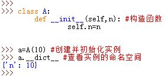
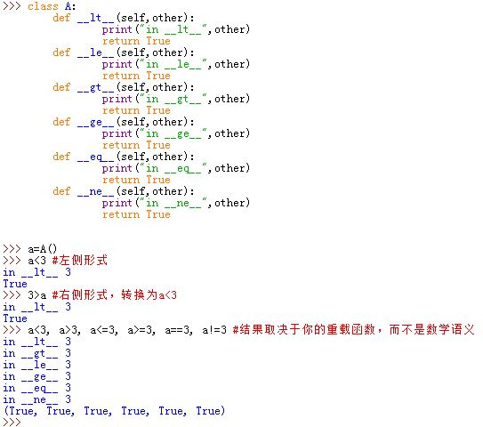
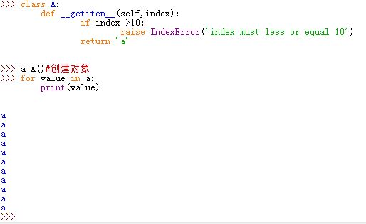
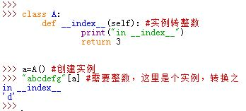
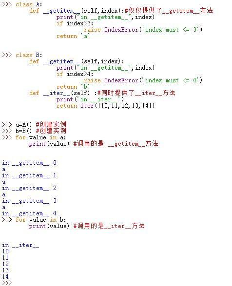
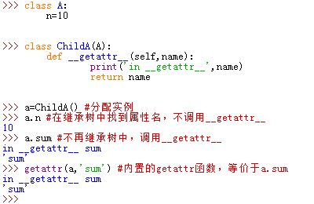
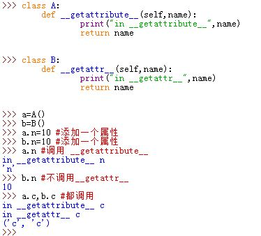
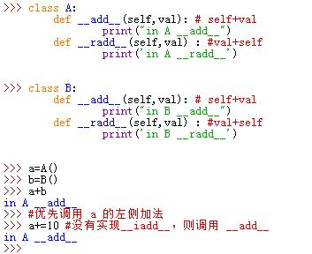

Recap:  
- dunder = double underscores  
- Alternative name: magic methods  
- Dunder methods are syntactic sugar (compact/elegant syntax)

就是 `__init__` 或者 等 class 的 attribute 叫做 dunder method 

```


# 1 运算符

1.运算符重载只是意味着在类方法中拦截内置的操作

* 运算符重载让类拦截常规的Python运算
* 类可以重载所有的Python表达式运算符。当实例对象作为内置运算符的操作数时，这些方法会自动调用
* 类也可以重载打印、函数调用、属性点号运算符等内置运算
* 重载可以使得实例对象的行为更像内置类型
* 重载运算符通常并不是必须的，也不是默认的行为  

  

2.Python中所有可以被重载的方法名称前、后均有两个下划线字符，以便将它与其他类内定义的名字区分开来，如`__add__`

3.若使用未定义运算符重载方法，则它可能继承自超类。若超类中也没有则说明你的类不支持该运算，强势使用该运算符则抛出异常  
  
  

start and end with double underscores, e.g.
```

```
– __init__ __del__ # init/final.
– __repr__ __str__ __int__ # conversions
– __lt__ __gt__ __eq__ ... # comparisons
– __add__ __sub__ __mul__ ... # arithmetic
– __call__ __hash__ __nonzero_ ...
– __getattr__ __setattr__ __delattr__
– __getitem__ __setitem__ __delitem__
– __len__ __iter__ __contains__

```
# 1 分类


- Python classes can define special behaviors using double underscore (double-under -> dunder) methods  
- common examples:  
  - `__init__`: initialization  
  - `__str__`: string representation for users  
  - `__repr__`: string representation for developers  
  - `__eq__`: equality comparison  
  - `__lt__`, `__gt__`: ordering comparisons  
  - `__getitem__`: accessing elements of a sequence

```python
class TextBatch:  
    def __init__(self, texts, labels):  
        if len(texts) != len(labels):  
            raise ValueError("Number of texts and labels must match")  
        self.texts = texts  
        self.labels = labels  
      
    def __str__(self):  
        """User-friendly string representation"""  
        return f"Batch of {len(self.texts)} texts"    def __repr__(self):  
        """Developer-friendly string representation"""  
        return f"TextBatch(texts={self.texts}, labels={self.labels})"  
    def __len__(self):  
        """Allow using len() on batch"""  
        return len(self.texts)  
      
    def __getitem__(self, index):  
        """Allow indexing into batch"""  
        return self.texts[index], self.labels[index]  
      
batch = TextBatch(texts=["hello", "world"], labels=[0, 1])  
print(batch)  
print(repr(batch))  
print(len(batch))  
print(batch[0])
```

## 1.1 `__ init __`初始化方法

```python
class Foo:
    """
    类是干啥的。。。。
    """
    def __init__(self,a1):
        """
        初始化方法
        :param a1: 
        """
        self.a1 = a1
        
obj = Foo('alex')
```


`.__init__(self,args)`方法：称为构造函数。当新的实例对象构造时，会调用`.__init__(self,args)`方法。它用于初始化实例的状态  
  
  


## 1.2 `__ new __ 构造方法`

' __ new__ '方法创建实例，并在init之前工作。

```python
class Foo(object):
    def __init__(self):
        """
        用于给对象中赋值，初始化方法
        """
        self.x = 123
    def __new__(cls, *args, **kwargs):
        """
        用于创建空对象，构造方法
        :param args: 
        :param kwargs: 
        :return: 
        """
        return object.__new__(cls)

obj = Foo()
```

## 1.3 `__ call __` 

```python
class Foo(object):
    def __call__(self, *args, **kwargs):
        print('执行call方法')

# obj = Foo()
# obj()
Foo()()
```

```python
#!/usr/bin/env python
# -*- coding:utf-8 -*-
from wsgiref.simple_server import make_server

def func(environ,start_response):
    start_response("200 OK", [('Content-Type', 'text/plain; charset=utf-8')])
    return ['你好'.encode("utf-8")  ]

class Foo(object):

    def __call__(self, environ,start_response):
        start_response("200 OK", [('Content-Type', 'text/html; charset=utf-8')])
        return ['你<h1 style="color:red;">不好</h1>'.encode("utf-8")]


# 作用：写一个网站，用户只要来方法，就自动找到第三个参数并执行。
server = make_server('127.0.0.1', 8000, Foo())
server.serve_forever()
```


19.`.__call__(self,*pargs,**kwargs)`方法：函数调用方法。当调用实例对象时，由`.__call__(self,*pargs,**kwargs)`方法拦截。

* `.__call__(self,*pargs,**kwargs)`方法支持所有的参数传递方式 
 
  


## 1.4 比较运算符


20.实例对象可以拦截6种比较运算符：`< > <= >= == !=`，对应于

```
	.__lt__(self, other) # <
	.__le__(self, other) # <=
	.__gt__(self, other) # >
	.__ge__(self, other) # >=
	.__eq__(self, other) # ==
	.__ne__(self, other) # !=
```

* 比较运算符全部是左端形式，无右端形式：`3<=obj`会转换成`obj>=3`
* 比较运算符并没有隐式关系。`==`为真，并不意味着`!=`为假。
  因此`.__eq__(self, other)`与`.__ne__(self, other)`必须同时实现而且语义要一致。  

  


## 1.5 `__ getitem__  __ setitem __   __ delitem __ `

```python
class Foo(object):

    def __setitem__(self, key, value):
        pass

    def __getitem__(self, item):
        return item + 'uuu'

    def __delitem__(self, key):
        pass


obj1 = Foo()
obj1['k1'] = 123  # 内部会自动调用 __setitem__方法
val = obj1['xxx']  # 内部会自动调用 __getitem__方法
print(val)
del obj1['ttt']  # 内部会自动调用 __delitem__ 方法
```

`.__getitem__(self,index)`和`.__setitem(self,index,value)`方法：

* 对于实例对象的索引运算，会自动调用`.__getitem__(self,index)`方法，将实例对象作为第一个参数传递，方括号内的索引值传递给第二个参数

* 对于分片表达式也调用`.__getitem__(self,index)`方法。实际上分片边界如`[2:4]`绑定到了一个`slice`分片对象上，该对象传递给了`.__getitem__`方法。  
  对于带有一个`.__getitem__`方法的类，该方法必须既能针对基本索引（一个整数），又能针对分片调用（一个`slice`对象作为参数）
* `.__setitem(self,index,value)`方法类似地拦截索引赋值和分片赋值。第一个参数为实例对象，第二个参数为基本索引或者分片对象，第三个参数为值  
  
  

`.__getitem__(self,index)`也是Python的重载迭代方式之一。一旦定义了这个方法，`for`循环每一次循环时可以调用`.__getitem__(self,index)`方法。因此任何响应了索引运算的内置或者用户自定义的实例对象通用可以响应迭代。

* `for`可以检测到超出边界异常`IndexError`，从而终止迭代  
  
  

## 1.6 `__ str__`打印

```python
class Foo(object):
    def __str__(self):
        """
        只有在打印对象时，会自动化调用此方法，并将其返回值在页面显示出来
        :return: 
        """
        return 'asdfasudfasdfsad'

obj = Foo()
print(obj)
```

```python
class User(object):
    def __init__(self,name,email):
        self.name = name
        self.email = email
    def __str__(self):
        return "%s %s" %(self.name,self.email,)
user_list = [User('二狗','2g@qq.com'),User('二蛋','2d@qq.com'),User('狗蛋','xx@qq.com')]
for item in user_list:
    print(item)
```


## 1.7 `__index__(self)`


`.__index__(self)`方法：该方法将实例对象转换为整数值。即当要求整数值的地方出现了实例对象时自行调用。  
  
  
## 1.8 `__ dict __`

```python
class Foo(object):
    def __init__(self,name,age,email):
        self.name = name
        self.age = age
        self.email = email

obj = Foo('alex',19,'xxxx@qq.com')
print(obj)
print(obj.name)
print(obj.age)
print(obj.email)
val = obj.__dict__ # 去对象中找到所有变量并将其转换为字典
print(val)
```

2.模块、类、实例对象的命名空间实际上是以字典的形式实现的，并由内置属性`.__dict__`表示

* 属性点号运算其实内部就是字典的索引运算
* 属性继承其实就是搜索链接的字典
	>每个实例都有各自独立的命名空间字典。初始时为空字典。
	>随着对`self`或者对象的属性赋值，命名空间字典不断扩张

3.读取属性可以通过点运算符或者直接通过键索引：

```
  obj.attr #通过点运算符
  obj.__dict__['attr']#通过键索引
```
 通过键索引时必须给出属性名字符串；通过点运算符时给出的是属性名（不是字符串）


## 1.9 迭代


8.目前Python的所有迭代环境都会首先尝试调用`.__iter__(self)`方法，再尝试调用`.__getitem__(self,index)`方法。

* `.__iter__(self)`方法必须返回一个迭代器对象。Python的迭代环境通过重复调用这个迭代器对象的`.__next__(self)`方法，直到发生了`StopIteration`异常
	* `.__iter__(self)`返回的迭代器对象会在调用`.__next__(self)`
	 的过程中明确保留状态信息，因此比`.__getitem__(self,index)`方法具有更好的通用性
	* 迭代器对象没有重载索引表达式，因此不支持随机的索引运算
	* `.__iter__(self)`返回的迭代器只能顺序迭代一次。
	  因此每次要进行新的一轮循环时必须创建一个新的迭代器对象
* 对于调用`.__getitem__(self,index)`的环境，Python的迭代环境通过重复调用该方法，其中`index`每轮迭代中从 0 依次递增，直到发生了`IndexError`异常  
  
  

9.要让实例对象支持多个迭代器，`.__iter__(self)`方法必须创建并返回新的迭代器对象。
>每个激活状态下的迭代器都有自己的状态信息，而不管其他激活状态下的迭代器

  

10.类通常把`in`成员关系运算符实现为一个迭代，用`.__iter__(self)`方法或`.__getitem__(self,index)`方法。也能实现`.__contains__(self,value)`方法来实现特定成员关系。

* `.__contains__(self,value)`方法优先于`.__iter__(self)`方法，`.__iter__(self)`方法优先于`.__getitem__(self,index)`方法采纳  
  
  

## 1.10 `.__getattr__(self,'name')` and `.__setattr__(self,'name',value)`


11.`.__getattr__(self,'name')`方法：拦截属性点号运算`obj.name`。只有当对未定义（即不存在）的属性名称进行点号运算时，实例对象会调用此方法
> 当Python可以从继承树中找到该属性名时，并不会调用`.__getattr__(self,'name')`方法
>
>属性不仅仅是变量名，也可以是方法名

* 内置的`getattr(obj,'name')`函数等价于调用`obj.name`，它执行继承搜索。搜不到时调用`.__getattr__(self,“name”)`方法  
* 如果没有定义`.__getattr__(self,“name”)`方法，则对于不知道如何处理的属性（即找不到的），则Python抛出内置的`AttributeError`异常  
  
  

12.`.__setattr__(self,'name',value)`方法：拦截所有的属性赋值语句（无论该属性名是否存在）
> 对于属性赋值语句，因为如果该属性曾经不存在，则一旦赋值就增加了一个新的属性
>
> 属性不仅仅是变量名，也可以是方法名

<font color='red'>注意：`.__setattr__(self,'name',value)`方法的函数体内，任何对`self`属性赋值语句(`self.name=value`)都会再次递归调用`.__setattr__(self,'name',value)`函数</font>

* 为了防止`.__setattr__(self,'name',value)`函数体内的无穷递归，在该方法内的`self`属性赋值要采用属性字典索引的方法：`self.__dict__['name']=value`
>属性不仅仅是变量名，也可以是方法名

* 内置的`setattr(obj,'name',value)`函数等价于调用`obj.name=value`

 

13.`.__getattribute__(self,'name')`方法：拦截所有的属性读取，而不仅仅是那些未定义的。  
<font color='red'>注意：`.__getattribute__(self,'name')`方法的函数体内，任何对`self`属性读取语句(`self.name`)都会再次递归调用`.__getattribute__(self,'name')`函数。尽量不要重载`.__getattribute__(self,'name')`方法避免无穷递归</font>
>属性不仅仅是变量名，也可以是方法名

 

 

14.通过`.__getattr__`与`.__setattr__`方法混合使用可以模拟实例对象的私有属性：

* 实例对象保存一个`self.private`变量名列表
* 对`.__setattr__`与`.__getattr__`，判断属性名是否在`self.private`变量名列表中。
  若是，则抛出异常
> 对于通过`obj.__dict__['name']`访问，可以绕过这种机制


## 1.11 `.__repr__(self)`和`.__str__(self)`方法


16.`.__repr__(self)`和`.__str__(self)`方法：当实例对象在打印或者转成字符串时调用

* 打印会首先尝试`.__str__(self)`方法和`str(x)`内置函数。如果没有，则使用
  `.__repr__(self)`方法
* `.__repr__(self)`主要应用于交互式下提示回应以及`repr`函数。如果没有，它不会调用
   `.__str__(self)`方法 
 
  

## 1.12 `.__add__(self,value)`##


15.`.__add__(self,value)`方法：当实例对象在加法中时调用

17.加法有三种：

* 常规加法：实例对象在`+`左侧，由`.__add__(self,value)`拦截
* 右侧加法：实例对象在`+`右侧，由`.__radd__(self,value)`拦截
* 原地加法：实例对西在`+=`左侧，由`.__iadd__(self,value)`拦截

要实现满足交换律的运算符，要同时重载`.__add__(self,value)`与`.__radd__(self,value)`方法。

* 当不同类的实例对象混合出现在`+`两侧时，Python优先选择左侧的那个类来拦截`+`
	>注意当在这三种加法函数体内出现了`+`或者`+=`时可能出现递归调用
* 原地`+=`优先采用`.__iadd__(self,value)`，如果它没有重载，则采用`.__add__(self,value)`

  

  

18.每个二元运算符都有类似`+`的右侧和原地重载方法。他们以相似的方式工作。

* 右侧方法通常只有在需要满足交换律时用得到，一般较少使用
* 在实现这些方法时，函数体内注意不要出现递归调用

## 1.13 `.__bool__(self)`


21.在布尔环境中，Python会首先尝试`.__bool__(self)`方法来获取一个直接的布尔值。如果没有这个方法，则 尝试`.__len__(self)`方法根据其结果确定实例对象的真值（非0则为真，0为假）

  


## 1.14 `.__del__(self)`


• is called when an object is garbage collected == after all references to the object have been deleted
• Implementation detail of CPython!!
• right after and might not happen at all


22.每当实例对象空间被收回时（在垃圾收集时），析构函数`.__del__(self)`自动调用。
>Python的析构函数不常用。原因有二：
>
>* 对于空间管理来说，通常不需要用户手动管理
>* 用户无法预测实例对象的具体回收时机，这个时机有Python自动调度

  
## 1.15 上下文管理【面试题】

```python
class Foo(object):
    def __enter__(self):
        self.x = open('a.txt',mode='a',encoding='utf-8')
        return self.x
    def __exit__(self, exc_type, exc_val, exc_tb):
        self.x.close()

with Foo() as ff:
    ff.write('alex')
    ff.write('alex')
    ff.write('alex')
    ff.write('alex')
```

```python
# class Context:
#     def __enter__(self):
#         print('进入')
#         return self
#
#     def __exit__(self, exc_type, exc_val, exc_tb):
#         print('推出')
#
#     def do_something(self):
#         print('内部执行')
#
# with Context() as ctx:
#     print('内部执行')
#     ctx.do_something()


class Foo(object):
    def do_something(self):
        print('内部执行')

class Context:
    def __enter__(self):
        print('进入')
        return Foo()

    def __exit__(self, exc_type, exc_val, exc_tb):
        print('推出')

with Context() as ctx:
    print('内部执行')
    ctx.do_something()
```

7.10.8   两个对象相加

```python
val = 5 + 8
print(val)

val = "alex" + "sb"
print(val)

class Foo(object):
    def __add__(self, other):
        return 123
    
obj1 = Foo()
obj2 = Foo()
val  = obj1 + obj2
print(val)
```

特殊成员：就是为了能够快速实现执行某些方法。


