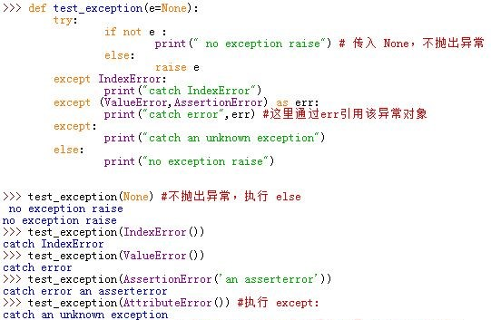
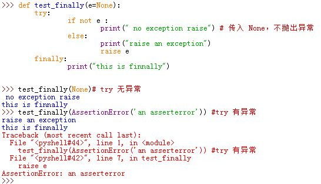
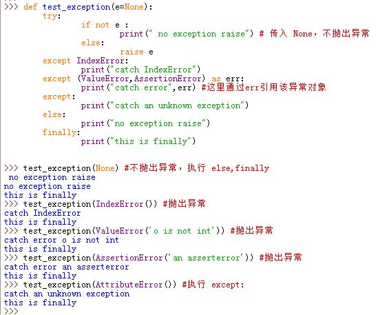
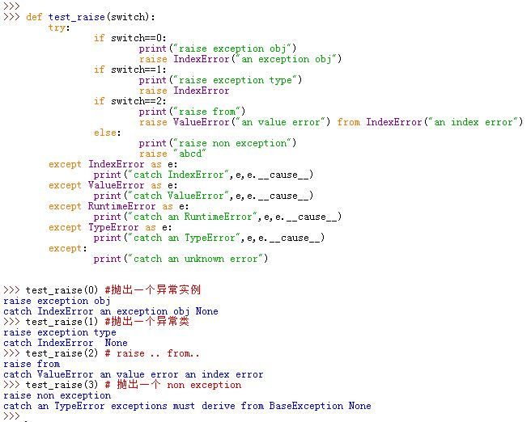
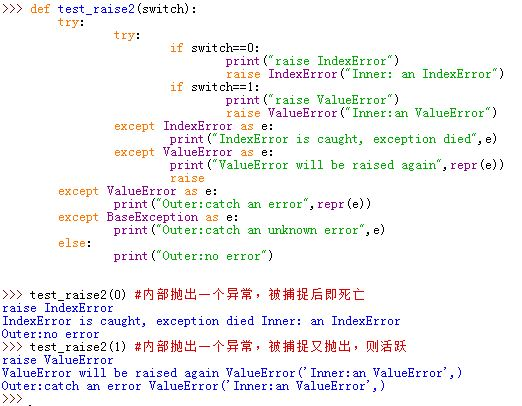
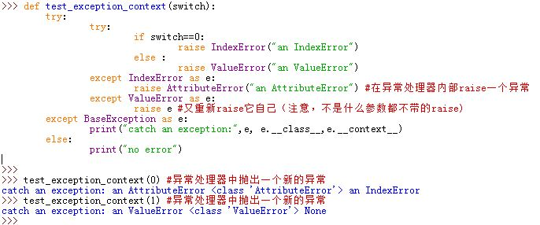
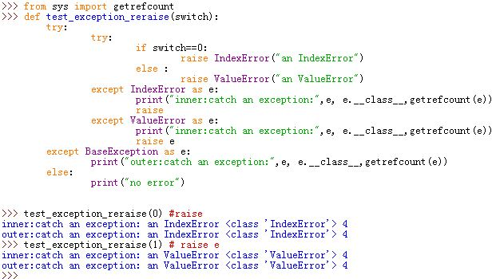
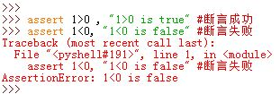
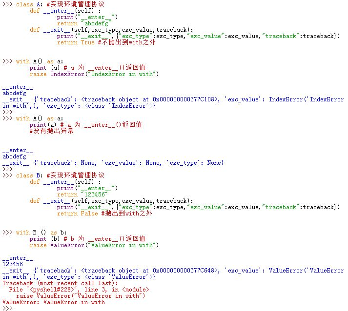
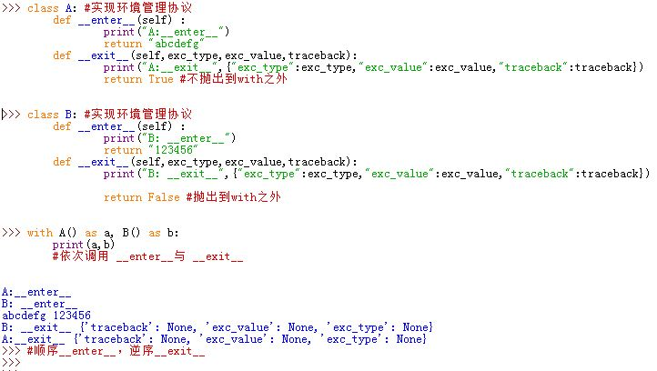

# 1 异常处理


• instances of Exception (or any subtype)
• "raise" explicitly raises exception
• propagate "along the stack of function calls"
    – terminating functions along the way, until they're caught
    – Uncaught exceptions terminate the program
    – Statement try/except may catch exceptions

#### 1.1.1.1 基本格式

```python
try:
    pass
except Exception as e:
    pass
```

```python
try:
    v = []
    v[11111] # IndexError
except ValueError as e:
    pass
except IndexError as e:
    pass
except Exception as e:
    print(e) # e是Exception类的对象，中有一个错误信息。
```

```python
try:
    int('asdf')
except Exception as e:
    print(e) # e是Exception类的对象，中有一个错误信息。
finally:
    print('最后无论对错都会执行')
    
# #################### 特殊情况 #########################
def func():
    try:
        # v = 1
        # return 123
        int('asdf')
    except Exception as e:
        print(e) # e是Exception类的对象，中有一个错误信息。
        return 123
    finally:
        print('最后')

func()
```

#### 1.1.1.2 主动触发异常

```python
try:
    int('123')
    raise Exception('阿萨大大是阿斯蒂') # 代码中主动抛出异常
except Exception as e:
    print(e)
```

```python
def func():
    result = True
    try:
        with open('x.log',mode='r',encoding='utf-8') as f:
            data = f.read()
        if 'alex' not in data:
            raise Exception()
    except Exception as e:
        result = False
    return result
```

#### 1.1.1.3 自定义异常

```python
class MyException(Exception):
    pass

try:
    raise MyException('asdf')
except MyException as e:
    print(e)
```

```python
class MyException(Exception):
    def __init__(self,message):
        super().__init__()
        self.message = message

try:
    raise MyException('asdf')
except MyException as e:
    print(e.message)
```

### 1.1.2 约束和反射

- #### 约束（抽象类/接口类）

  - 给子类一个规范，让子类必须按照抽象类的规范来实现方法。

```python
# 约束字类中必须写send方法，如果不写，则调用时候就报抛出 NotImplementedError 
class Interface(object):
    def send(self):
        raise NotImplementedError()
        
class Message(Interface):
    def send(self):
        print('发送短信')z
        
class Email(Interface):
    def send(self):
        print('发送邮件')
```

```python
class Message(object):
    
    def msg(self):
        print('发短信')

	def email(self):
        print('邮件')
        
    def wechat(self):
        print('微信')

obj = Message()
obj.msg()
obj.email()
obj.wechat()
```

```python
class BaseMessage(object):
    def send(self,a1):
        raise NotImplementedError('字类中必须有send方法')
        
class Msg(BaseMessage):
    def send(self):
        pass

class Email(BaseMessage):
    def send(self):
        pass

class Wechat(BaseMessage):
    def send(self):
        pass

class DingDing(BaseMessage):
    def send(self):
        print('钉钉')
    
obj = Email()
obj.send()
```

- 反射

  - 通过对象来获取实例变量、绑定方法
  - 通过类来获取类变量、类方法、静态方法
  - 通过模块名来获取模块中的任意变量（普通变量、函数、类）
  - 通过本文件来获取本文件中的任意变量
    - getattr(sys.modules[name],'变量名')

根据字符串的形式去某个对象中 操作 他的成员。

- getattr(对象,"字符串")     根据字符粗的形式去某个对象中 获取 对象的成员。 

```python
class Foo(object):
    def __init__(self,name):
        self.name = name
obj = Foo('alex')

# 获取变量
v1 = getattr(obj,'name')
# 获取方法
method_name = getattr(obj,'login')
method_name()
```

- hasattr(对象,'字符串')   根据字符粗的形式去某个对象中判断是否有该成员。 

```python
#!/usr/bin/env python
# -*- coding:utf-8 -*-
from wsgiref.simple_server import make_server

class View(object):
    def login(self):
        return '登陆'

    def logout(self):
        return '退出'

    def index(self):
        return '首页'


def func(environ,start_response):
    start_response("200 OK", [('Content-Type', 'text/plain; charset=utf-8')])
    #
    obj = View()
    # 获取用户输入的URL
    method_name = environ.get('PATH_INFO').strip('/')
    if not hasattr(obj,method_name):
        return ["sdf".encode("utf-8"),]
    response = getattr(obj,method_name)()
    return [response.encode("utf-8")  ]

# 作用：写一个网站，用户只要来访问，就自动找到第三个参数并执行。
server = make_server('192.168.12.87', 8000, func)
server.serve_forever()
```

- setattr(对象,'变量','值')   根据字符粗的形式去某个对象中设置成员。 

```python
class Foo:
    pass


obj = Foo()
obj.k1 = 999
setattr(obj,'k1',123) # obj.k1 = 123

print(obj.k1)
```

- delattr(对象,'变量')   根据字符粗的形式去某个对象中删除成员。

```python
class Foo:
    pass

obj = Foo()
obj.k1 = 999
delattr(obj,'k1')
print(obj.k1)
```

```python
class Cloud(object):

    def upload(self):
        pass
    
    def download(self):
        pass
    
    def run(self):
        # up|C:/xxx/xxx.zip
        # down|xxxx.py
        value = input('请用户输入要干什么？')
        action = value.split('|')[0]
        # 最low的形式
        if action == 'up':
            self.upload()
		elif action == 'down':
            self.download()
		else:
            print('输入错误')
		
		# 构造字典 (*)
		method_dict = {'up':self.upload, 'down':self.download}
         method = method_dict.get(action)
		method()
         
		# 反射（*）
         method = getattr(self,action) # upload  # self.upload
		method()
```

```python
class Foo(object):
    def get(self):
        pass

obj = Foo()
# if hasattr(obj,'post'): 
#     getattr(obj,'post')

v1 = getattr(obj,'get',None) # 推荐
print(v1)
```


python一切皆对象

- py文件
- 包
- 类
- 对象

python一切皆对象，所以以后想要通过字符串的形式操作其内部成员都可以通过反射的机制实现。 

模块：importlib 

```
importlibimport importlib
importlib.import_module('模块名')
os = __import__('os')
print(os.path.isdir('D:\code\day24\pack'))
print(os.path.isfile('D:\code\day24\pack'))
```

根据字符串的形式导入模块。

```python
模块 = importlib.import_module('utils.redis')
```


# 2 `try_except_模块`
1.Python中，异常会根据错误自动地被触发，也能由代码主动触发和截获

2.捕捉异常的代码：

```
try:
	statements #该代码执行主要的工作，并有可能引起异常
except ExceptionType1: #except子句定义异常处理，这里捕捉特定的ExceptionType1类型的异常
	statements 
except (ExceptionType2,ExceptionType3): #except子句定义异常处理，
			#这里捕捉任何列出的异常（即只要是ExceptionType2类型或者ExceptionType3类型）
	statements 
except ExceptionType4 as excp: #这里捕捉特定的ExceptionType4类型异常，但是用变量名excp引用异常对象
	statements #这里可以使用excp引用捕捉的异常对象
except: # 该子句捕获所有异常
	statements
else: #如果没有发生异常，这来到这里；当发生了异常则不执行else子句
	statements
```

* 当`try`子句执行时发生异常，则Python会执行第一个匹配该异常的`except`子句。当`except`子句执行完毕之后（除非该`except`子句 又引发了另一个异常），程序会跳转到整体语句之后执行。
	>整体语句就是指上面的`try..except..else`
* 如果异常发生在`try`代码块内，且无匹配的`except`子句，则异常向上传递到本`try`块外层的`try`块中。如果已经传递到了顶层了异常还没有被捕捉，则Python会终止程序并且打印默认的出错消息
* 如果`try`代码块内语句未产生异常，则Python会执行`else`子句，然后程序会在整体语句之后继续执行

  

3.`try/finally`语句：

```
try:
	statements
finally:
	statements
```
无论`try`代码块执行时是否发生了异常，`finally`子句一定会被执行

* 若`try`子句无异常，则Python会接着执行`finally`子句，执行完之后程序会跳转到整体语句之后执行
* 若`try`子句有异常，则Python会跳转到`finally`子句中，并接着把异常向上传递

  

4.Python中的`try|except|finally`统一格式：

```
try:
	statements #该代码执行主要的工作，并有可能引起异常
except ExceptionType1: #except子句定义异常处理，这里捕捉特定的ExceptionType1类型的异常
	statements 
except (ExceptionType2,ExceptionType3): #except子句定义异常处理，
			#这里捕捉任何列出的异常（即只要是ExceptionType2类型或者ExceptionType3类型）
	statements 
except ExceptionType4 as excp: #这里捕捉特定的ExceptionType4类型异常，但是用变量名excp引用异常对象
	statements #这里可以使用excp引用捕捉的异常对象
except:  # 该子句捕获所有异常
	statements
else:    # 如果没有发生异常，这来到这里；当发生了异常则不执行else子句
	statements
finally: # 一定会执行这个子句
	statements 
```
* `else`、`finally`子句可选；`except`子句可能有0个或者多个。但是如果有`else`子句，则至少有一个`except`
* `finally`执行时机：无论有没有异常抛出，在程序跳出整体语句之前的最后时刻一定会执行
	>整体语句就是指上面的`try..except..else...finally`

  

5.要显式触发异常，可以用`raise`语句。有三种形式的形式：

* `raise exception_obj`：抛出一个异常实例
* `raise Exception_type`：抛出一个指定异常类型的实例，调用`Exception_type()`获得
* `raise <exceptionObj|Exception_type> from <exceptionObj2|Exception_type2>`:
  第二个异常实例会附加到第一个异常实例的`.__cause__`属性中并抛出第一个异常实例
* `raise`：转发当前作用域中激活的异常实例。若当前作用域中没有激活的异常实例，则抛出`RuntimeError`实例对象

* 一旦异常在程序中由某个`except`子句捕获，则它就死掉了不会再传递
* `raise`抛出的必须是一个`BaseException`实例或者`BaseException`子类，否则抛出`TypeError`
	>`BaseException`类是所有内建异常的父类。
	>
	>`Exception`类是所有内建异常、`non-system-exiting`异常的父类。用于自定义的异常类也应该从该类派生

  

  

6.在一个异常处理器内部`raise`一个异常时，前一个异常会附加到新异常的`__context__`属性

* 如果在异常处理器内部`raise`被捕获的异常自己，则并不会添加到`__context__`属性  

  

* 在异常处理器内部`raise`与`raise e`效果相同  

  

7.`assert`语句可能会引起`AssertionError`。其用法为：`assert <test>,<data>`。这等价于：

```
if __debug__:
	if not <test>:	
	raise AssertionError(<data>)
```

* `<test>`表达式用于计算真假，`<data>`表达式用于作为异常的参数。若`<test>`计算为假，则抛出`AssertionError`
* 若执行时用命令行 `-0`标志位，则关闭`assert`功能（默认是打开的）。
	> `__debug__`是内置变量名。当有`-0`标志位时，它为0；否则为1
* 通常`assert`用于给定约束条件，而不是用于捕捉程序的错误。  

  

8.Python3中有一种新的异常相关语句：`with/as`语句。它是作为`try/finally`的替代方案。用法为：

```
with expression [as var]:
	statements
```
`expression`必须返回一个对象，该对象必须支持环境管理协议。其工作方式为：

* 计算`expression`表达式的值，得到环境管理器对象。环境管理器对象必须有`.__enter__(self)`方法和`.__exit__(self, exc_type, exc_value, traceback)`方法
* 调用环境管理器对象的`.__enter__(self)`方法。如果有`as`子句，`.__enter__(self)`方法返回值赋值给`as`子句中的变量`var`；如果没有`as`子句，则`.__enter__(self)`方法返回值直接丢弃。**<font color='red'>并不是将环境管理器对象赋值给`var`</font>**
* 执行`statements`代码块
* 如果`statements`代码块抛出异常，则`.__exit__(self, exc_type, exc_value, traceback)`方法自动被调用
	>在内部这几个实参由`sys.exc_info()`返回`(exc_type, exc_value, traceback)`信息，

	* 若`.__exit__()`方法返回值为`False`，则重新抛出异常到`with`语句之外
	* 若`.__exit__()`方法返回值为`True`，则异常终止于此，并不会抛出`with`语句之外
* 如果`statements`代码块未抛出异常，则`.__exit__(self, exc_type, exc_value, traceback)`方法自动被调用，调用参数为：`.__exit__(self,None,None,None)`

  

9.Python3.1之后，`with`语句可以指定多个环境管理器，以逗号分隔。根据定义的顺序这些环境管理器对象的`.__enter__(self)`方法顺序调用，`.__exit__(self, exc_type, exc_value, traceback)`方法逆序调用
>如果对象要支持环境管理协议，则必须实现`.__enter__(self)`方法和`.__exit__(self, exc_type, exc_value, traceback)`方法

  


# 3 例子


```python
lst = [1, 2, 3, 'jj', 0]
def demo(lst, i):
    try:
        x = 1/lst[i]
    except (IndexError,ZeroDivisionError) :
        print('1. Exception', i)
        return None
    except TypeError as e:
        print("Error:", e)
        return None
    except Exception as e: # any other exception
        print("Error:", e)
    else: # no exception occured
        return x
    finally:
        print('always executed')
        
for i in range(len(lst)+1):
demo(lst, i)


```