# 1 迭代器_iterator
https://www.programiz.com/python-programming/iterator

Iterators are methods that iterate collections like [lists](https://www.programiz.com/python-programming/list), [tuples](https://www.programiz.com/python-programming/tuple), etc. Using an iterator method, we can loop through an [object](https://www.programiz.com/python-programming/class#objects) and return its elements.
Technically, a Python **iterator object** must implement two special methods, `__iter__()` and `__next__()`, collectively called the **iterator protocol**.

## 1.1 Iterating Through an Iterator

In Python, we can use the [next()](https://www.programiz.com/python-programming/methods/built-in/next) function to return the next item in the sequence.

Let's see an example,

```
# define a list
my_list = [4, 7, 0]

# create an iterator from the list
iterator = iter(my_list)

# get the first element of the iterator
print(next(iterator))  # prints 4

# get the second element of the iterator
print(next(iterator))  # prints 7

# get the third element of the iterator
print(next(iterator))  # prints 0
```

[Run Code](https://www.programiz.com/python-programming/online-compiler)

**Output**

```
4
7
0
```

Here, first we created an iterator from the list using the [iter()](https://www.programiz.com/python-programming/methods/built-in/iter) method. And then used the `next()` function to retrieve the elements of the iterator in sequential order.

When we reach the end and there is no more data to be returned, we will get the `StopIteration` Exception.

### 1.1.1 Using for Loop

A more elegant way of automatically iterating is by using the [for loop](https://www.programiz.com/python-programming/for-loop). For example,

```
# define a list
my_list = [4, 7, 0]

for element in my_list:
    print(element)
```

[Run Code](https://www.programiz.com/python-programming/online-compiler)

**Output**

```
4
7
0
```

---

## 1.2 Working of for loop for Iterators

The `for` loop in Python is used to iterate over a sequence of elements, such as a list, tuple, or [string](https://www.programiz.com/python-programming/string).

When we use the `for` loop with an iterator, the loop will automatically iterate over the elements of the iterator until it is exhausted.

Here's an example of how a `for` loop works with an iterator,

```
# create a list of integers
my_list = [1, 2, 3, 4, 5]

# create an iterator from the list
iterator = iter(my_list)

# iterate through the elements of the iterator
for element in iterator:

    # Print each element
    print(element)
```

[Run Code](https://www.programiz.com/python-programming/online-compiler)

In this example, the `for` loop iterates over the elements of the iterator object.

On each iteration, the loop assigns the value of the next element to the variable element, and then executes the indented code block.

This process continues until the iterator is exhausted, at which point the for loop terminates.

---

## 1.3 Building Custom Iterators

Building an iterator from scratch is easy in Python. We just have to implement the `__iter__()` and the `__next__()` methods,

- `__iter__()` returns the iterator object itself. If required, some initialization can be performed.

- `__next__()` must return the next item in the sequence. On reaching the end, and in subsequent calls, it must raise `StopIteration`.

Let's see an example that will give us the next power of **2** in each iteration. Power exponent starts from zero up to a user set number,

```
class PowTwo:
    """Class to implement an iterator
    of powers of two"""

    def __init__(self, max=0):
        self.max = max

    def __iter__(self):
        self.n = 0
        return self

    def __next__(self):
        if self.n <= self.max:
            result = 2 ** self.n
            self.n += 1
            return result
        else:
            raise StopIteration


# create an object
numbers = PowTwo(3)

# create an iterable from the object
i = iter(numbers)

# Using next to get to the next iterator element
print(next(i)) # prints 1
print(next(i)) # prints 2
print(next(i)) # prints 4
print(next(i)) # prints 8
print(next(i)) # raises StopIteration exception
```

[Run Code](https://www.programiz.com/python-programming/online-compiler)

**Output**

```
1
2
4
8
Traceback (most recent call last):
  File "<string>", line 32, in <module>
File "<string>", line 18, in __next__
StopIteration
```

We can also use a `for` loop to iterate over our iterator class.

```
for i in PowTwo(3):
    print(i)
```

**Output**

```
1
2
4
8
```

To learn more about object-oriented programming, visit [Python OOP](https://www.programiz.com/python-programming/object-oriented-programming).

## 1.4 Python Infinite Iterators

An infinite iterator is an iterator that never ends, meaning that it will continue to produce elements indefinitely.
Here is an example of how to create an infinite iterator in Python using the `count()` function from the `itertools` module,

```
from itertools import count

# create an infinite iterator that starts at 1 and increments by 1 each time
infinite_iterator = count(1)

# print the first 5 elements of the infinite iterator
for i in range(5):
    print(next(infinite_iterator))
```

[Run Code](https://www.programiz.com/python-programming/online-compiler)

**Output**
```

1
2
3
4
5
```

Here, we have created an infinite iterator that starts at **1** and increments by **1** each time.
And then we printed the first **5** elements of the infinite iterator using the `for` loop and the `next()` method.

## 1.5 迭代器

- 迭代器

  - 对某种对象(str/list/tuple/dict/set类创建的对象)-可迭代对象中的元素进行逐一获取，表象：具有`__next__`方法且每次调用都获取可迭代对象中的元素（从前到后一个一个获取）。
  - 列表转换成迭代器：
  - v1 = iter([11,22,33])
  - ``` v1 = [11,22,33,44].__iter__() ```
  - 迭代器想要获取每个值：反复调用  ```val = v1.__next__() ```

  ```python
  v1 = [11,22,33,44]
  
  # 列表转换成迭代器
  v2 = iter(v1)
  result1 = v2.__next__()
  print(result1)
  result2 = v2.__next__()
  print(result2)
  result3 = v2.__next__()
  print(result3)
  result4 = v2.__next__()
  print(result4)
  result5 = v2.__next__()
  print(result5)
  """
  # v1 = "alex"
  # v2 = iter(v1)
  # while True:
  #     try:
  #         val = v2.__next__()
  #         print(val)
  #     except Exception as e:
  #         break
  ```

  - 直到报错：stoplteration错误，表示迭代完毕。
  - 如何判别一个对象是否是迭代器：内部是否有`__next__方法` 。
  - for 循环

  ```python
  v1 = [11,22,33,44]
  
  # 1.内部会将v1转换成迭代器
  # 2.内部反复执行 迭代器.__next__()
  # 3.取完不报错
  for item in v1:
      print(item)
  ```

- 可迭代对象

  - 内部具有 `__iter__()` 方法且返回一个迭代器。（*）

  ```python
  v1 = [11,22,33,44]
  result = v1.__iter__()
  ```

  - 可以被for循环

表象：可以被for循环对象就可以成为是可迭代对象：‘x’ [11,2]

```python
class Foo:
    pass

obj = Foo()
```

如何让一个对象编程可迭代对象？

在类中实现`__iter__`方法且返回一个迭代器（生成器）

```python
class Foo:
    def __iter__(self):
        return iter([1,2,3,4])

obj = Foo()


class Foo:
    def __iter__(self):
        yield 1
        yield 2
        yield 3

obj = Foo()
```

备注：只要能被for循环就去看他内部的iter方法。


## 1.6 迭代器
1.可迭代对象：在逻辑上它保存了一个序列，在迭代环境中依次返回序列中的一个元素值。
>可迭代对象不一定是序列，但是序列一定是可迭代对象

2.迭代协议：`.__next__()`方法。

* 任何对象只要实现了迭代协议，则它就是一个迭代器对象
* 迭代器对象调用`.__next__()`方法，会得到下一个迭代结果
* 在一系列迭代之后到达迭代器尾部，若再次调用`.__next__()`方法，则会触发`StopIteration`异常
* 迭代器在Python中是用C语言的速度运行的，因此速度最快  
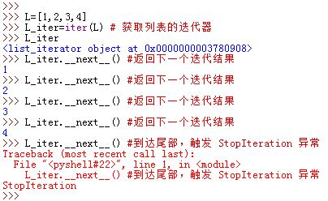

3.Python3提供了一个内置的`next()`函数，它自动调用迭代器的`.__next__()`方法。即给定一个迭代器对象`x`，`next(x)`等同于`x.__next__()`  
 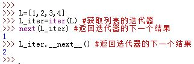

4.内置的`iter()`函数用于从序列、字典、`set`以及其他可迭代对象中获取迭代器。

* 对任何迭代器对象`iterator`，调用`iter(iterator)`返回它本身
* 迭代器对象实现了迭代协议
* 文件对象本身是一个迭代器对象。即文件对象实现了迭代协议，因此打开多个文件会返回同一个文件对象
* 列表、元组、字典、`set`、字符串等不适迭代器对象，他们没有实现迭代协议。因此每次调用`iter()`均返回一个新迭代器对象。他们支持安装多个迭代器，每个迭代器状态不同
	* 在原地修改列表、`set`、字典时，会实时反映到它们的迭代器上
  
  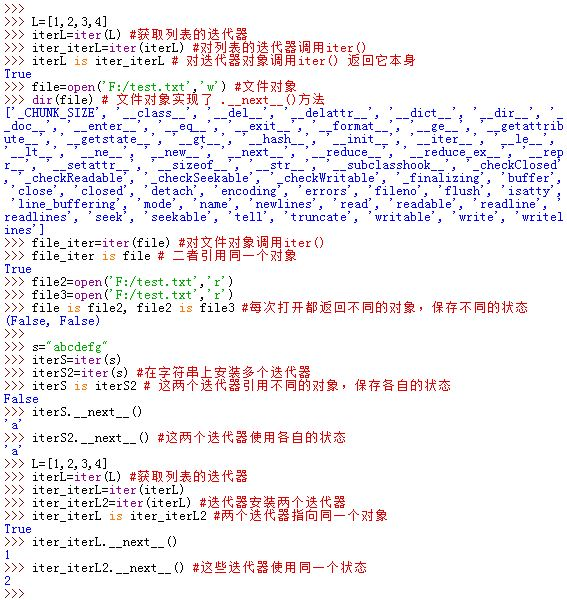

5.文件迭代器：文件对象本身是一个迭代器（这里文件对象要是读打开）。它的`.__next__()`方法每次调用时，返回文件中的下一行。当到达文件末尾时，`.__next__()`方法会引发`StopIteration`异常。
>`.readline()`方法在到达文件末尾时返回空字符串

  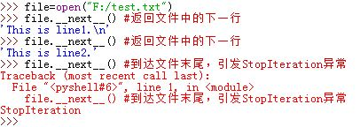

6.字典的迭代器：字典的迭代器在迭代环境中，每次迭代返回的是一个键。  
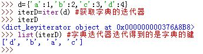

7.扩展的列表解析表达式：
 `[ x+y for x in 'abc' if x!='a' for y in 'lmn' if y!='l']`  
其通用结构为：

```
[ expression for target1 in iterable1 [if condition1]
	     for target2 in iterable2 [if condition2]
	     ....]
```
>我们总是可以用`for`循环手动构建列表解析表达式的结果，但是列表解析表达式性能更好

  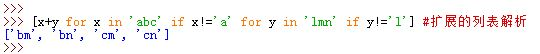

8.`for`循环、列表解析、`in`成员关系测试、`map()`内置函数、`sorted()`内置函数、`zip()`内置函数等都是用迭代协议来完成工作

9.常见的迭代函数：

* `map(func,iterable)`：它将函数`func`应用于传入的迭代器的每个迭代返回元素，返回一个新的迭代器，函数执行结果作为新迭代器的迭代值 
> `map()`可以用于多个可迭代对象：`map(func,[1,2,3],[2,3,4])`，其中`func(first,second)` 的两个参数分别从两个可迭代对象中获取，函数结果作为新迭代器的迭代值 

  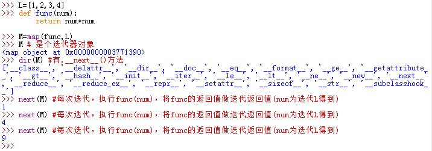
* `zip(iterable1,iterable2,...)`：它组合可迭代对象`iterable1`、`iterable2`、`...`中的各项，返回一个新的迭代器。新迭代器长度由`iterable1`、`iterable2`、`...`最短的那个决定。  
  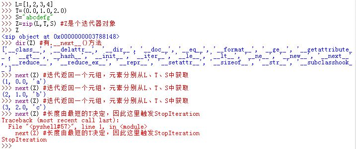
* `enumerate(iterable,start)`：返回一个迭代器对象，它迭代结果是每次迭代返回一个`(index,value)`元组  
  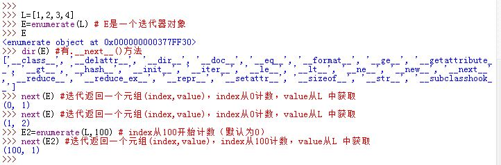
* `filter(func,iterable)`：返回一个迭代器对象，它的迭代结果得到`iterable`中部分元素，其中这些元素使得`func()`函数返回为真  
  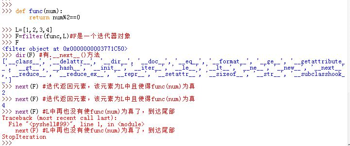
* `reduce(func,iterable,initial)`：对`iterable`中每一项成对地运行`func`，返回最终值  
> `reduce`函数位于`functools`包内

  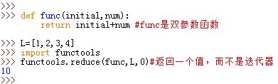

* `sorted(iterable,key=None,reverse=False)`：排序并返回排好的新列表  
  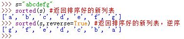

* `sum(iterable,start)`：返回可迭代对象中的累加值  
  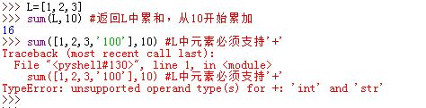

* `any(iterable)`：只要可迭代对象`iterable`迭代返回的某个元素为真则返回`True`
* `all(iterable)`：只有可迭代对象`iterable`迭代返回的所有元素为真则返回`True`  
  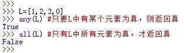

* `max(iterable,key=func)`：返回最大元素。若指定`func`，则返回是`func(num)`最大的那个元素
* `min(iterable,key=func)`：返回最小元素。若指定`func`，则返回是`func(num)`最小的那个元素  
  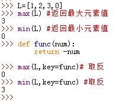

10.`set`解析、字典解析支持列表解析的扩展语法   
  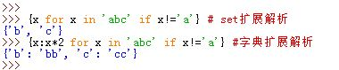

11.Python3中，`range`对象不支持`.__next__()`，因此它本身不是迭代器，而`map`、`zip`、`filter`对象都是迭代器。

* `range`不直接生成列表的优点是节约内存空间
* 由于`map`、`zip`、`filter`对象都是迭代器，因此不支持在它们身上安装多个活跃的迭代器。对他们调用`iter()`其实返回的是它们本身。  
  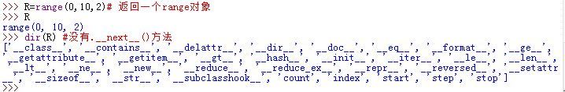

12.字典的视图：键视图、值视图、字典视图都没有`.__next__()`方法，因此他们都不是迭代器  
  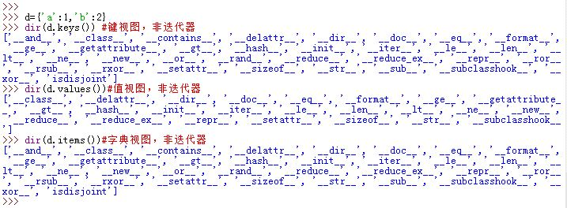

13.通常列表解析执行速度最快，`map()`速度次之，`for`循环速度最慢。前两者以C语言速度执行、后者在Python虚拟机上执行


# 2 生成器_generator_使用Yield

In Python, a generator is a function that returns an iterator that produces a sequence of values when iterated over.
Generators are useful when we want to produce a large sequence of values, but we don't want to store all of them in memory at once.

• functions can use yield instead of return
• each call returns an iterator
• end of function raises StopIteration

```
def enumerate(seq):
    n = 0
    for item in seq:
        yield n, item
        n += 1
```

## 2.1 原理

14.生成器函数：编写为常规的`def`语句，但是用`yield`语句一次返回一个结果。==每次使用生成器函数时会继续上一轮的状态。==
>生成器函数会保存上次执行的状态

定义生成器函数的语法为：

```
	def genFunc(num):
		for i in range(num):
			yield i**2
```

* 生成器函数执行时，得到一个生成器对象，它`yield`一个值，而不是返回一个值。	
	* 生成器对象自动实现迭代协议，它有一个`.__next__()`方法
	* 对生成器对象调用`.__next__()`方法会继续生成器函数的运行到下一个`yield`
 	  结果或引发一个`StopIteration`异常
* `yield`语句会挂起生成器函数并向调用者发送一个值。当下一轮继续时，函数会在上一个`yield`表达式返回后继续执行，其本地变量根据上一轮保持的状态继续使用 
* 生成器函数运行代码随时间产生一系列的值，而不是一次性计算它们。这会节约内存并允许计算时间分散。  
  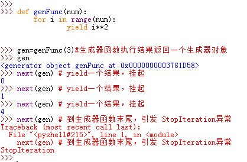

15.`for`循环（及其它迭代环境）通过重复调用`.__next__()`方法直到捕获一个异常。若一个不支持迭代协议的对象想用工作在这种环境中，`for`循环会尝试使用索引协议迭代。

16.生成器对象有一个`.send(arg)`方法。该方法会将`arg`参数发送给生成器作为`yield`表达式的返回值，同时生成器会触发生成动作(相当于调用了一次`.__next__()`方法。
> `yield`表达式的返回值和生成值是不同的。  
> 返回值是用于生成器函数内部，`yield`表达式默认返回值为`None`；  
> 而生成值是用于生成器函数外部的迭代返回。  

* 生成器对象必须先启动。启动意味着它第一次运行到`yield`之前挂起    
  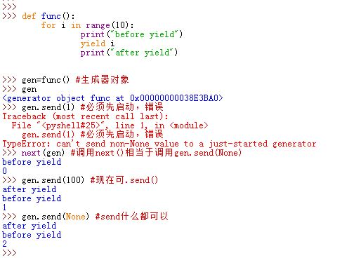
* 要想启动生成器，可以直接使用`next(generatorable)`函数，也可以使用`generatorable.send(None)`方法，或者
  `generatorable.__next__()`方法
  >`next(generatorable)`函数相当于使用`generatorable.send(None)`方法
* `generatorable.send(None)`方法会在传递`yield`表达式的值（默认为`None`返回值），下一轮迭代从`yield`表达式返回开始
  >每一轮挂起时，`yield`表达式 yield 一个数，但是并没有返回（挂起了该`yield`表达式）

  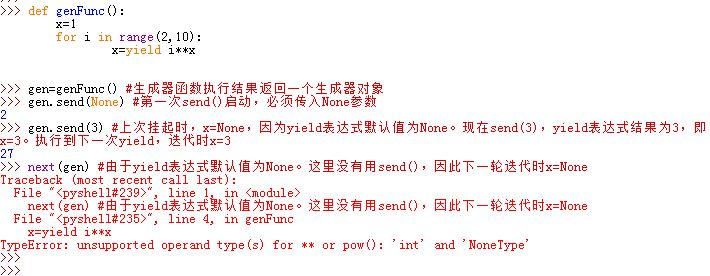

17.生成器表达式：类似于列表解析，但是它是在圆括号中的，而不是方括号中的。

* 生成器表达式返回的是一个生成器对象
* 列表解析的结果等同于`list()`内参数为一个生成器表达式
* 当生成器表达式在其他括号之内时，它本身的圆括号可以不写
* 同样的迭代可以用生成器函数或者一个生成器表达式
	* 生成器函数可以包含更多的逻辑
	* 生成器表达式更简洁，没有函数调用产生生成器的过程
	* 生成器函数与生成器表达式支持自动迭代与手动迭代
* 生成器对象本身是迭代器，因此只支持一个活跃的迭代器。  
  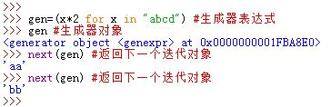

18.生成器函数可以有`return`，它可以出现在函数内任何地方。生成器函数内遇到`return`则触发`StopIteration`异常，同时`return`的值作为异常说明  
  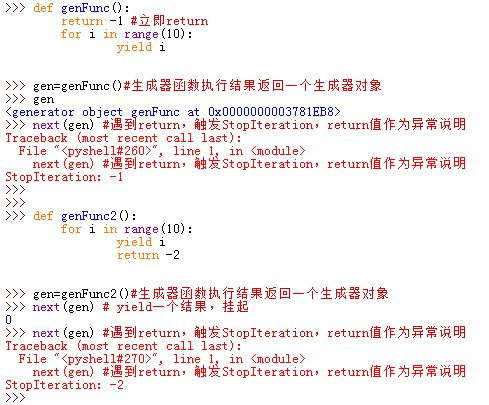

19.可以调用生成器对象的`.close()`方法强制关闭它。这样再次给它`send()`任何信息，都会抛出`StopIteration`异常，表明没有什么可以生成的了  
  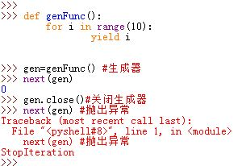

20.`yield from`：从`PEP 380`引入的新特性。  

* `yield from`可以将一个大的生成器切分成小生成器：
 ```
  def generator(): #该生成器yield数字[0~19]
	for i in range(10):
		yield i
	for j in range(10,20):
		yield j
  ```
  如果你想切分成两个迭代器，可以这么做：

  ```
  def generator2():
	for i in range(10):
		yield i
  def generator3():
	for j in range(10):
		yield j
  def generator():
	for i in generator2():
		yield i
	for j in generator3():
		yield j
  ```
 
 引入`yield from`之后你可以这么做：

  def generator2():
	for i in range(10):
		yield i
  def generator3():
	for j in range(10):
		yield j
  def generator():
	yield from generator2()
	yield from generator3()
 `yield from`能实现代理生成器：
  ```
  def generator():
	inner_gen=generator2()
	yield from inner_gen #为了便于说明，这里分两行写
  gen=generator()  
```


	* 对`inner_gen`迭代产生的每个值都直接作为`gen` yield值
	* 所有`gen.send(val)`发送到`gen`的值`val`都会被直接传递给`inner_gen`。
	*  `inner_gen`抛出异常：
		* 如果`inner_gen`产生了`StopIteration`异常，
		  则`gen`会继续执行`yield from`之后的语句
		* 如果对`inner_gen`产生了非`StopIteration`异常，则传导至`gen`中，
	  	  导致`gen`在执行`yield from`的时候抛出异常
	* `gen`抛出异常：
		* 如果`gen`产生了除`GeneratorExit`以外的异常，则该异常直接 throw 到`inner_gen`中
		* 如果`gen`产生了`GeneratorExit`异常，或者`gen`的`.close()`方法被调用，
	  	  则`inner_gen`的`.close()`方法被调用。
	* `gen`中`yield from`表达式求职结果是`inner_gen`迭代结束时抛出的`StopIteration`异常的第一个参数
	* `inner_gen`中的`return xxx`语句实际上会抛出一个`StopIteration(xxx)`异常，
	  所以`inner_gen`中的`return`值会成为`gen`中的`yield from`表达式的返回值。


## 2.2 Create Python Generator

In Python, similar to defining a normal function, we can define a generator function using the `def` [keyword](https://www.programiz.com/python-programming/keywords-identifier), but instead of the `return` statement we use the `yield` statement.

```
def generator_name(arg):
    # statements
    yield something
```

Here, the `yield` keyword is used to produce a value from the generator.

When the generator function is called, it does not execute the function body immediately. Instead, it returns a generator object that can be iterated over to produce the values.

---

## 2.3 Example: Python Generator

Here's an example of a generator function that produces a sequence of numbers,

```
def my_generator(n):

    # initialize counter
    value = 0

    # loop until counter is less than n
    while value < n:

        # produce the current value of the counter
        yield value

        # increment the counter
        value += 1

# iterate over the generator object produced by my_generator
for value in my_generator(3):

    # print each value produced by generator
    print(value)
```

[Run Code](https://www.programiz.com/python-programming/online-compiler)

**Output**

0
1
2

In the above example, the `my_generator()` generator function takes an integer `n` as an argument and produces a sequence of numbers from **0** to `n-1` using [while loop](https://www.programiz.com/python-programming/while-loop).

The `yield` keyword is used to produce a value from the generator and pause the generator function's execution until the next value is requested.

The `for` loop iterates over the generator object produced by `my_generator()`, and the print statement prints each value produced by the generator.

We can also create a generator object from the generator function by calling the function like we would any other function as,

```
generator = my_range(3)
print(next(generator))  # 0
print(next(generator))  # 1
print(next(generator))  # 2
```

**Note**: To learn more, visit [range()](https://www.programiz.com/python-programming/methods/built-in/range) and [for loop()](https://www.programiz.com/python-programming/for-loop).

---

## 2.4 Python Generator Expression

In Python, a generator expression is a concise way to create a generator object.

It is similar to a [list comprehension](https://www.programiz.com/python-programming/list-comprehension), but instead of creating a [list](https://www.programiz.com/python-programming/list), it creates a generator object that can be iterated over to produce the values in the generator.

### 2.4.1 Generator Expression Syntax

A generator expression has the following syntax,

```
(expression for item in iterable)
```

Here, `expression` is a value that will be returned for each item in the `iterable`.

The generator expression creates a generator object that produces the values of `expression` for each item in the `iterable`, one at a time, when iterated over.

---

## 2.5 Example 2: Python Generator Expression

```
# create the generator object
squares_generator = (i * i for i in range(5))

# iterate over the generator and print the values
for i in squares_generator:
    print(i)
```

[Run Code](https://www.programiz.com/python-programming/online-compiler)

**Output**

0
1
4
9
16

Here, we have created the generator object that will produce the squares of the numbers **0** through **4** when iterated over.

And then, to iterate over the generator and get the values, we have used the `for` loop.

---

## 2.6 Use of Python Generators

There are several reasons that make generators a powerful implementation.

### 2.6.1 Easy to Implement

Generators can be implemented in a clear and concise way as compared to their iterator class counterpart. Following is an example to implement a sequence of power of **2** using an iterator class.

```
class PowTwo:
    def __init__(self, max=0):
        self.n = 0
        self.max = max

    def __iter__(self):
        return self

    def __next__(self):
        if self.n > self.max:
            raise StopIteration

        result = 2 ** self.n
        self.n += 1
        return result
```

The above program was lengthy and confusing. Now, let's do the same using a generator function.

```
def PowTwoGen(max=0):
    n = 0
    while n < max:
        yield 2 ** n
        n += 1
```

Since generators keep track of details automatically, the implementation was concise and much cleaner.

### 2.6.2 Memory Efficient

A normal function to return a sequence will create the entire sequence in memory before returning the result. This is an overkill, if the number of items in the sequence is very large.

Generator implementation of such sequences is memory friendly and is preferred since it only produces one item at a time.

### 2.6.3 Represent Infinite Stream

Generators are excellent mediums to represent an infinite stream of data. Infinite streams cannot be stored in memory, and since generators produce only one item at a time, they can represent an infinite stream of data.

The following generator function can generate all the even numbers (at least in theory).

```
def all_even():
    n = 0
    while True:
        yield n
        n += 2
```

### 2.6.4 Pipelining Generators

Multiple generators can be used to pipeline a series of operations. This is best illustrated using an example.

Suppose we have a generator that produces the numbers in the [Fibonacci series](https://www.programiz.com/python-programming/examples/fibonacci-sequence). And we have another generator for squaring numbers.

If we want to find out the sum of squares of numbers in the Fibonacci series, we can do it in the following way by pipelining the output of generator functions together.

```
def fibonacci_numbers(nums):
    x, y = 0, 1
    for _ in range(nums):
        x, y = y, x+y
        yield x

def square(nums):
    for num in nums:
        yield num**2

print(sum(square(fibonacci_numbers(10))))

# Output: 4895
```

[Run Code](https://www.programiz.com/python-programming/online-compiler)

This pipelining is efficient and easy to read (and yes, a lot cooler!).

## 2.7 例子

### 2.7.1 生成器的例子

生成器推导式

```python
# def func():
#     result = []
#     for i in range(10):
#         result.append(i)
#     return result
# v1 = func()
v1 = [i for i in range(10)] # 列表推导式，立即循环创建所有元素。
print(v1)

# def func():
#     for i in range(10):
#         yield i
# v2 = func()
v2 = (i for i in range(10)) # 生成器推导式，创建了一个生成器，内部循环为执行。

# 面试题：请比较 [i for i in range(10)] 和 (i for i in range(10)) 的区别？
```

```python
# 示例一
# def func():
#     result = []
#     for i in range(10):
#         result.append(i)
#     return result
# v1 = func()
# for item in v1:
#    print(item)

# 示例二
# def func():
#     for i in range(10):
#         def f():
#             return i
#         yield f
#
# v1 = func()
# for item in v1:
#     print(item())

# 示例三：
v1 = [i for i in range(10)] # 列表推导式，立即循环创建所有元素。
v2 = (lambda :i for i in range(10))
for item in v2:
    print(item())
```


```python
# 函数
def func():
    return 123
func()
```

```python
# 生成器函数（内部是否包含yield）
def func():
    print('F1')
    yield 1
    print('F2')
    yield 2
    print('F3')
    yield 100
    print('F4')
# 函数内部代码不会执行，返回一个 生成器对象 。
v1 = func()
# 生成器是可以被for循环，一旦开始循环那么函数内部代码就会开始执行。
for item in v1:
    print(item)
```

```python
def func():
    count = 1
    while True:
        yield count
        count += 1
        
val = func()

for item in val:
    print(item)
```

小结：函数中如果存在yield，那么该函数就是一个生成器函数，调用生成器函数会返回一个生成器，生成器只有被for循环时，生成器函数内部的代码才会执行，每次循环都会获取yield返回的值。

```python
def func():
    count = 1
    while True:
        yield count
        count += 1
        if count == 100:
            return

val = func()
for item in val:
    print(item)
```

示例：读文件

```python
def func():
    """
    分批去读取文件中的内容，将文件的内容返回给调用者。
    :return:
    """
    cursor = 0
    while True:
        f = open('db', 'r', encoding='utf-8')# 通过网络连接上redis
        # 代指   redis[0:10]
        f.seek(cursor)
        data_list =[]
        for i in range(10):
            line = f.readline()
            if not line:
                return
            data_list.append(line)
        cursor = f.tell()
        f.close()  # 关闭与redis的连接


        for row in data_list:
            yield row


for item in func():
    print(item)
```

- yeild from关键字【未讲】
- 生成器推导式【未讲】

### 2.7.2 小例子

Write a Python generator function called small_words that accepts a list of strings as input and yields those words that are at most 3 letter long.

```
def small_words(words):
    for word in words:
        if len(word) <= 3:
            yield word
```


```
word_list = ["apple", "banana", "cat", "dog", "elephant"]
for small_word in small_words(word_list):
    print(small_word)
```


### 2.7.3 例子3


==
yield 改为 return 


再改为 


Immer 1 zuruck
因为 renturn 的时候 I = j =1 总会被执行
Yiled 的时候, 上一轮的值 immer vorbehalten , 被保留


# 3 总结

- 迭代器，对可迭代对象中的元素进行逐一获取，迭代器对象的内部都有一个 __next__方法，用于以一个个获取数据。
- 可迭代对象，可以被for循环且此类对象中都有 __iter__方法且要返回一个迭代器（生成器）。
- 生成器，函数内部有yield则就是生成器函数，调用函数则返回一个生成器，循环生成器时，则函数内部代码才会执行。


  特殊的迭代器（**）：
  ```python
  def func():
      yield 1
      yield 2
      yield 3
  
  v = func()
  result = v.__next__()
  print(result)
  result = v.__next__()
  print(result)
  result = v.__next__()
  print(result)
  result = v.__next__()
  print(result)
  ```

  特殊的可迭代对象：
  ```python
  def func():
      yield 1
  
  v = func()
  result = v.__iter__()
  print(result)
  ```


